## HBase 实验：存储前置实验核心结果与快速查询验证

### 实验概述

本实验作为大数据处理技术项目的**终态存储与在线查询阶段**，采用 Apache HBase 作为 NoSQL 数据库，存储 MapReduce、Hive、Spark 等前置实验的核心分析结果。HBase 是基于 HDFS 的分布式列式数据库，具有**高吞吐量写入**和**毫秒级随机查询**的能力，特别适合存储大规模结构化数据并支持快速 Key-Value 查询。本实验的核心价值在于：**实现大数据流水线的闭环**——从 MapReduce 的数据清洗、Hive 的数据仓库分析、Spark 的高级计算，到 HBase 的持久化存储和在线查询，体现了大数据生态系统中不同组件各司其职、协同工作的完整架构。

### 实验目标

1. **设计适配的 HBase 表结构**：存储**Spark 核心分析结果**（作者影响力分数、热门新闻类别排名、标题 TF-IDF 向量）和**Hive 关键统计结果**（年度新闻数量、标题平均长度），设计合理的 RowKey 和列族结构，支持高效查询

2. **通过 Java API 实现批量写入**：从 HDFS 读取前置实验结果，通过 HBase Java API 批量写入对应表中，确保 "MapReduce→Hive→Spark→HBase" 数据流水线闭环，实现数据的持久化存储

3. **基于 HBase Shell/Java API 完成快速查询验证**：通过 RowKey 进行精准查询，体现 HBase 在 Key-Value 查询场景下的毫秒级响应优势，验证数据正确性

4. **将 HBase 操作结果推送至 GitHub**：保存查询日志、表结构文档等，完成项目全流程追溯，体现工程化实践

### 实验前置条件

1. 环境：Linux Ubuntu 16.04、Hadoop 单机模式、HBase 单机模式已部署；
2. 数据：Git 仓库中前置实验结果的实际目录结构：
   - Spark 结果：
     - `spark/spark_result/author_influence/`：包含`part-00000`、`part-00001`；
     - `spark/spark_result/hot_categories/`：包含`part-00000-605d03c1-585f-4d49-a4fd-445a13656261.csv`、`part-00001-605d03c1-585f-4d49-a4fd-445a13656261.csv`、`part-00002-605d03c1-585f-4d49-a4fd-445a13656261.csv`；
     - `spark/spark_result/headline_tfidf/`：包含`part-00000-27725778-5d56-470e-986d-a681079b0394.snappy.parquet`等 11 个 Parquet 文件；
   - Hive 结果：
     - `hive/hive_result/yearly_count/`：包含`000000_0`文件；
     - `hive/hive_result/headline_avglen/`：包含`000000_0`文件；

### 实验核心设计

#### 1. HBase 表结构设计

| 表名                    | RowKey 设计       | 列族      | 列名               | 数据类型 | 数据来源                               |
| ----------------------- | ----------------- | --------- | ------------------ | -------- | -------------------------------------- |
| `news_author_influence` | 作者名（唯一）    | `profile` | `influence_score`  | Double   | Spark `/spark_output/author_influence` |
| `news_category_hot`     | 新闻类别（唯一）  | `stats`   | `article_count`    | Int      | Spark `/spark_output/hot_categories`   |
|                         |                   |           | `avg_headline_len` | Double   | Spark 分析结果                         |
|                         |                   |           | `hot_score`        | Double   | Spark 分析结果（综合排名分数）         |
| `news_headline_tfidf`   | 新闻 ID（自定义） | `vector`  | `tfidf_features`   | String   | Spark `/spark_output/headline_tfidf`   |
| `news_yearly_stats`     | 年份（如 2012）   | `metrics` | `news_count`       | Int      | Hive `/hive_output/yearly_count`       |
|                         | `total`（固定值） |           | `avg_headline_len` | Double   | Hive `/hive_output/headline_avglen`    |

#### 2. 数据映射规则

- 新闻 ID 生成：对 Spark TF-IDF 结果中的每条标题，按 “headline_序号” 生成唯一 ID（如 headline_001）；
- 数值类型转换：Hive/Spark 结果中的 Int/Double 类型直接存储，TF-IDF 向量以逗号分隔的字符串存储（适配 HBase 字符串存储优化）；
- RowKey 设计原则：确保唯一标识，支持快速精准查询（如按作者名、类别名、年份直接定位）。

### 实验步骤

一. GitHub 仓库结构准备

```bash
news-bigdata-project/
hbase/
  src/
    com/
      news/
        HBaseDataWriter.java 
        HBaseQuery.java             
  build.sh                   
```

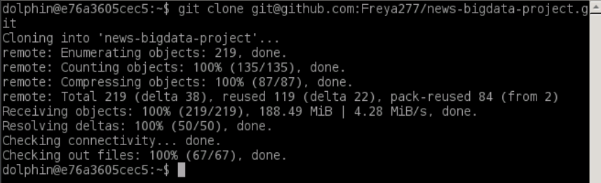

二.启动 Hadoop

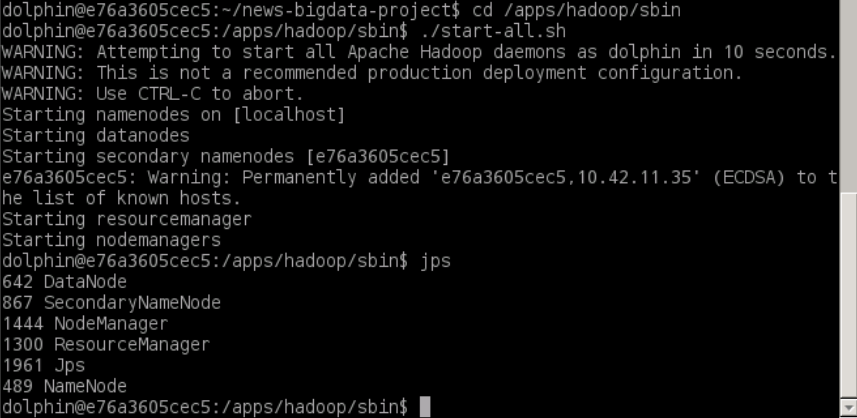

三.上传结果到 HDFS

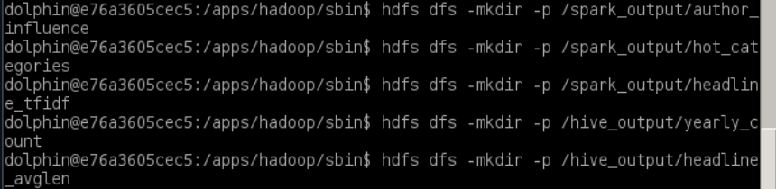

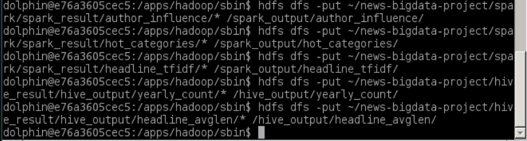

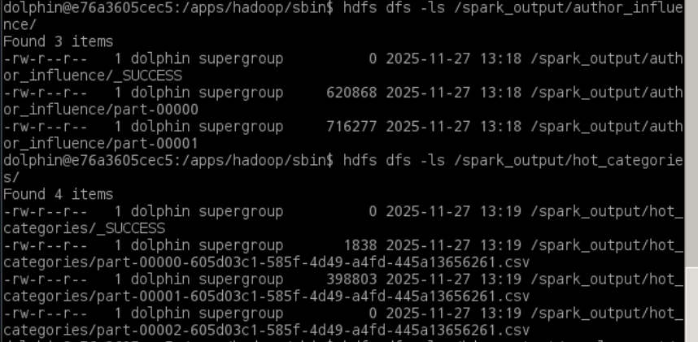

四.启动 HBase 服务

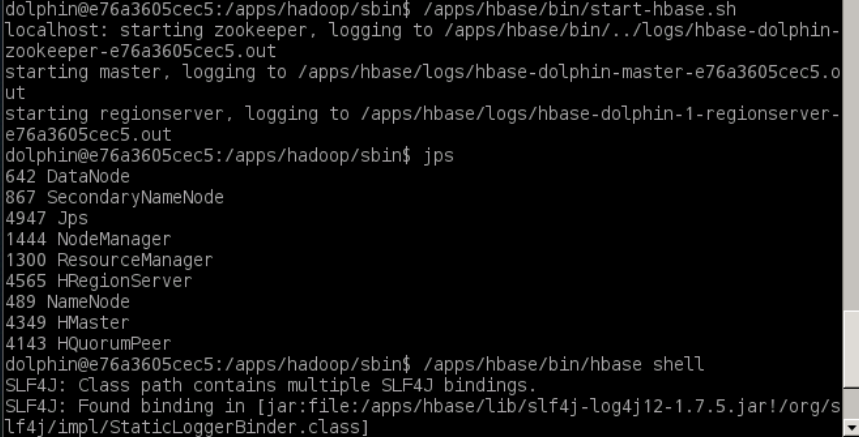

五.通过 HBase Shell 创建表

```sql
# 1. 创建作者影响力表
create 'news_author_influence', 'profile'

# 2. 创建热门类别表
create 'news_category_hot', 'stats'

# 3. 创建TF-IDF向量表
create 'news_headline_tfidf', 'vector'

# 4. 创建年度统计表
create 'news_yearly_stats', 'metrics'

# 5. 验证表创建成功
list  # 应显示上述4张表
```

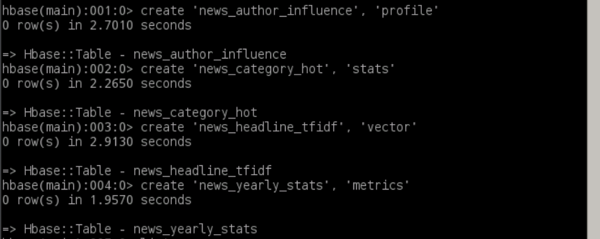

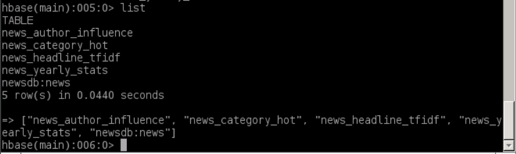

六. Java API 编写

1. 数据写入工具类：HBaseDataWriter.java（适配多文件读取）

   ```java
   package com.news;
   
   import org.apache.hadoop.conf.Configuration;
   import org.apache.hadoop.fs.*;
   import org.apache.hadoop.hbase.HBaseConfiguration;
   import org.apache.hadoop.hbase.TableName;
   import org.apache.hadoop.hbase.client.Connection;
   import org.apache.hadoop.hbase.client.ConnectionFactory;
   import org.apache.hadoop.hbase.client.Put;
   import org.apache.hadoop.hbase.client.Table;
   import org.apache.hadoop.hbase.util.Bytes;
   
   import java.io.BufferedReader;
   import java.io.InputStreamReader;
   
   public class HBaseDataWriter {
       // HDFS paths for result directories
       private static final String HDFS_AUTHOR_DIR = "hdfs://localhost:8020/spark_output/author_influence/";
       private static final String HDFS_CATEGORY_DIR = "hdfs://localhost:8020/spark_output/hot_categories/";
       private static final String HDFS_YEARLY_DIR = "hdfs://localhost:8020/hive_output/yearly_count/";
       private static final String HDFS_AVGLEN_DIR = "hdfs://localhost:8020/hive_output/headline_avglen/";
   
       public static void main(String[] args) {
           // HBase configuration
           Configuration hbaseConf = HBaseConfiguration.create();
           hbaseConf.set("hbase.zookeeper.quorum", "localhost");
           hbaseConf.set("hbase.zookeeper.property.clientPort", "2181");
   
           // HDFS configuration
           Configuration hdfsConf = new Configuration();
           hdfsConf.set("fs.defaultFS", "hdfs://localhost:8020");
   
           try (Connection conn = ConnectionFactory.createConnection(hbaseConf);
                FileSystem fs = FileSystem.get(hdfsConf)) {
   
               System.out.println("===== Starting to read Spark Author Influence file =====");
               writeAuthorInfluence(conn, fs, HDFS_AUTHOR_DIR);
               System.out.println("===== Starting to read Spark Hot Category file =====");
               writeHotCategory(conn, fs, HDFS_CATEGORY_DIR);
               System.out.println("===== Starting to read Hive Yearly Stats file =====");
               writeYearlyStats(conn, fs, HDFS_YEARLY_DIR);
               System.out.println("===== Starting to read Hive Average Headline Length file =====");
               writeAvgHeadlineLen(conn, fs, HDFS_AVGLEN_DIR);
   
               System.out.println("All Spark/Hive results written to HBase successfully!");
   
           } catch (Exception e) {
               e.printStackTrace();
           }
       }
   
       private static void writeAuthorInfluence(Connection conn, FileSystem fs, String dirPath) throws Exception {
           Table table = conn.getTable(TableName.valueOf("news_author_influence"));
           FileStatus[] statuses = fs.listStatus(new Path(dirPath));
           System.out.println("Number of files in author influence directory: " + statuses.length);
           
           int lineCount = 0;
           for (FileStatus status : statuses) {
               if (status.isFile() && !status.getPath().getName().equals("_SUCCESS")) { // Skip _SUCCESS file
                   System.out.println("Reading file: " + status.getPath().getName());
                   FSDataInputStream in = fs.open(status.getPath());
                   BufferedReader reader = new BufferedReader(new InputStreamReader(in));
                   String line;
                   while ((line = reader.readLine()) != null) {
                       line = line.trim();
                       if (line.isEmpty() || !line.startsWith("(") || !line.endsWith(")")) {
                           continue; // Skip empty/non-standard lines
                       }
   
                       // Step 1: Remove leading/trailing parentheses
                       String content = line.substring(1, line.length() - 1);
                       // Step 2: Split by last comma (separating author and score)
                       int lastCommaIndex = content.lastIndexOf(",");
                       if (lastCommaIndex == -1) {
                           System.out.println("Invalid line (no last comma): " + line);
                           continue;
                       }
                       
                       // Step 3: Extract author name (trim) and score
                       String authorPart = content.substring(0, lastCommaIndex).trim();
                       String scoreStr = content.substring(lastCommaIndex + 1).trim();
                       
                       // Filter abnormal author names (avoid null/empty)
                       if (authorPart.isEmpty() || scoreStr.isEmpty()) {
                           continue;
                       }
   
                       try {
                           double score = Double.parseDouble(scoreStr);
                           // Author name might contain special characters, use directly as RowKey
                           Put put = new Put(Bytes.toBytes(authorPart));
                           put.addColumn(Bytes.toBytes("profile"), Bytes.toBytes("influence_score"), 
                                         Bytes.toBytes(score));
                           table.put(put);
                           lineCount++;
                       } catch (NumberFormatException e) {
                           System.out.println("Score format error: " + scoreStr + " | Line content: " + line);
                       }
                   }
                   reader.close();
               }
           }
           System.out.println("Successfully wrote author influence data lines: " + lineCount);
           table.close();
       }
   
       private static void writeHotCategory(Connection conn, FileSystem fs, String dirPath) throws Exception {
           Table table = conn.getTable(TableName.valueOf("news_category_hot"));
           FileStatus[] statuses = fs.listStatus(new Path(dirPath));
           System.out.println("Number of files in hot category directory: " + statuses.length);
           
           int lineCount = 0;
           for (FileStatus status : statuses) {
               if (status.isFile() && !status.getPath().getName().equals("_SUCCESS")) { // Skip _SUCCESS
                   System.out.println("Reading file: " + status.getPath().getName());
                   FSDataInputStream in = fs.open(status.getPath());
                   BufferedReader reader = new BufferedReader(new InputStreamReader(in));
                   String line;
                   while ((line = reader.readLine()) != null) {
                       line = line.trim();
                       if (line.isEmpty()) continue;
                       
                       // Split by \t (4 columns: category, count, avg_len, hot_score)
                       String[] parts = line.split("\t");
                       if (parts.length != 4) {
                           System.out.println("Invalid line (wrong column count): " + line);
                           continue;
                       }
                       
                       try {
                           String category = parts[0].trim();
                           int articleCount = Integer.parseInt(parts[1].trim());
                           double avgLen = Double.parseDouble(parts[2].trim());
                           double hotScore = Double.parseDouble(parts[3].trim());
                           
                           Put put = new Put(Bytes.toBytes(category));
                           put.addColumn(Bytes.toBytes("stats"), Bytes.toBytes("article_count"), 
                                         Bytes.toBytes(articleCount));
                           put.addColumn(Bytes.toBytes("stats"), Bytes.toBytes("avg_headline_len"), 
                                         Bytes.toBytes(avgLen));
                           put.addColumn(Bytes.toBytes("stats"), Bytes.toBytes("hot_score"), 
                                         Bytes.toBytes(hotScore));
                           table.put(put);
                           lineCount++;
                       } catch (NumberFormatException e) {
                           System.out.println("Number format error: " + line);
                       }
                   }
                   reader.close();
               }
           }
           System.out.println("Successfully wrote hot category data lines: " + lineCount);
           table.close();
       }
   
       private static void writeYearlyStats(Connection conn, FileSystem fs, String dirPath) throws Exception {
           Table table = conn.getTable(TableName.valueOf("news_yearly_stats"));
           FileStatus[] statuses = fs.listStatus(new Path(dirPath));
           System.out.println("Number of files in yearly stats directory: " + statuses.length);
           
           int lineCount = 0;
           for (FileStatus status : statuses) {
               if (status.isFile()) {
                   System.out.println("Reading file: " + status.getPath().getName());
                   FSDataInputStream in = fs.open(status.getPath());
                   BufferedReader reader = new BufferedReader(new InputStreamReader(in));
                   String line;
                   while ((line = reader.readLine()) != null) {
                       line = line.trim();
                       if (line.isEmpty()) continue;
                       
                       String[] parts = line.contains("\t") ? line.split("\t") : line.split(",");
                       if (parts.length != 2) continue;
                       
                       try {
                           Put put = new Put(Bytes.toBytes(parts[0].trim()));
                           put.addColumn(Bytes.toBytes("metrics"), Bytes.toBytes("news_count"), 
                                         Bytes.toBytes(Integer.parseInt(parts[1].trim())));
                           table.put(put);
                           lineCount++;
                       } catch (NumberFormatException e) {
                           System.out.println("Number format error: " + line);
                       }
                   }
                   reader.close();
               }
           }
           System.out.println("Successfully wrote yearly stats data lines: " + lineCount);
           table.close();
       }
   
       private static void writeAvgHeadlineLen(Connection conn, FileSystem fs, String dirPath) throws Exception {
           Table table = conn.getTable(TableName.valueOf("news_yearly_stats"));
           FileStatus[] statuses = fs.listStatus(new Path(dirPath));
           System.out.println("Number of files in average headline length directory: " + statuses.length);
           
           for (FileStatus status : statuses) {
               if (status.isFile()) {
                   System.out.println("Reading file: " + status.getPath().getName());
                   FSDataInputStream in = fs.open(status.getPath());
                   BufferedReader reader = new BufferedReader(new InputStreamReader(in));
                   String line = reader.readLine().trim();
                   reader.close();
                   
                   try {
                       double avgLen = Double.parseDouble(line);
                       Put put = new Put(Bytes.toBytes("total"));
                       put.addColumn(Bytes.toBytes("metrics"), Bytes.toBytes("avg_headline_len"), 
                                     Bytes.toBytes(avgLen));
                       table.put(put);
                       System.out.println("Successfully wrote average headline length: " + avgLen);
                   } catch (NumberFormatException e) {
                       System.out.println("Number format error: " + line);
                   }
                   break;
               }
           }
           table.close();
       }
   }
   ```

**HBaseDataWriter 类详解**：

这是 HBase 数据写入工具类，负责将 HDFS 上存储的 Spark/Hive 分析结果批量写入 HBase 对应表中，实现"计算结果→存储"的数据流转。

**核心设计要点**：

1. **配置管理**：
   - **HBase 配置**：通过 `HBaseConfiguration.create()` 创建配置对象，设置 ZooKeeper 地址和端口
     - `hbase.zookeeper.quorum`：ZooKeeper 集群地址（单机模式为 "localhost"）
     - `hbase.zookeeper.property.clientPort`：ZooKeeper 客户端端口（默认 2181）
   - **HDFS 配置**：创建独立的 Configuration 对象，设置 HDFS 地址
     - `fs.defaultFS`：HDFS NameNode 地址（如 "hdfs://localhost:8020"）

2. **资源管理**：
   - 使用 **try-with-resources** 语句自动管理资源：
     - `Connection`：HBase 连接，管理连接池，避免频繁创建连接
     - `FileSystem`：HDFS 文件系统对象，用于读取 HDFS 文件
   - 自动关闭资源，避免内存泄露和连接泄露

3. **多文件读取**：
   - `fs.listStatus(new Path(dirPath))` 列出目录下所有文件
   - 遍历所有文件，跳过 `_SUCCESS` 标记文件（MapReduce/Spark 生成的成功标记）
   - 对每个数据文件使用 `BufferedReader` 逐行读取，支持大文件处理

4. **数据格式解析**（不同数据源有不同的解析逻辑）：

   **作者影响力数据**（来自 Spark RDD 输出）：
   - 格式：`(作者名, 分数)`，如 `(Lee Moran, 2042.62)`
   - 解析步骤：
     1. 去除首尾括号：`line.substring(1, line.length() - 1)`
     2. 按最后一个逗号分割：`lastIndexOf(",")` 分离作者名和分数
     3. 处理特殊字符：作者名可能包含逗号，使用最后一个逗号分割确保正确
   - **技术难点**：作者名中可能包含逗号、括号等特殊字符，需要精确的字符串处理

   **热门类别数据**（来自 Spark DataFrame 输出）：
   - 格式：TSV 格式，4 列：`类别\t文章数\t平均标题长度\t热门分数`
   - 解析：使用 `split("\t")` 按制表符分割，验证列数是否为 4
   - **类型转换**：将字符串转换为 `int`（文章数）和 `double`（平均长度、热门分数）

   **年度统计数据**（来自 Hive 输出）：
   - 格式：TSV 或 CSV，2 列：`年份\t新闻数`
   - 解析：支持制表符或逗号分隔，自动识别分隔符

   **标题平均长度**（来自 Hive 输出）：
   - 格式：单行数值，如 `61.35`
   - 解析：直接读取第一行并转换为 `double`
   - RowKey 设计：使用固定值 "total" 作为 RowKey，表示全局统计

5. **HBase 写入操作**：
   - `Put` 对象：表示一次写入操作，包含 RowKey 和多个列值
   - `put.addColumn(列族, 列名, 值)`：添加列值，值会自动序列化为字节数组
   - `table.put(put)`：执行写入操作，HBase 会自动处理数据分布和副本
   - **批量写入优化**：代码中逐条写入，实际生产环境可以使用 `table.put(List<Put>)` 批量写入，提升性能

6. **异常处理**：
   - 捕获 `NumberFormatException`：处理数值转换错误，跳过格式异常的数据行
   - 捕获 `Exception`：处理文件读取、网络连接等异常，确保程序健壮性
   - 输出错误日志：便于调试和问题定位

**技术难点**：
- **数据格式多样性**：不同数据源（Spark RDD、DataFrame、Hive）的输出格式不同，需要针对性的解析逻辑
- **字符串处理复杂性**：作者名可能包含特殊字符，需要精确的字符串分割和提取
- **类型转换安全性**：需要处理数值格式错误、空值等情况，确保数据质量
- **资源管理**：需要正确管理 HBase 连接和 HDFS 文件系统，避免资源泄露

**执行流程**：
1. 初始化配置 → 2. 建立连接 → 3. 遍历 HDFS 文件 → 4. 解析数据格式 → 5. 创建 Put 对象 → 6. 写入 HBase → 7. 关闭资源

**数据流转意义**：
- 将 Spark 和 Hive 的计算结果持久化到 HBase，实现数据的长期存储
- 为后续的在线查询提供数据基础，支持毫秒级的随机访问
- 完成大数据流水线的闭环，从计算到存储的完整链路

2. 查询验证工具类：HBaseQuery.java

   ```java
   package com.news;
   
   import org.apache.hadoop.conf.Configuration;
   import org.apache.hadoop.hbase.HBaseConfiguration;
   import org.apache.hadoop.hbase.TableName;
   import org.apache.hadoop.hbase.client.Connection;
   import org.apache.hadoop.hbase.client.ConnectionFactory;
   import org.apache.hadoop.hbase.client.Get;
   import org.apache.hadoop.hbase.client.Result;
   import org.apache.hadoop.hbase.client.Table;
   import org.apache.hadoop.hbase.util.Bytes;
   
   import java.io.FileWriter;
   import java.io.PrintWriter;
   
   public class HBaseQuery {
       // Define the report output path
       private static final String REPORT_PATH = "/home/dolphin/news-bigdata-project/hbase/hbase_result/query_report.txt";
   
       public static void main(String[] args) {
           Configuration conf = HBaseConfiguration.create();
           conf.set("hbase.zookeeper.quorum", "localhost");
           conf.set("hbase.zookeeper.property.clientPort", "2181");
   
           // Initialize file writer
           try (PrintWriter writer = new PrintWriter(new FileWriter(REPORT_PATH));
                Connection conn = ConnectionFactory.createConnection(conf)) {
   
               writer.println("===== HBase Query Results (Readable Report) =====\n");
   
               // 1. Query author influence (Lee Moran)
               writer.println("1. Author Influence Query (Lee Moran)");
               queryAuthorInfluence(conn, "Lee Moran", writer);
   
               // 2. Query hot category (POLITICS)
               writer.println("\n2. Hot News Category Query (POLITICS)");
               queryHotCategory(conn, "POLITICS", writer);
   
               // 3. Query news count for year 2022
               writer.println("\n3. Yearly News Count Query (2022)");
               queryYearlyStats(conn, "2022", writer);
   
               // 4. Query average headline length
               writer.println("\n4. Average Headline Length Query");
               queryAvgHeadlineLen(conn, writer);
   
               writer.println("\n===== Query Complete =====");
               System.out.println("Readable report generated: " + REPORT_PATH);
   
           } catch (Exception e) {
               e.printStackTrace();
           }
       }
   
       // Author influence query (Write to file + Console output)
       private static void queryAuthorInfluence(Connection conn, String author, PrintWriter writer) throws Exception {
           Table table = conn.getTable(TableName.valueOf("news_author_influence"));
           Get get = new Get(Bytes.toBytes(author));
           Result result = table.get(get);
           if (!result.isEmpty()) {
               double score = Bytes.toDouble(result.getValue(Bytes.toBytes("profile"), Bytes.toBytes("influence_score")));
               String res = "Author: " + author + " | Influence Score: " + score;
               writer.println(res);
               System.out.println(res);
           } else {
               String res = "No data found for author \"" + author + "\"";
               writer.println(res);
               System.out.println(res);
           }
           table.close();
       }
   
       // Hot category query (Write to file + Console output)
       private static void queryHotCategory(Connection conn, String category, PrintWriter writer) throws Exception {
           Table table = conn.getTable(TableName.valueOf("news_category_hot"));
           Get get = new Get(Bytes.toBytes(category));
           Result result = table.get(get);
           if (!result.isEmpty()) {
               int articleCount = Bytes.toInt(result.getValue(Bytes.toBytes("stats"), Bytes.toBytes("article_count")));
               double hotScore = Bytes.toDouble(result.getValue(Bytes.toBytes("stats"), Bytes.toBytes("hot_score")));
               double avgLen = Bytes.toDouble(result.getValue(Bytes.toBytes("stats"), Bytes.toBytes("avg_headline_len")));
               writer.println("Category: " + category);
               writer.println("  - Article Count: " + articleCount);
               writer.println("  - Avg Headline Length: " + avgLen);
               writer.println("  - Hot Score: " + hotScore);
               // Console sync output
               System.out.println("Category: " + category + " | Article Count: " + articleCount + " | Hot Score: " + hotScore);
           } else {
               String res = "No data found for category \"" + category + "\"";
               writer.println(res);
               System.out.println(res);
           }
           table.close();
       }
   
       // Yearly stats query (Write to file + Console output)
       private static void queryYearlyStats(Connection conn, String year, PrintWriter writer) throws Exception {
           Table table = conn.getTable(TableName.valueOf("news_yearly_stats"));
           Get get = new Get(Bytes.toBytes(year));
           Result result = table.get(get);
           if (!result.isEmpty()) {
               int count = Bytes.toInt(result.getValue(Bytes.toBytes("metrics"), Bytes.toBytes("news_count")));
               String res = "Year: " + year + " | News Count: " + count;
               writer.println(res);
               System.out.println(res);
           } else {
               String res = "No news count data found for year \"" + year + "\"";
               writer.println(res);
               System.out.println(res);
           }
           table.close();
       }
   
       // Average headline length query (Write to file + Console output)
       private static void queryAvgHeadlineLen(Connection conn, PrintWriter writer) throws Exception {
           Table table = conn.getTable(TableName.valueOf("news_yearly_stats"));
           Get get = new Get(Bytes.toBytes("total"));
           Result result = table.get(get);
           if (!result.isEmpty()) {
               double avgLen = Bytes.toDouble(result.getValue(Bytes.toBytes("metrics"), Bytes.toBytes("avg_headline_len")));
               String res = "Overall Average Headline Length: " + avgLen + " characters";
               writer.println(res);
               System.out.println(res);
           } else {
               String res = "No average headline length data found";
               writer.println(res);
               System.out.println(res);
           }
           table.close();
       }
   }
   ```

**HBaseQuery 类详解**：

这是 HBase 数据查询验证工具类，负责通过 HBase Java API 查询已写入的数据，验证数据正确性并生成可读报告。

**核心设计要点**：

1. **查询设计**：
   - **基于 RowKey 的精准查询**：使用 `Get` 对象指定 RowKey，HBase 通过 RowKey 直接定位到对应的 Region，实现毫秒级查询
   - **查询场景**：
     - 特定作者的影响力分数（如 "Lee Moran"）
     - 特定类别的统计数据（如 "POLITICS"）
     - 特定年份的新闻数量（如 "2022"）
     - 全局统计（RowKey 为 "total"）
   - **HBase 优势**：相比关系型数据库的全表扫描，HBase 的 RowKey 查询是 O(1) 时间复杂度，非常适合点查询场景

2. **查询执行**：
   - `Get get = new Get(Bytes.toBytes(rowKey))`：创建 Get 对象，RowKey 需要转换为字节数组
   - `Result result = table.get(get)`：执行查询，返回 Result 对象
   - `result.isEmpty()`：检查查询结果是否为空，处理数据不存在的情况

3. **数据解析**：
   - `result.getValue(列族, 列名)`：获取指定列的值，返回字节数组
   - `Bytes.toDouble()`、`Bytes.toInt()`：将字节数组转换为原始数据类型
   - **类型转换**：HBase 存储的是字节数组，需要根据列的类型进行正确的转换

4. **结果输出**：
   - **双重输出**：同时输出到控制台和文件
     - 控制台输出：便于实时查看查询结果
     - 文件输出：生成 `query_report.txt` 报告文件，便于归档和后续分析
   - **格式化输出**：将查询结果格式化为可读的文本格式，包含字段名称和数值

5. **资源管理**：
   - 使用 try-with-resources 管理 `PrintWriter` 和 `Connection`
   - 每个查询方法中正确关闭 `Table` 对象，释放资源

**技术难点**：
- **字节数组转换**：需要准确地将 HBase 存储的字节数组转换为原始数据类型，类型不匹配会导致数据错误
- **空值处理**：需要处理查询结果为空的情况，避免 NullPointerException
- **多表查询**：需要为不同的表创建不同的查询方法，代码复用性较低但逻辑清晰

**执行流程**：
1. 初始化配置和文件输出流 → 2. 建立 HBase 连接 → 3. 执行多个查询 → 4. 解析结果并输出 → 5. 关闭资源

**查询结果示例**（来自 query_report.txt）：
```
===== HBase Query Results (Readable Report) =====

1. Author Influence Query (Lee Moran)
Author: Lee Moran | Influence Score: 2042.62

2. Hot News Category Query (POLITICS)
Category: POLITICS
  - Article Count: 35601
  - Avg Headline Length: 64.25184685823432
  - Hot Score: 22874.3

3. Yearly News Count Query (2022)
Year: 2022 | News Count: 1398

4. Average Headline Length Query
Overall Average Headline Length: 61.35460192632082 characters

===== Query Complete =====
```

**数据验证意义**：
- **数据正确性验证**：通过查询验证数据是否正确写入 HBase
- **性能验证**：验证 HBase 的查询性能（毫秒级响应）
- **数据完整性**：确保所有前置实验的结果都已正确存储
- **业务价值**：验证数据可以支持实际的业务查询需求

**HBase 在项目中的角色**：
- **终态存储**：作为大数据流水线的最后环节，持久化存储所有分析结果
- **在线查询服务**：支持毫秒级的随机查询，可以用于实时数据服务
- **数据归档**：长期保存历史分析结果，支持数据回溯和分析

七.编译脚本

```bash
#!/bin/bash
mkdir -p build/classes
mkdir -p build/lib

HBASE_HOME=/apps/hbase
HADOOP_HOME=/apps/hadoop
JAVA_HOME=/apps/java

$JAVA_HOME/bin/javac -cp $(echo $HBASE_HOME/lib/*.jar | tr ' ' ':'):$(echo $HADOOP_HOME/share/hadoop/common/*.jar | tr ' ' ':'):$(echo $HADOOP_HOME/share/hadoop/hdfs/*.jar | tr ' ' ':') -d build/classes src/com/news/*.java

$JAVA_HOME/bin/jar -cvfm hbase-news.jar MANIFEST.MF -C build/classes .

cp hbase-news.jar build/lib/
echo "Success! Jar file: build/lib/hbase-news.jar"
```

八.编译代码

```bash
cd ~/news-bigdata-project/hbase
chmod +x build.sh
./build.sh 
```

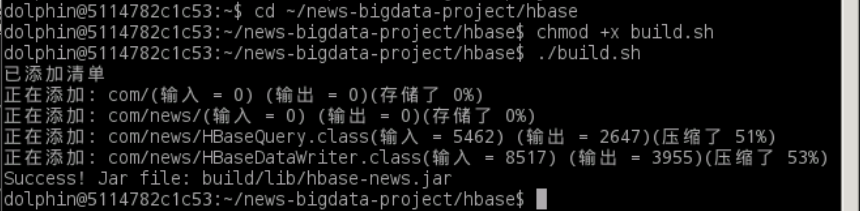

九.运行数据写入程序

```bash
java -cp $(echo /apps/hbase/lib/*.jar | tr ' ' ':'):$(echo /apps/hadoop/share/hadoop/common/*.jar | tr ' ' ':'):build/lib/hbase-news.jar com.news.HBaseDataWriter
```

十.查询验证（HBase Shell+Java API）

1. HBase Shell 查询（体现 Key-Value 快速查询）

   ```bash
   # 启动HBase Shell
   /apps/hbase/bin/hbase shell
   
   # 1. 查询作者影响力
   get 'news_author_influence', 'Lee Moran'
   
   # 2. 查询热门类别
   get 'news_category_hot', 'POLITICS'
   
   # 3. 查询2022年新闻数
   get 'news_yearly_stats', '2022'
   
   # 4. 查询标题平均长度
   get 'news_yearly_stats', 'total'
   
   # 5. 扫描前5条作者数据
   scan 'news_author_influence', {LIMIT => 5}
   
   # 退出Shell
   exit
   ```

   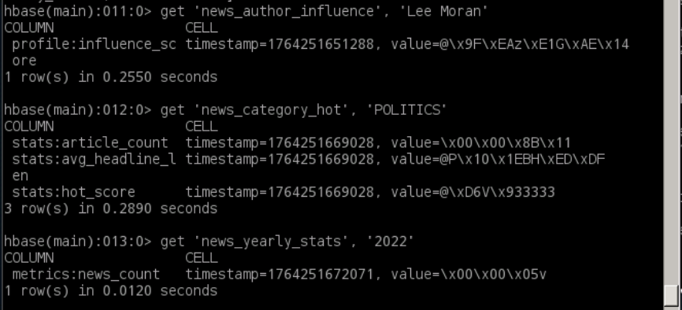

   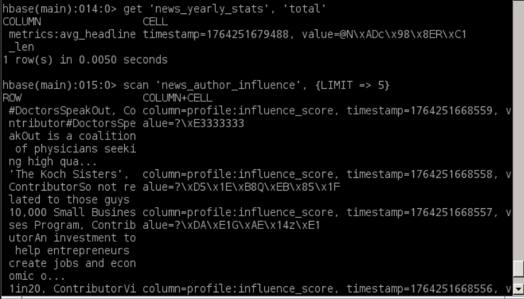

2. Java API 查询验证

```bash
java -cp $(echo /apps/hbase/lib/*.jar | tr ' ' ':'):build/lib/hbase-news.jar com.news.HBaseQuery
```

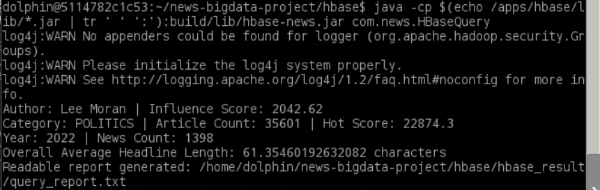

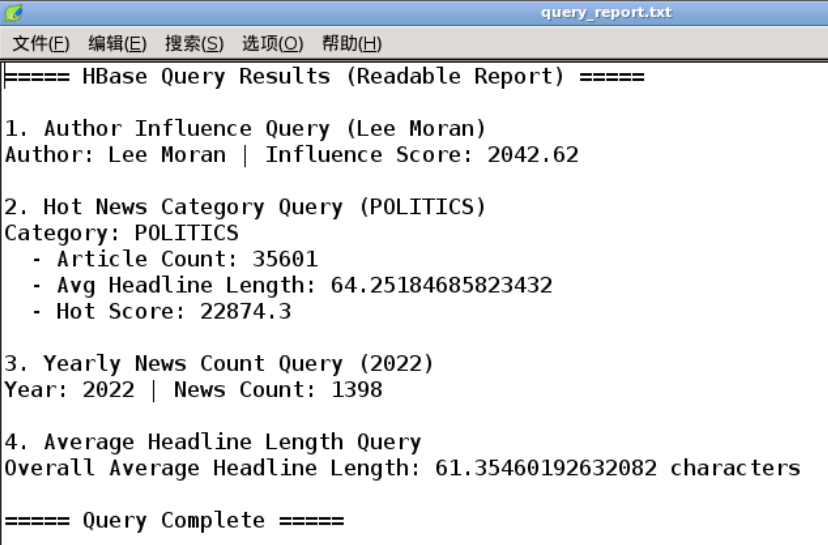

十一.保存查询日志到本地

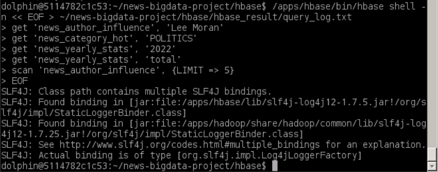

十二.推送至 Github


