## Hive 实验：基于清洗后的新闻数据构建数据仓库并进行分析

### 实验概述

本实验作为大数据处理技术项目的**数据仓库构建与分析阶段**，采用 Apache Hive 作为数据仓库工具，对 MapReduce 清洗后的结构化数据进行存储和深度分析。Hive 基于 Hadoop 构建，提供了类似 SQL 的查询语言（HiveQL），使得熟悉 SQL 的数据分析师能够直接对存储在 HDFS 上的大数据进行查询分析，无需编写复杂的 MapReduce 程序。本实验的核心价值在于：**将 MapReduce 的批处理能力与 SQL 的易用性相结合**，实现了从原始数据到业务洞察的快速转换，为后续 Spark 高级分析和 HBase 实时查询提供了高质量的数据基础。

### 数据集

本实验基于 MapReduce 清洗后的数据 `/news_cleaned`，该数据已经被处理为 Hive 能够加载的 TSV 结构：

| category | date | authors | headline | short_description |

**数据特点**：
- **格式**：TSV（Tab-Separated Values），字段以制表符分隔，便于 Hive 直接加载
- **规模**：包含大约二十万条清洗后的新闻记录，数据质量已通过 MapReduce 阶段验证
- **结构**：扁平化结构，无嵌套字段，适合关系型数据仓库模型
- **来源**：来自 MapReduce 数据清洗任务的输出，体现了大数据流水线的数据流转

### 实验目标

#### 目标一：构建新闻数据仓库

**技术要点**：
- 创建 `newsdb` 数据库：建立独立的数据仓库命名空间，便于数据管理和权限控制
- 创建外部表 `news_cleaned`：使用外部表（External Table）而非内部表（Managed Table），数据仍存储在 HDFS 上，Hive 只管理元数据；优势是删除表时不会删除 HDFS 数据，保证数据安全
- 加载 `/news_cleaned` 数据：通过 `LOCATION` 子句直接指向 HDFS 路径，Hive 自动读取数据，无需显式导入，实现**零拷贝**数据加载

#### 目标二：执行新闻分析任务

依据数据集特点设计 Hive 查询任务，展示 HiveQL 在**多维统计分析**场景下的强大能力：

1. **查询每个类别的新闻数量**：使用 `GROUP BY` 和 `COUNT(*)` 实现分组聚合，展示 Hive 在分类统计中的应用
2. **查询新闻最多的前 10 个作者**：结合 `GROUP BY`、`ORDER BY` 和 `LIMIT`，实现 Top-N 查询，体现 Hive 在排名分析中的优势
3. **按年份统计新闻数量**：使用字符串函数 `substr()` 提取日期字段中的年份，展示 Hive 在时间维度分析中的灵活性
4. **查询标题长度平均值**：使用 `AVG()` 和 `length()` 函数计算文本特征，为后续 Spark MLlib 文本挖掘提供基础统计信息

**技术难点**：
- **字符串处理**：日期字段提取需要精确的字符串操作，避免格式不一致导致的数据错误
- **空值处理**：作者字段可能为空，需要 `WHERE authors IS NOT NULL AND authors != ''` 过滤，确保统计准确性
- **性能优化**：大规模数据的聚合查询可能涉及全表扫描，需要合理设计查询逻辑以减少计算开销

#### 目标三：保存查询结果到 HDFS

将分析结果持久化到 HDFS，为后续 Spark 和 HBase 实验提供输入数据：

- `/hive_output/category_count`：类别统计结果，用于 Spark 热门类别分析
- `/hive_output/top_authors`：作者排名结果，用于 Spark 作者影响力计算
- `/hive_output/yearly_count`：年度统计结果，用于 HBase 时间维度查询
- `/hive_output/headline_avglen`：标题平均长度，用于文本特征分析

**数据流转意义**：Hive 的输出成为 Spark 和 HBase 的输入，体现了大数据流水线中**数据在不同计算引擎间的无缝流转**。

### 实验步骤

一. GitHub 仓库结构准备

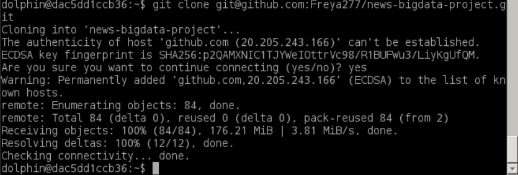

二. 启动 Hadoop


三. 将文件上传到 HDFS

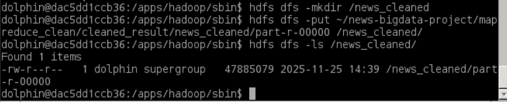

四. 启动 MySQL


五. 启动 Hive

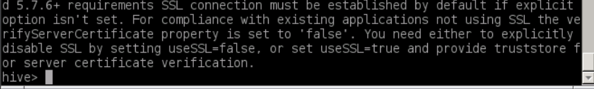

六. 创建 Hive 数据库

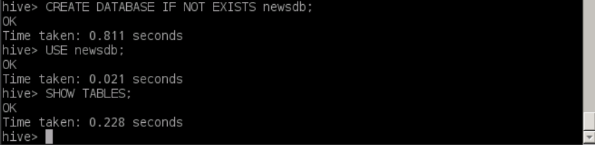

七. 创建新闻外部表

**外部表创建说明**：

```sql
CREATE EXTERNAL TABLE news_cleaned (
    category string,
    date string,
    authors string,
    headline string,
    short_description string
)
ROW FORMAT DELIMITED
FIELDS TERMINATED BY '\t'
STORED AS TEXTFILE
LOCATION '/news_cleaned';
```

**技术要点**：
- **EXTERNAL TABLE**：外部表的关键字，表示数据存储在 HDFS 上，Hive 只管理元数据（表结构、分区信息等）
- **字段类型**：所有字段定义为 `string` 类型，Hive 会自动处理字符串数据，适合文本型新闻数据
- **行格式定义**：`ROW FORMAT DELIMITED FIELDS TERMINATED BY '\t'` 指定字段分隔符为制表符，与 MapReduce 输出的 TSV 格式匹配
- **存储格式**：`STORED AS TEXTFILE` 指定为文本文件格式，便于直接查看和调试
- **数据位置**：`LOCATION '/news_cleaned'` 指向 HDFS 上的数据目录，Hive 会直接读取该路径下的所有文件

**外部表优势**：
- **数据安全**：删除表时不会删除 HDFS 数据，避免误操作导致数据丢失
- **数据共享**：多个 Hive 表或 Spark 作业可以共享同一份 HDFS 数据，无需复制
- **灵活管理**：可以在 Hive 外部直接操作 HDFS 数据，Hive 会自动感知数据变化

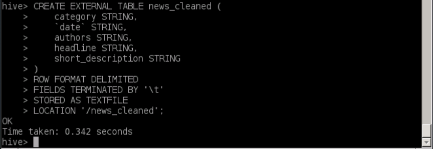

八. 验证数据是否正确加载

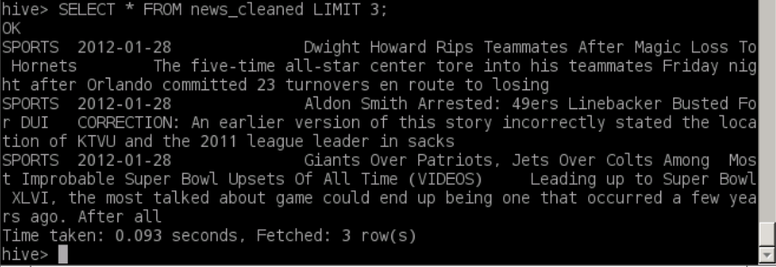

九. Hive 数据分析任务

#### 任务 1：按类别统计新闻数量

**查询设计说明**：

这是一个典型的**分组聚合查询**，展示了 Hive 在分类统计场景下的核心能力。

**查询逻辑**：
```sql
SELECT category, COUNT(*) AS cnt
FROM news_cleaned
GROUP BY category
ORDER BY cnt DESC;
```

**技术要点**：
- **GROUP BY category**：按类别分组，将相同类别的记录聚合在一起
- **COUNT(*)**：统计每个分组中的记录数量，`*` 表示统计所有行（包括 NULL 值）
- **ORDER BY cnt DESC**：按计数降序排序，便于查看最热门的新闻类别
- **执行计划**：Hive 会将此查询转换为 MapReduce 作业，Map 阶段按 category 分组，Reduce 阶段进行计数和排序

**保存到 HDFS**：

```sql
INSERT OVERWRITE DIRECTORY '/hive_output/category_count'
ROW FORMAT DELIMITED 
FIELDS TERMINATED BY '\t'
SELECT category, COUNT(*)
FROM news_cleaned
GROUP BY category;
```

**输出说明**：
- **INSERT OVERWRITE DIRECTORY**：将查询结果直接写入 HDFS 目录，`OVERWRITE` 表示如果目录已存在则覆盖
- **输出格式**：TSV 格式（制表符分隔），便于后续 Spark 或 HBase 读取
- **结果用途**：该结果将作为 Spark 热门类别分析的输入数据，实现 Hive 到 Spark 的数据流转

**查询结果分析**：
根据输出文件，可以观察到不同类别的新闻数量分布，例如 POLITICS（政治）类别包含最多的新闻，这反映了新闻数据集的类别分布特征。

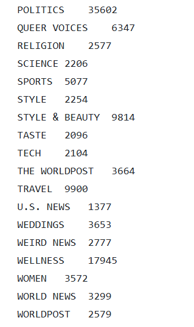

#### 任务 2：新闻最多的前 10 位作者

**查询设计说明**：

这是一个**Top-N 查询**，结合了数据过滤、分组聚合、排序和限制结果集，展示了 Hive 在排名分析场景下的综合能力。

**查询逻辑**：
```sql
SELECT authors, COUNT(*) AS cnt
FROM news_cleaned
WHERE authors IS NOT NULL AND authors != ''
GROUP BY authors
ORDER BY cnt DESC
LIMIT 10;
```

**技术要点**：
- **WHERE 子句过滤**：`authors IS NOT NULL AND authors != ''` 过滤掉空值和空字符串，确保只统计有效的作者数据
  - **数据质量保证**：由于 MapReduce 清洗阶段可能保留了空作者字段，需要在查询阶段进行二次过滤
  - **性能考虑**：WHERE 过滤在 GROUP BY 之前执行，可以减少需要处理的数据量
- **GROUP BY authors**：按作者分组，统计每个作者的文章数量
- **ORDER BY cnt DESC**：按文章数量降序排序，找出最活跃的作者
- **LIMIT 10**：限制结果集为前 10 条，实现 Top-10 查询

**保存到 HDFS**：

```sql
INSERT OVERWRITE DIRECTORY '/hive_output/top_authors'
ROW FORMAT DELIMITED
FIELDS TERMINATED BY '\t'
SELECT 
    authors, 
    COUNT(*) AS article_count 
FROM 
    news_cleaned
WHERE 
    authors IS NOT NULL AND authors != ''
GROUP BY 
    authors
ORDER BY 
    article_count DESC  
LIMIT 10;
```

**输出说明**：
- **字段别名**：使用 `article_count` 作为别名，使输出结果更具可读性
- **结果用途**：该结果可用于识别新闻平台的核心作者，为后续 Spark 作者影响力分析提供基础数据

**查询结果分析**：
输出结果展示了新闻数据集中最活跃的 10 位作者及其文章数量，这些作者可能是平台的核心内容贡献者，其影响力值得进一步分析。

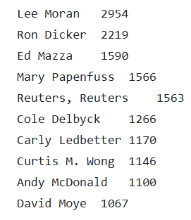

#### **任务 3：按年份统计新闻数量**

**查询设计说明**：

这是一个**时间维度分析查询**，通过字符串函数提取日期字段中的年份，实现按年份的聚合统计，展示了 Hive 在时间序列分析中的应用。

**日期字段处理**：

由于 `date` 字段格式如 `"2022-09-23"`（YYYY-MM-DD），可以用 `substr()` 函数提取前 4 个字符作为年份：

```sql
SELECT substr(`date`,1,4) AS year, COUNT(*) AS cnt
FROM news_cleaned
GROUP BY substr(`date`,1,4)
ORDER BY year;
```

**技术要点**：
- **字符串函数 substr()**：`substr(date, 1, 4)` 从日期字符串的第 1 个字符开始，提取 4 个字符（即年份部分）
  - **参数说明**：第一个参数是源字符串，第二个参数是起始位置（从 1 开始），第三个参数是提取长度
  - **日期格式假设**：此方法假设日期格式固定为 YYYY-MM-DD，如果格式不一致可能导致错误
- **反引号转义**：`date` 是 Hive 的保留关键字，使用反引号 `` `date` `` 可以避免语法冲突
- **GROUP BY 表达式**：`GROUP BY substr(date, 1, 4)` 使用与 SELECT 中相同的表达式，确保分组逻辑一致
- **ORDER BY year**：按年份升序排序，便于观察新闻数量随时间的变化趋势

**保存到 HDFS**：

```sql
INSERT OVERWRITE DIRECTORY '/hive_output/yearly_count'
ROW FORMAT DELIMITED
FIELDS TERMINATED BY '\t'
SELECT 
    substr(`date`, 1, 4) AS year,
    COUNT(*)
FROM 
    news_cleaned
GROUP BY 
    substr(`date`, 1, 4)  
ORDER BY 
    year;  
```

**输出说明**：
- **时间序列数据**：输出结果展示了不同年份的新闻数量分布，可用于分析新闻发布的时间趋势
- **结果用途**：该结果将存储到 HBase 的 `news_yearly_stats` 表中，支持按年份的快速查询

**查询结果分析**：
输出结果可以揭示新闻数据集的时间跨度（如 2012-2022），以及不同年份的新闻发布量变化，可能反映出新闻平台的发展历程或特定年份的重大事件影响。

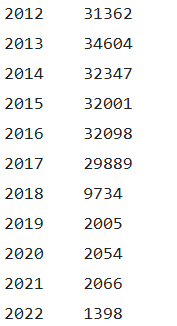

#### 任务 4：标题平均长度（文本特征分析）

**查询设计说明**：

这是一个**文本特征提取查询**，通过计算标题的平均长度，为后续 Spark MLlib 文本挖掘任务提供基础统计特征，展示了 Hive 在文本分析预处理中的应用。

**文本长度计算**：

Hive 中使用 `length()` 函数计算字符串长度（字符数）：

```sql
SELECT AVG(length(headline)) AS avg_headline_len 
FROM news_cleaned;
```

**技术要点**：
- **length() 函数**：计算字符串的字符数（不是字节数），对于英文文本，字符数等于字节数；对于包含中文等多字节字符的文本，需要注意编码问题
- **AVG() 聚合函数**：计算所有标题长度的平均值，这是一个标量聚合（返回单个值）
- **全表扫描**：此查询需要扫描整个表的所有记录，计算量大，但结果只有一个数值，适合作为全局特征

**保存到 HDFS**：

```sql
INSERT OVERWRITE DIRECTORY '/hive_output/headline_avglen'
ROW FORMAT DELIMITED 
FIELDS TERMINATED BY '\t'
SELECT AVG(length(headline))
FROM news_cleaned;
```

**输出说明**：
- **单值输出**：输出文件只包含一个数值（平均标题长度），例如 `61.35`，表示平均每个标题约 61 个字符
- **结果用途**：
  - 作为文本特征分析的基准值，用于判断标题长度的分布特征
  - 存储到 HBase 的 `news_yearly_stats` 表中（RowKey 为 "total"），支持全局统计查询
  - 为 Spark MLlib 的文本特征工程提供参考，例如在 TF-IDF 特征提取中，可以基于平均长度进行特征选择

**查询结果分析**：
平均标题长度反映了新闻标题的写作风格和长度规范。较长的标题可能包含更多信息，但也可能影响可读性；较短的标题可能更简洁，但信息量可能不足。这个特征可以用于：
- **文本分类**：不同类别的新闻可能有不同的标题长度特征
- **质量评估**：异常长或异常短的标题可能表示数据质量问题
- **特征工程**：在机器学习模型中，标题长度可以作为特征之一


十. 导出 Hive 结果到本地

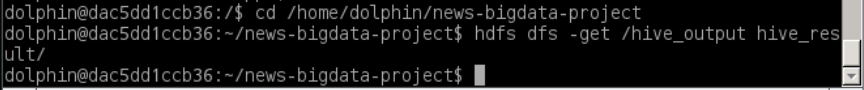

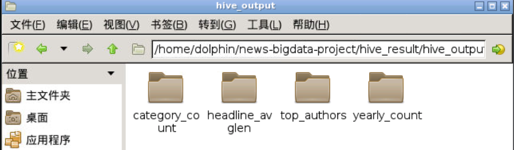

十一. push 至 GitHub

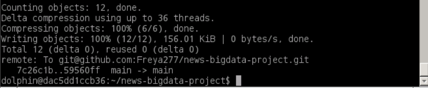

