## 使用 MapReduce 对 News Category Dataset 进行新闻类别统计与数据清洗

### 实验概述

本实验作为大数据处理技术项目的**基础数据预处理与分析阶段**，采用 Hadoop MapReduce 框架对大规模新闻数据集进行分布式处理。MapReduce 作为 Hadoop 生态系统的核心计算引擎，通过"分而治之"的并行计算模型，能够高效处理海量非结构化 JSON 数据。本实验设计了两个核心任务：**新闻类别统计分析**和**数据清洗转换**，前者展示了 MapReduce 在聚合统计场景下的强大能力，后者为后续 Hive、Spark、HBase 实验提供了标准化的结构化数据输入，体现了大数据流水线中数据预处理的关键作用。

### 数据集

News_Category_Dataset_v3.json：包含从 HuffPost 获得的 209527 条 2012 年至 2022 年的新闻头条。它可以帮助用户进行文本分类、主题建模等自然语言处理任务。数据集中的每一行记录都包括新闻标题、类别标签以及发布日期等信息。

每行包含：

```json
link
headline
category
short_description
authors
date
```

**数据集特点**：
- 格式：JSON Lines（每行一个 JSON 对象）
- 规模：包含大约二十万条新闻记录
- 字段：包含链接、标题、类别、短描述、作者、日期结构化信息
- 挑战：数据中存在格式不规范、字段缺失、JSON 解析异常等问题，需要健壮的错误处理机制

### 实验目标

#### **任务 1：新闻类别统计**

**目的：对新闻数据进行分类统计，输出每类新闻出现次数。**

**技术难点**：
- 处理大规模 JSON 数据的分布式解析，需要高效的 JSON 解析库（Jackson）
- 在 Map 阶段实现容错机制，过滤格式异常的 JSON 记录
- 利用 MapReduce 的 Shuffle 机制自动将相同类别的数据聚合到同一 Reducer
- 处理数据倾斜问题（某些类别可能包含大量记录，需要合理的分区策略）

输出格式：

```bash
CATEGORY   COUNT
```

此任务用于展示 MapReduce 在**分布式聚合统计**场景下的核心能力，通过 Map 阶段的并行解析和 Reduce 阶段的汇总计算，实现对海量数据的快速分类统计。

#### **任务 2：新闻数据清洗**

**目的：将原始 JSON Lines 数据清洗为 Hive 可加载的结构化 TSV 文件。**

**技术难点**：
- 实现多字段提取与格式转换，从嵌套 JSON 结构转换为扁平化 TSV 格式
- 设计数据质量校验规则，过滤关键字段缺失的脏数据
- 处理特殊字符和编码问题，确保 TSV 格式的字段分隔符（tab）不会与数据内容冲突
- 优化 MapReduce 作业配置，减少网络传输开销（使用 NullWritable 作为 Key 避免不必要的 Shuffle）

清洗内容包括：

- 过滤无效 JSON（通过异常捕获机制实现容错）
- 过滤关键信息为空（如 category、date、headline）的记录（数据质量保证）
- 提取字段：category、date、authors、headline、short_description（字段映射与转换）
- 输出 TSV 格式（字段以 tab 分隔，便于 Hive 直接加载）

该任务的输出将作为 Hive 实验的输入，体现了大数据流水线中**ETL（Extract-Transform-Load）**流程的 Extract 和 Transform 阶段。

### 实验步骤

#### **任务 1：新闻类别统计**

一. GitHub 仓库结构准备

```css
news-bigdata-project/
│
├── mapreduce/
│   ├── src/
│   │   ├── CategoryCountMapper.java
│   │   ├── CategoryCountReducer.java
│   │   └── CategoryCountDriver.java
│   ├── News_Category_Dataset_v3.json
│   ├── build.sh
│   └── README.md（非必须）
```

二. 克隆 GitHub 仓库

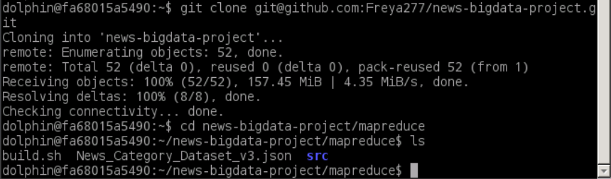

三. 启动 Hadoop

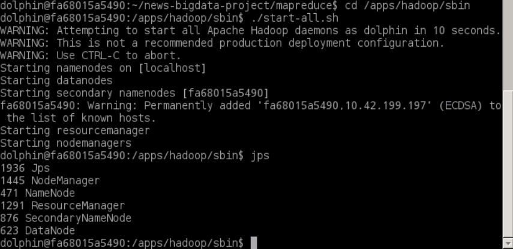

四. 将 JSON 数据上传到 HDFS

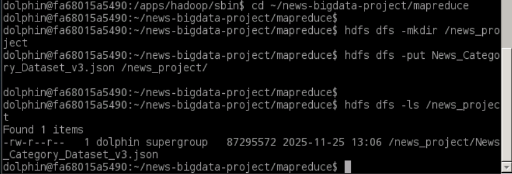

五. 编写 MapReduce 程序

在 GitHub 中放入以下文件：

- src/CategoryCountMapper.java
- src/CategoryCountReducer.java
- src/CategoryCountDriver.java

这些代码用于：

- 解析 JSON 行
- 取出 `"category"` 字段
- 实现类别计数

1. CategoryCountMapper.java

   ```java
   package mapreduce;
   
   import java.io.IOException;
   import org.apache.hadoop.io.IntWritable;
   import org.apache.hadoop.io.LongWritable;
   import org.apache.hadoop.io.Text;
   import org.apache.hadoop.mapreduce.Mapper;
   import com.fasterxml.jackson.databind.JsonNode;
   import com.fasterxml.jackson.databind.ObjectMapper;
   
   public class CategoryCountMapper extends Mapper<LongWritable, Text, Text, IntWritable> {
       private final static IntWritable one = new IntWritable(1);
       private Text category = new Text();
       private ObjectMapper jsonMapper = new ObjectMapper();
   
       @Override
       protected void map(LongWritable key, Text value, Context context) throws IOException, InterruptedException {
           try {
               JsonNode node = jsonMapper.readTree(value.toString());
               String cat = node.get("category").asText();
               category.set(cat);
               context.write(category, one);
           } catch (Exception e) {
               // Ignore malformed JSON
           }
       }
   }
   ```

**CategoryCountMapper 类详解**：

这是 MapReduce 作业的 **Map 阶段处理类**，负责将输入的 JSON 格式新闻数据转换为键值对形式，为后续的聚合统计做准备。

**核心设计要点**：
- **继承 Mapper 泛型类**：`Mapper<LongWritable, Text, Text, IntWritable>` 定义了输入输出类型
  - 输入：`LongWritable`（行偏移量）、`Text`（JSON 字符串）
  - 输出：`Text`（类别名）、`IntWritable`（计数 1）
- **使用 Jackson 库进行 JSON 解析**：`ObjectMapper` 是高性能的 JSON 解析工具，能够高效处理大规模数据流
- **容错机制**：通过 try-catch 捕获 JSON 解析异常，自动跳过格式错误的记录，确保作业不会因个别脏数据而失败
- **对象复用优化**：将 `IntWritable one` 和 `Text category` 声明为类成员变量，避免在 map 方法中频繁创建对象，减少 GC 压力
- **输出键值对设计**：输出 `(category, 1)` 键值对，其中 value 固定为 1，表示该类别出现一次；后续在 Shuffle 阶段，相同 category 的记录会被自动聚合到同一个 Reducer

**执行流程**：每个 Map Task 并行处理 HDFS 上的数据分片，对每条 JSON 记录提取 category 字段并输出 `(category, 1)`，实现了分布式并行解析。
2. CategoryCountReducer.java

   ```java
   package mapreduce;
   
   import java.io.IOException;
   import org.apache.hadoop.io.IntWritable;
   import org.apache.hadoop.io.Text;
   import org.apache.hadoop.mapreduce.Reducer;
   
   public class CategoryCountReducer extends Reducer<Text, IntWritable, Text, IntWritable> {
   
       @Override
       protected void reduce(Text key, Iterable<IntWritable> values, Context context) 
           throws IOException, InterruptedException {
   
           int sum = 0;
           for (IntWritable val : values) {
               sum += val.get();
           }
           context.write(key, new IntWritable(sum));
       }
   }
   ```

**CategoryCountReducer 类详解**：

这是 MapReduce 作业的 **Reduce 阶段处理类**，负责对 Map 阶段输出的键值对进行聚合计算，实现最终的类别统计。

**核心设计要点**：
- **继承 Reducer 泛型类**：`Reducer<Text, IntWritable, Text, IntWritable>` 定义了输入输出类型
  - 输入：`Text`（类别名）、`Iterable<IntWritable>`（该类别对应的所有计数 1 的集合）
  - 输出：`Text`（类别名）、`IntWritable`（该类别的总计数）
- **Shuffle 机制的作用**：在 Map 和 Reduce 之间，Hadoop 框架会自动执行 Shuffle 操作，将相同 key（category）的所有 value（1）聚合到同一个 Reducer，这是 MapReduce 实现分布式聚合的核心机制
- **迭代器模式**：`Iterable<IntWritable> values` 是一个迭代器，不能直接获取大小，必须通过遍历累加；这种设计避免了将大量数据加载到内存，支持处理任意大小的数据集合
- **累加逻辑**：遍历所有 value，将每个 IntWritable 的值累加到 sum 中，最终得到该类别的总出现次数
- **输出结果**：输出 `(category, totalCount)` 键值对，完成该类别的统计

**执行流程**：每个 Reducer 处理一个或多个类别（取决于分区策略），对每个类别累加其所有计数，输出最终的统计结果。多个 Reducer 并行工作，实现高效的分布式聚合计算。

3. CategoryCountDriver.java

   ```java
   package mapreduce;
   
   import org.apache.hadoop.conf.Configuration;
   import org.apache.hadoop.fs.Path;
   import org.apache.hadoop.mapreduce.Job;
   import org.apache.hadoop.mapreduce.lib.input.TextInputFormat;
   import org.apache.hadoop.mapreduce.lib.output.TextOutputFormat;
   import org.apache.hadoop.io.Text;
   import org.apache.hadoop.io.IntWritable;
   
   public class CategoryCountDriver {
       public static void main(String[] args) throws Exception {
           Configuration conf = new Configuration();
           Job job = Job.getInstance(conf, "News Category Count");
   
           job.setJarByClass(CategoryCountDriver.class);
           job.setMapperClass(CategoryCountMapper.class);
           job.setReducerClass(CategoryCountReducer.class);
   
           job.setOutputKeyClass(Text.class);
           job.setOutputValueClass(IntWritable.class);
   
           TextInputFormat.addInputPath(job, new Path(args[0]));
           TextOutputFormat.setOutputPath(job, new Path(args[1]));
   
           System.exit(job.waitForCompletion(true) ? 0 : 1);
       }
   }
   ```

**CategoryCountDriver 类详解**：

这是 MapReduce 作业的 **驱动类（Driver）**，负责配置作业参数、提交作业到 Hadoop 集群并监控执行状态。

**核心设计要点**：
- **Configuration 对象**：封装了 Hadoop 集群的配置信息（如 HDFS 地址、资源管理器地址等），作业会根据这些配置连接到集群
- **Job 对象**：代表一个完整的 MapReduce 作业，通过 `Job.getInstance()` 创建，第二个参数是作业名称，用于在集群管理界面中标识该作业
- **setJarByClass()**：指定包含 Mapper 和 Reducer 类的 JAR 包，Hadoop 会将此 JAR 分发到各个节点执行
- **Mapper/Reducer 类绑定**：通过 `setMapperClass()` 和 `setReducerClass()` 指定具体的处理类
- **输出类型声明**：`setOutputKeyClass()` 和 `setOutputValueClass()` 声明最终输出的键值对类型，Hadoop 会据此进行序列化
- **输入输出路径**：通过 `TextInputFormat.addInputPath()` 指定输入路径（支持目录，会自动处理目录下所有文件），通过 `TextOutputFormat.setOutputPath()` 指定输出路径（必须不存在，避免覆盖）
- **作业提交与监控**：`job.waitForCompletion(true)` 提交作业并等待完成，参数 true 表示打印进度信息；返回 true 表示成功，false 表示失败

**执行流程**：Driver 类在客户端运行，将作业配置和代码打包提交到 Hadoop 集群；ResourceManager 分配资源，NodeManager 启动 Map Task 和 Reduce Task；作业完成后返回执行结果。
六. 编译 MapReduce 程序

**编译说明**：MapReduce 程序需要编译为 JAR 包才能在 Hadoop 集群上运行。编译过程需要包含 Hadoop 的核心库和第三方依赖（如 Jackson JSON 库）。

build.sh 内容：

```bash
#!/bin/bash
mkdir -p build

javac -cp $(hadoop classpath):./lib/* -d build src/*.java

jar -cvf categorycount.jar -C build .
```

**编译脚本详解**：
- **`hadoop classpath`**：动态获取 Hadoop 安装目录下的所有 JAR 包路径，确保编译时能找到 Hadoop API（如 Mapper、Reducer 等类）
- **`./lib/*`**：包含项目依赖的第三方库（如 Jackson 的 `jackson-databind.jar`），用于 JSON 解析
- **`-d build`**：指定编译输出目录，将 `.class` 文件输出到 `build` 目录
- **`jar -cvf`**：创建 JAR 包
  - `-c`：创建新的归档文件
  - `-v`：显示详细输出
  - `-f`：指定 JAR 文件名
  - `-C build .`：从 `build` 目录开始，将所有 `.class` 文件打包到 JAR 的根目录

**编译结果**：生成 `categorycount.jar`，包含所有编译后的类文件和必要的包结构，可直接通过 `hadoop jar` 命令提交到集群执行。

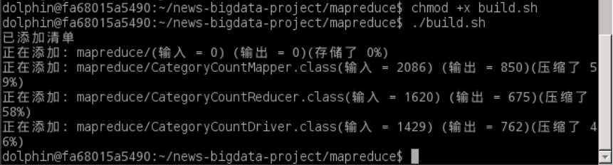

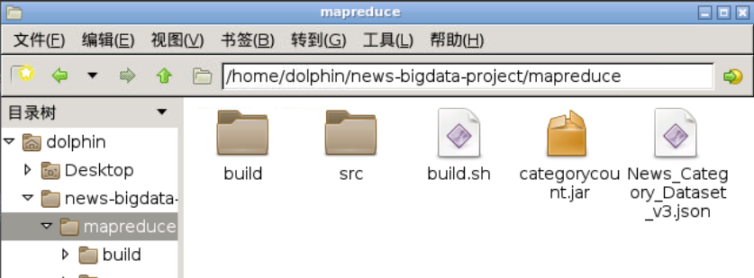

七. 运行 MapReduce 程序

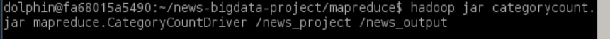

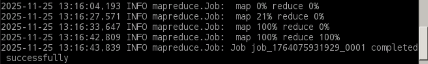

八. 查看 HDFS 结果

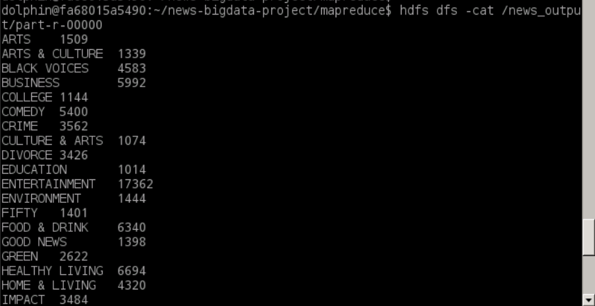

九. 将结果从 HDFS 下载到本地

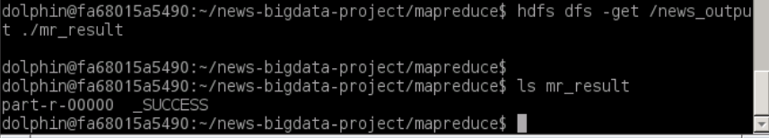

十. 将最终文件推送回 GitHub

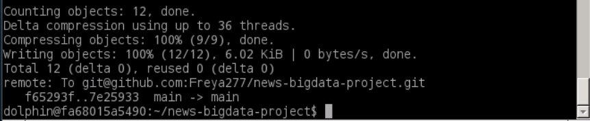

#### **任务 2：新闻数据清洗**

一. GitHub 仓库结构准备

```css
news-bigdata-project/
│
├── mapreduce_clean/
│   ├── src/
│   │   ├── CleanMapper.java
│   │   ├── CleanReducer.java
│   │   └── CleanDriver.java
│   ├── News_Category_Dataset_v3.json
│   ├── build.sh
│   └── README.md（非必须）
```

二. 克隆 GitHub 仓库

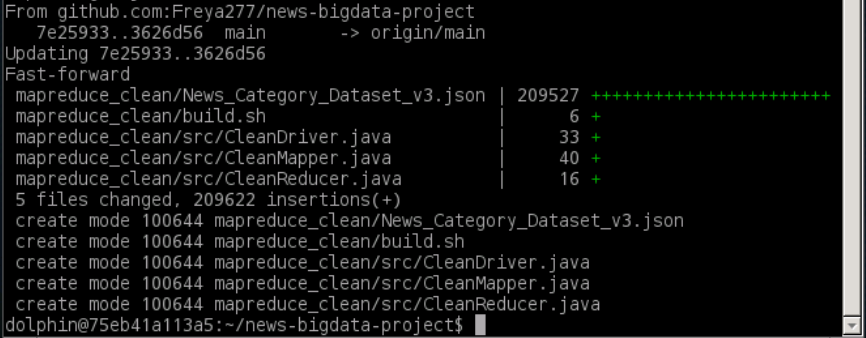

三. 启动 Hadoop

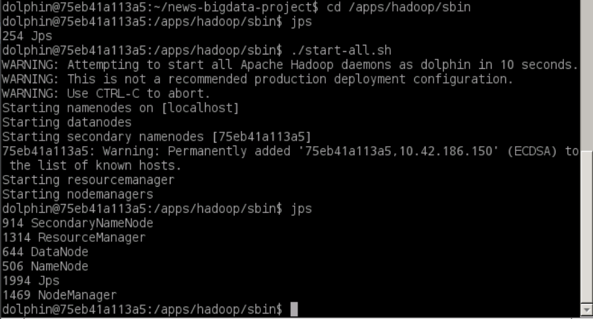

四. 将 JSON 数据上传到 HDFS

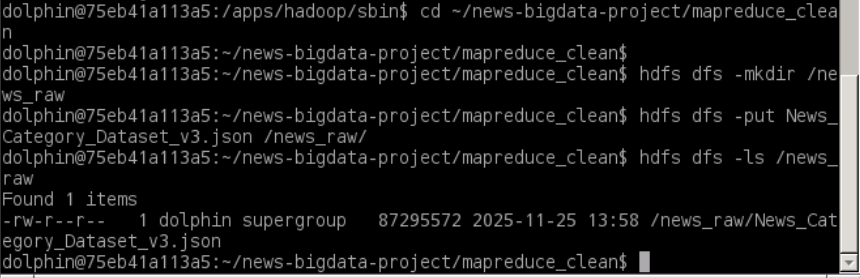

五. 编写 MapReduce 程序

1. CleanMapper.java

   ```java
   package mapreduce_clean;
   
   import java.io.IOException;
   import org.apache.hadoop.io.LongWritable;
   import org.apache.hadoop.io.NullWritable;
   import org.apache.hadoop.io.Text;
   import org.apache.hadoop.mapreduce.Mapper;
   import com.fasterxml.jackson.databind.JsonNode;
   import com.fasterxml.jackson.databind.ObjectMapper;
   
   public class CleanMapper extends Mapper<LongWritable, Text, NullWritable, Text> {
   
       private ObjectMapper json = new ObjectMapper();
       private Text cleaned = new Text();
   
       @Override
       protected void map(LongWritable key, Text value, Context context)
               throws IOException, InterruptedException {
           try {
               JsonNode node = json.readTree(value.toString());
   
               String category = node.get("category").asText();
               String date = node.get("date").asText();
               String authors = node.get("authors").asText();
               String headline = node.get("headline").asText();
               String shortDesc = node.get("short_description").asText();
   
               if (category.isEmpty() || date.isEmpty() || headline.isEmpty()) return;
   
               String out = category + "\t" + date + "\t" +
                            authors + "\t" + headline + "\t" + shortDesc;
   
               cleaned.set(out);
               context.write(NullWritable.get(), cleaned);
   
           } catch (Exception e) {
               // skip invalid JSON
           }
       }
   }
   ```

**CleanMapper 类详解**：

这是数据清洗作业的 **Map 阶段处理类**，负责将 JSON 格式的原始数据转换为结构化的 TSV 格式，并实现数据质量校验。

**核心设计要点**：
- **输出 Key 使用 NullWritable**：`Mapper<LongWritable, Text, NullWritable, Text>` 中输出 Key 为 `NullWritable`，这是一个特殊的 Hadoop 类型，表示"空键"。使用 NullWritable 的优势：
  - **减少网络传输**：所有记录的 Key 都是相同的空值，Shuffle 阶段不需要传输 Key 数据，节省网络带宽
  - **避免不必要的排序**：由于 Key 都相同，Shuffle 阶段的排序操作可以优化或跳过
  - **简化 Reduce 逻辑**：Reducer 接收到的所有记录都属于同一个 Key，可以直接输出，无需复杂聚合
- **多字段提取**：从 JSON 对象中提取 5 个关键字段（category、date、authors、headline、short_description），实现从嵌套结构到扁平结构的转换
- **数据质量校验**：通过 `if (category.isEmpty() || date.isEmpty() || headline.isEmpty())` 检查关键字段是否为空，过滤掉不符合质量要求的记录，确保输出数据的完整性
- **TSV 格式构建**：使用制表符（`\t`）作为字段分隔符，构建标准的 TSV 格式，便于后续 Hive 直接加载
- **容错机制**：通过 try-catch 捕获 JSON 解析异常，自动跳过格式错误的记录，保证作业的健壮性

**执行流程**：每个 Map Task 并行处理数据分片，对每条 JSON 记录进行解析、校验和格式转换，输出清洗后的 TSV 格式数据。由于使用 NullWritable 作为 Key，所有有效记录都会被发送到同一个 Reducer（或根据分区策略分配到多个 Reducer）。
2. CleanReducer.java

   ```java
   package mapreduce_clean;
   
   import java.io.IOException;
   import org.apache.hadoop.io.NullWritable;
   import org.apache.hadoop.io.Text;
   import org.apache.hadoop.mapreduce.Reducer;
   
   public class CleanReducer extends Reducer<NullWritable, Text, NullWritable, Text> {
       @Override
       protected void reduce(NullWritable key, Iterable<Text> values, Context context)
               throws IOException, InterruptedException {
           for (Text t : values) {
               context.write(NullWritable.get(), t);
           }
       }
   }
   ```

**CleanReducer 类详解**：

这是数据清洗作业的 **Reduce 阶段处理类**，由于清洗的核心逻辑（解析、校验、格式转换）已在 Map 阶段完成，Reducer 仅负责将清洗后的数据直接输出。

**核心设计要点**：
- **Pass-through 模式**：Reducer 不执行任何聚合或转换操作，只是将 Map 阶段输出的数据原样传递，这种模式称为"直通式"处理
- **为什么需要 Reducer**：虽然逻辑简单，但 Reducer 仍然必要，因为：
  - **数据分区与排序**：即使 Key 都是 NullWritable，Hadoop 框架仍会进行分区和排序，确保数据有序输出
  - **输出文件数量控制**：通过设置 Reducer 数量，可以控制最终输出文件的个数（每个 Reducer 产生一个输出文件）
  - **容错与重试**：Reducer 提供了额外的容错机制，如果某个 Reducer 失败，可以单独重试而不影响其他 Reducer
- **迭代器遍历**：`Iterable<Text> values` 包含所有发送到该 Reducer 的清洗后记录，通过简单的 for 循环遍历并输出
- **输出格式保持一致**：输出 Key 仍为 NullWritable，Value 为清洗后的 TSV 格式文本，与 Map 阶段输出格式一致

**执行流程**：每个 Reducer 接收来自多个 Map Task 的清洗后数据，由于所有记录的 Key 都是 NullWritable，它们会被聚合到同一个 Reducer（或根据分区策略分配到多个 Reducer）。Reducer 遍历所有记录并直接输出，最终生成结构化的 TSV 文件，供后续 Hive 实验使用。
3. CleanDriver.java

   ```java
   package mapreduce_clean;
   
   import org.apache.hadoop.conf.Configuration;
   import org.apache.hadoop.fs.Path;
   
   import org.apache.hadoop.mapreduce.Job;
   import org.apache.hadoop.mapreduce.lib.input.FileInputFormat;
   import org.apache.hadoop.mapreduce.lib.output.FileOutputFormat;
   
   public class CleanDriver {
       public static void main(String[] args) throws Exception {
   
           if (args.length != 2) {
               System.err.println("Usage: CleanDriver <input> <output>");
               System.exit(-1);
           }
   
           Configuration conf = new Configuration();
           Job job = Job.getInstance(conf, "News_Clean");
   
           job.setJarByClass(CleanDriver.class);
           job.setMapperClass(CleanMapper.class);
           job.setReducerClass(CleanReducer.class);
   
           job.setOutputKeyClass(org.apache.hadoop.io.NullWritable.class);
           job.setOutputValueClass(org.apache.hadoop.io.Text.class);
   
           FileInputFormat.addInputPath(job, new Path(args[0]));
           FileOutputFormat.setOutputPath(job, new Path(args[1]));
   
           System.exit(job.waitForCompletion(true) ? 0 : 1);
       }
   }
   ```

**CleanDriver 类详解**：

这是数据清洗作业的 **驱动类**，负责配置作业参数、参数校验和作业提交。

**核心设计要点**：
- **参数校验**：通过 `if (args.length != 2)` 检查命令行参数数量，确保输入路径和输出路径都已提供，提高程序的健壮性和用户体验
- **输入输出格式类**：使用 `FileInputFormat` 和 `FileOutputFormat`（而非任务 1 的 `TextInputFormat` 和 `TextOutputFormat`），两者功能类似，都是处理文本文件的输入输出格式
- **输出类型配置**：`setOutputKeyClass(NullWritable.class)` 和 `setOutputValueClass(Text.class)` 明确声明输出类型，与 Mapper/Reducer 的输出类型保持一致
- **作业命名**：作业名称为 "News_Clean"，在 Hadoop 集群管理界面（如 YARN ResourceManager Web UI）中可以清晰识别该作业的用途

**与任务 1 的对比**：
- 任务 1 使用 `TextInputFormat`/`TextOutputFormat`，任务 2 使用 `FileInputFormat`/`FileOutputFormat`，两者在功能上等价，都是处理文本文件的标准格式
- 任务 1 的输出类型是 `(Text, IntWritable)`（键值对统计结果），任务 2 的输出类型是 `(NullWritable, Text)`（无键的清洗后数据）
- 两个任务的 Driver 类结构相似，体现了 MapReduce 编程模型的统一性

**执行流程**：Driver 在客户端运行，验证参数后创建 Job 对象并配置各项参数，提交作业到 Hadoop 集群；集群执行 Map 和 Reduce 任务，完成数据清洗并输出 TSV 格式文件。
六. 编译 MapReduce 程序

**编译说明**：数据清洗任务的编译过程与任务 1 相同，都需要包含 Hadoop 核心库和 Jackson JSON 库。编译脚本生成 `clean.jar`，用于提交清洗作业。

build.sh 内容：

```bash
#!/bin/bash
mkdir -p build

javac -cp $(hadoop classpath):./lib/* -d build src/*.java

jar -cvf clean.jar -C build .
```

**编译要点**：
- 依赖项与任务 1 相同：Hadoop 核心库（Mapper、Reducer、Job 等 API）和 Jackson 库（JSON 解析）
- 输出 JAR 文件名：`clean.jar`，与任务 1 的 `categorycount.jar` 区分
- 编译后的类文件包含完整的包结构（`mapreduce_clean` 包），确保运行时类加载正确

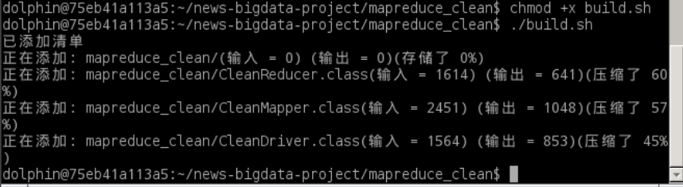

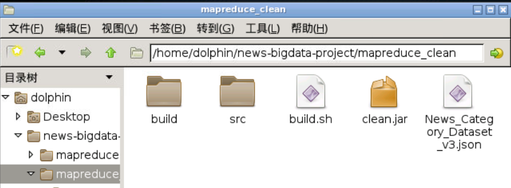

七. 运行 MapReduce 程序

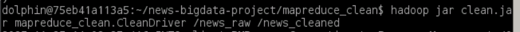

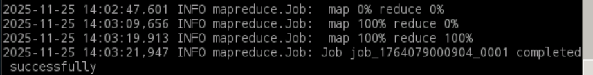

八. 查看 HDFS 结果


九. 将结果从 HDFS 下载到本地

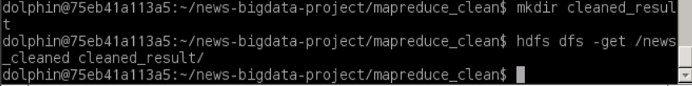

十. 将最终文件推送回 GitHub

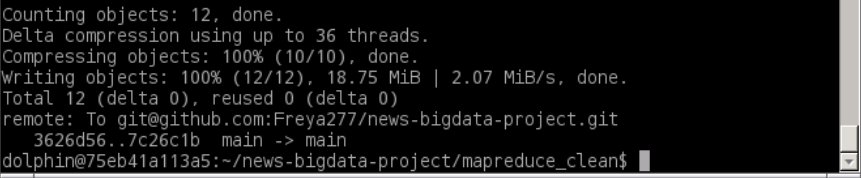

