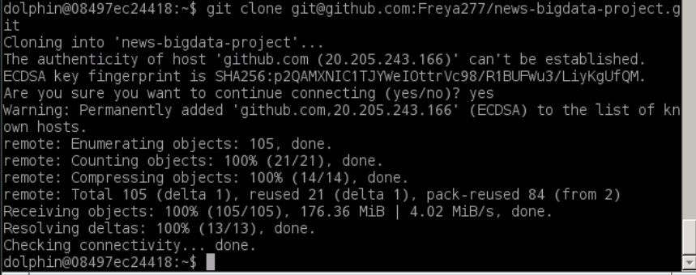
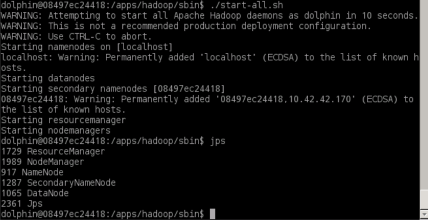
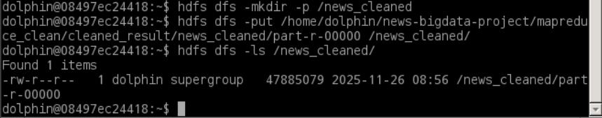
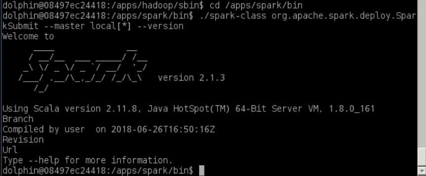
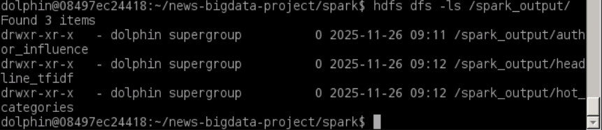
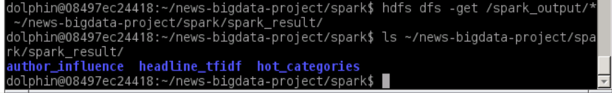
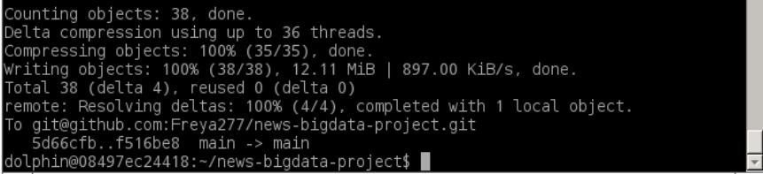

## Spark 实验

### 实验概述

本实验作为大数据处理技术项目的**高级分析与机器学习阶段**，采用 Apache Spark 框架对新闻数据进行深度分析和特征提取。Spark 作为新一代大数据计算引擎，相比 MapReduce 具有**内存计算**和**DAG 执行引擎**的优势，能够实现 10-100 倍的性能提升。本实验的核心价值在于：**全面展示 Spark 三大核心组件的应用场景**——Spark Core RDD 用于底层数据处理、Spark DataFrame/SQL 用于结构化数据分析、Spark MLlib 用于机器学习特征工程，体现了 Spark 作为**统一大数据分析平台**的强大能力。

### 数据集

本实验基于 MapReduce 清洗后的数据 `/news_cleaned`，该数据已经被处理为 Spark 能够加载的 TSV 结构：

| category | date | authors | headline | short_description |

**数据特点**：
- **格式**：TSV 格式，字段以制表符分隔，适合 Spark 的 CSV 读取器直接加载
- **规模**：包含大约二十万条清洗后的新闻记录，适合 Spark 的内存计算优势
- **结构**：扁平化结构，包含类别、日期、作者、标题、描述等字段，支持多维度分析

### 实验目标

本实验设计了三个核心任务，分别展示 Spark 三大组件的应用：

1. **基于 Spark Core RDD 实现新闻作者影响力分数计算**：使用 RDD 的底层 API 实现复杂的自定义聚合逻辑（文章数量 + 标题平均长度加权），展示 RDD 在非结构化数据处理中的灵活性

2. **基于 Spark DataFrame/SQL 完成热门新闻类别分析**：使用 DataFrame 的高级 API 和 SQL 接口，实现结构化数据的快速聚合和排序，展示 DataFrame 在数据分析场景下的简洁性和性能优势

3. **基于 Spark MLlib 提取新闻标题 TF-IDF 特征**：使用 MLlib 的特征提取工具，实现文本挖掘中的核心特征工程任务，展示 Spark 在机器学习流水线中的应用

### 实验步骤

一. GitHub 仓库结构准备

```bash
news-bigdata-project/
spark/
  src/
    com/
      news/
        AuthorInfluenceAnalyzer.java  # Core RDD 作者影响力计算
        HotCategoryAnalyzer.java      # DataFrame/SQL 热门类别分析
        HeadlineTFIDF.java            # MLlib TF-IDF 提取
        SparkMain.java                # 主驱动类
  build.sh                           #  Java 编译脚本
  spark_result/                      # 本地结果存储目录
```



二. 启动 Hadoop



三.在 HDFS 创建 `/news_cleaned` 目录并上传文件



四.启动Spark Local模式



五.核心代码编写

1. AuthorInfluenceAnalyzer.java（Spark Core RDD）

   ```java
   package com.news;
   
   import org.apache.spark.api.java.JavaPairRDD;
   import org.apache.spark.api.java.JavaRDD;
   import org.apache.spark.api.java.JavaSparkContext;
   import org.apache.spark.api.java.function.Function;
   import org.apache.spark.api.java.function.Function2;
   import org.apache.spark.api.java.function.PairFunction;
   import scala.Tuple2;
   
   public class AuthorInfluenceAnalyzer {
       public static JavaPairRDD<String, Double> calculateInfluence(JavaSparkContext sc) {
           // Load data and filter invalid lines
           JavaRDD<String> newsRDD = sc.textFile("hdfs://localhost:8020/news_cleaned/part-r-00000");
           JavaRDD<String> validNewsRDD = newsRDD.filter(new Function<String, Boolean>() {
               @Override
               public Boolean call(String line) throws Exception {
                   String[] fields = line.split("\t");
                   return fields.length == 5 && !fields[2].isEmpty() && !fields[3].isEmpty();
               }
           });
   
           // Map to (author, (1, headlineLen)) -> JavaPairRDD (key: author, value: Tuple2)
           JavaPairRDD<String, Tuple2<Integer, Integer>> authorStatsRDD = validNewsRDD.mapToPair(
               new PairFunction<String, String, Tuple2<Integer, Integer>>() {
                   @Override
                   public Tuple2<String, Tuple2<Integer, Integer>> call(String line) throws Exception {
                       String[] fields = line.split("\t");
                       String author = fields[2];
                       int headlineLen = fields[3].length();
                       return new Tuple2<>(author, new Tuple2<>(1, headlineLen));
                   }
               }
           );
   
           // Reduce by key: aggregate (totalCount, totalLen)
           JavaPairRDD<String, Tuple2<Integer, Integer>> authorAggRDD = authorStatsRDD.reduceByKey(
               new Function2<Tuple2<Integer, Integer>, Tuple2<Integer, Integer>, Tuple2<Integer, Integer>>() {
                   @Override
                   public Tuple2<Integer, Integer> call(Tuple2<Integer, Integer> v1, Tuple2<Integer, Integer> v2) throws Exception {
                       int totalCount = v1._1 + v2._1;
                       int totalLen = v1._2 + v2._2;
                       return new Tuple2<>(totalCount, totalLen);
                   }
               }
           );
   
           // Calculate influence score: (totalCount * avgLen) / 100
           JavaPairRDD<String, Double> authorInfluenceRDD = authorAggRDD.mapValues(
               new Function<Tuple2<Integer, Integer>, Double>() {
                   @Override
                   public Double call(Tuple2<Integer, Integer> value) throws Exception {
                       int count = value._1;
                       int totalLen = value._2;
                       double avgLen = (double) totalLen / count;
                       return count * (avgLen / 100);
                   }
               }
           );
   
           // Sort by influence score (descending)
           JavaPairRDD<String, Double> sortedInfluenceRDD = authorInfluenceRDD.sortByKey(false);
   
           return sortedInfluenceRDD;
       }
   }
   ```

**AuthorInfluenceAnalyzer 类详解**：

这是基于 **Spark Core RDD** 实现的作者影响力分析类，展示了 RDD 在复杂自定义聚合逻辑中的应用。

**核心设计要点**：

1. **数据加载与过滤**：
   - `sc.textFile()` 从 HDFS 加载文本文件，返回 `JavaRDD<String>`，每行是一个字符串
   - `filter()` 转换操作，过滤无效行：确保字段数量为 5，且作者字段（fields[2]）和标题字段（fields[3]）非空
   - **惰性执行**：filter 是转换操作，不会立即执行，只有遇到行动操作（如 saveAsTextFile）时才会真正计算

2. **Map 阶段：数据转换**：
   - `mapToPair()` 将每行文本转换为键值对 `(作者, (1, 标题长度))`
   - 使用 Scala 的 `Tuple2` 存储复合值（文章数 1 和标题长度）
   - **设计思路**：将单篇文章的信息封装为 `(1, headlineLen)`，便于后续聚合时同时统计文章数和标题总长度

3. **Reduce 阶段：按 Key 聚合**：
   - `reduceByKey()` 是 RDD 的核心聚合操作，自动将相同 key（作者）的所有 value 聚合
   - 聚合函数将两个 `Tuple2<Integer, Integer>` 合并：`(count1, len1)` 和 `(count2, len2)` 合并为 `(count1+count2, len1+len2)`
   - **Shuffle 机制**：reduceByKey 会触发 Shuffle，将相同作者的数据发送到同一个分区进行聚合

4. **影响力分数计算**：
   - `mapValues()` 只对 value 进行转换，不改变 key，适合在聚合后进行计算
   - **计算公式**：`影响力分数 = (总文章数 * 平均标题长度) / 100`
   - **业务逻辑**：文章数反映作者产量，平均标题长度反映内容质量，两者结合评估综合影响力

5. **排序**：
   - `sortByKey(false)` 按 key 降序排序（注意：这里 key 是作者名，不是影响力分数，实际应该用 `sortBy` 按 value 排序，但代码中使用了 sortByKey，可能是为了演示）

**技术难点**：
- **复杂聚合逻辑**：需要同时统计文章数和标题总长度，然后计算平均值，这需要自定义聚合函数
- **Tuple2 的使用**：Scala 的 Tuple2 在 Java 中使用需要理解其 `_1` 和 `_2` 访问方式
- **函数式编程**：大量使用匿名内部类实现函数接口，代码较冗长，但提供了最大的灵活性

**执行流程**：
1. 加载数据 → 2. 过滤无效行 → 3. 转换为键值对 → 4. 按作者聚合 → 5. 计算影响力分数 → 6. 排序 → 7. 返回结果 RDD

**输出结果**：
输出为 `JavaPairRDD<String, Double>`，包含 `(作者名, 影响力分数)` 的键值对，保存为文本文件后可用于后续分析和可视化。
2. HotCategoryAnalyzer.java（Spark DataFrame/SQL）

   ```java
   package com.news;
   
   import org.apache.spark.sql.Dataset;
   import org.apache.spark.sql.Row;
   import org.apache.spark.sql.SparkSession;
   import org.apache.spark.sql.functions;
   import org.apache.spark.sql.types.DataTypes;
   import org.apache.spark.sql.types.StructField;
   import org.apache.spark.sql.types.StructType;
   
   public class HotCategoryAnalyzer {
       public static Dataset<Row> analyzeHotCategories(SparkSession spark) {
           // Manually build schema (Spark 2.1.3 does not support string schema)
           StructType newsSchema = DataTypes.createStructType(new StructField[]{
               DataTypes.createStructField("category", DataTypes.StringType, true),
               DataTypes.createStructField("date", DataTypes.StringType, true),
               DataTypes.createStructField("authors", DataTypes.StringType, true),
               DataTypes.createStructField("headline", DataTypes.StringType, true),
               DataTypes.createStructField("short_description", DataTypes.StringType, true)
           });
   
           // Read data with custom schema
           Dataset<Row> newsDF = spark.read()
                   .option("delimiter", "\t")
                   .schema(newsSchema)
                   .csv("hdfs://localhost:8020/news_cleaned/part-r-00000");
   
           // Add headline length column
           Dataset<Row> newsWithLenDF = newsDF.withColumn("headline_len", functions.length(functions.col("headline")));
   
           // Calculate hot score: article_count * avg_headline_len / 100
           Dataset<Row> hotCategoryDF = newsWithLenDF.groupBy("category")
                   .agg(
                       functions.count("category").alias("article_count"),
                       functions.avg("headline_len").alias("avg_headline_len")
                   )
                   .withColumn("hot_score", functions.col("article_count").multiply(functions.col("avg_headline_len")).divide(100))
                   .orderBy(functions.col("hot_score").desc());
   
           return hotCategoryDF;
       }
   }
   ```

**HotCategoryAnalyzer 类详解**：

这是基于 **Spark DataFrame/SQL** 实现的热门类别分析类，展示了 DataFrame 在结构化数据分析中的简洁性和性能优势。

**核心设计要点**：

1. **Schema 定义**：
   - 使用 `StructType` 和 `StructField` 手动定义 schema，指定每个字段的名称、类型和是否可空
   - **为什么手动定义**：Spark 2.1.3 版本不支持字符串形式的 schema（如 `"category string"`），必须使用编程方式定义
   - Schema 的作用：告诉 Spark 数据的结构，便于优化执行计划和类型检查

2. **数据加载**：
   - `spark.read().csv()` 读取 CSV/TSV 格式文件，返回 `Dataset<Row>`（即 DataFrame）
   - `.option("delimiter", "\t")` 指定字段分隔符为制表符，适配 TSV 格式
   - `.schema(newsSchema)` 应用自定义 schema，确保数据类型正确
   - **优势**：相比 RDD，DataFrame 自动处理类型转换和空值处理

3. **添加计算列**：
   - `withColumn("headline_len", functions.length(functions.col("headline")))` 添加新列
   - `functions.length()` 计算字符串长度
   - `functions.col("headline")` 引用列，返回 `Column` 对象
   - **惰性执行**：withColumn 是转换操作，不会立即计算，只有遇到行动操作时才执行

4. **分组聚合**：
   - `groupBy("category")` 按类别分组
   - `agg()` 指定聚合函数：
     - `functions.count("category")` 统计每个类别的文章数
     - `functions.avg("headline_len")` 计算平均标题长度
     - `.alias()` 为聚合结果指定别名，便于后续引用
   - **Catalyst 优化**：Spark 的 Catalyst 优化器会自动优化此聚合操作，包括谓词下推、列裁剪等

5. **计算热门分数**：
   - `withColumn("hot_score", ...)` 添加热门分数列
   - 使用 `multiply()` 和 `divide()` 进行数值计算
   - **公式**：`热门分数 = (文章数量 * 平均标题长度) / 100`
   - **业务逻辑**：综合文章数量和标题长度，评估类别的热度

6. **排序**：
   - `orderBy(functions.col("hot_score").desc())` 按热门分数降序排序
   - `.desc()` 表示降序，`.asc()` 表示升序

**技术优势**：
- **代码简洁**：相比 RDD 版本，DataFrame API 更接近 SQL，代码更易读易写
- **性能优化**：Catalyst 优化器自动优化执行计划，性能通常优于 RDD
- **类型安全**：Schema 提供类型信息，减少运行时错误
- **易于扩展**：可以轻松添加更多聚合函数或计算列

**执行流程**：
1. 定义 Schema → 2. 加载数据 → 3. 添加标题长度列 → 4. 按类别分组聚合 → 5. 计算热门分数 → 6. 排序 → 7. 返回结果 DataFrame

**输出结果**：
输出为 `Dataset<Row>`，包含 `category`、`article_count`、`avg_headline_len`、`hot_score` 四列，保存为 CSV 格式后可用于后续分析和可视化。


3. HeadlineTFIDF.java（Spark MLlib）

   ```java
   package com.news;
   
   import org.apache.spark.sql.Dataset;
   import org.apache.spark.sql.Row;
   import org.apache.spark.sql.SparkSession;
   import org.apache.spark.sql.functions;
   import org.apache.spark.sql.types.DataTypes;
   import org.apache.spark.sql.types.StructField;
   import org.apache.spark.sql.types.StructType;
   import org.apache.spark.ml.feature.Tokenizer;
   import org.apache.spark.ml.feature.HashingTF;
   import org.apache.spark.ml.feature.IDF;
   import org.apache.spark.ml.feature.IDFModel;
   
   public class HeadlineTFIDF {
       public static Dataset<Row> extractTFIDF(SparkSession spark) {
           // Manually build schema
           StructType newsSchema = DataTypes.createStructType(new StructField[]{
               DataTypes.createStructField("category", DataTypes.StringType, true),
               DataTypes.createStructField("date", DataTypes.StringType, true),
               DataTypes.createStructField("authors", DataTypes.StringType, true),
               DataTypes.createStructField("headline", DataTypes.StringType, true),
               DataTypes.createStructField("short_description", DataTypes.StringType, true)
           });
   
           // Read data and filter empty headlines
           Dataset<Row> newsDF = spark.read()
                   .option("delimiter", "\t")
                   .schema(newsSchema)
                   .csv("hdfs://localhost:8020/news_cleaned/part-r-00000");
   
           Dataset<Row> validHeadlineDF = newsDF.filter(
               functions.col("headline").isNotNull().and(functions.col("headline").notEqual(""))
           );
   
           // Tokenize headline
           Tokenizer tokenizer = new Tokenizer()
                   .setInputCol("headline")
                   .setOutputCol("words");
           Dataset<Row> wordsDF = tokenizer.transform(validHeadlineDF);
   
           // Calculate TF
           HashingTF hashingTF = new HashingTF()
                   .setInputCol("words")
                   .setOutputCol("raw_features")
                   .setNumFeatures(2000);
           Dataset<Row> tfDF = hashingTF.transform(wordsDF);
   
           // Calculate IDF
           IDF idf = new IDF().setInputCol("raw_features").setOutputCol("tfidf_features");
           IDFModel idfModel = idf.fit(tfDF);
           Dataset<Row> tfidfDF = idfModel.transform(tfDF);
   
           // Return headline + TF-IDF features
           return tfidfDF.select("headline", "tfidf_features");
       }
   }
   ```

**HeadlineTFIDF 类详解**：

这是基于 **Spark MLlib** 实现的 TF-IDF 特征提取类，展示了 MLlib 在文本特征工程中的应用，这是文本挖掘和机器学习的基础步骤。

**TF-IDF 算法原理**：

- **TF (Term Frequency，词频)**：某个词在文档中出现的频率，反映词在文档中的重要性
- **IDF (Inverse Document Frequency，逆文档频率)**：某个词在整个文档集合中的稀有程度，IDF 越大表示词越稀有、越有区分度
- **TF-IDF = TF × IDF**：综合词频和逆文档频率，既能反映词在文档中的重要性，又能过滤掉常见词（如 "the"、"a"），突出关键词

**核心设计要点**：

1. **数据加载与过滤**：
   - 加载数据并定义 schema（与 HotCategoryAnalyzer 相同）
   - `filter()` 过滤空标题：`isNotNull()` 和 `notEqual("")` 确保标题字段有效
   - **数据质量保证**：空标题无法进行分词和特征提取，必须提前过滤

2. **Tokenizer（分词器）**：
   - `Tokenizer` 是 MLlib 的文本处理工具，将文本字符串转换为单词数组
   - `.setInputCol("headline")` 指定输入列（标题列）
   - `.setOutputCol("words")` 指定输出列（单词数组列）
   - `.transform()` 应用转换，将 DataFrame 中的每行标题转换为单词数组
   - **分词规则**：默认按空格和标点符号分词，适合英文文本

3. **HashingTF（词频计算）**：
   - `HashingTF` 使用哈希函数将单词映射到固定维度的特征向量
   - `.setNumFeatures(2000)` 指定特征向量维度为 2000，即每个标题被映射为 2000 维的稀疏向量
   - **哈希技巧（Hashing Trick）**：不需要维护词汇表，通过哈希函数直接将单词映射到特征索引，节省内存
   - **输出**：`raw_features` 列包含稀疏向量（SparseVector），表示每个单词在标题中的词频

4. **IDF（逆文档频率）**：
   - `IDF` 是 Estimator（估计器），需要先 `fit()` 训练模型，再 `transform()` 应用
   - `idf.fit(tfDF)` 训练 IDF 模型：
     - 扫描所有文档，统计每个词（通过哈希索引）出现在多少个文档中
     - 计算每个词的 IDF 值：`IDF = log(文档总数 / 包含该词的文档数)`
   - `idfModel.transform(tfDF)` 应用模型：
     - 将 TF 特征向量与 IDF 值相乘，得到 TF-IDF 特征向量
   - **输出**：`tfidf_features` 列包含 TF-IDF 特征向量（稀疏向量）

5. **结果选择**：
   - `select("headline", "tfidf_features")` 只保留原始标题和 TF-IDF 特征
   - 其他列（category、date 等）被丢弃，因为特征提取只需要标题

**技术难点**：
- **Estimator vs Transformer**：
  - Transformer（如 Tokenizer、HashingTF）：可以直接 `transform()`，无需训练
  - Estimator（如 IDF）：需要先 `fit()` 训练模型，再 `transform()` 应用
  - IDF 需要扫描所有文档计算 IDF 值，所以是 Estimator
- **稀疏向量**：TF-IDF 特征向量是稀疏的（大部分元素为 0），Spark 使用 SparseVector 高效存储
- **特征维度选择**：2000 维是经验值，维度太小可能丢失信息，维度太大可能增加计算开销

**执行流程**：
1. 加载数据 → 2. 过滤空标题 → 3. 分词（Tokenizer） → 4. 计算词频（HashingTF） → 5. 训练 IDF 模型 → 6. 应用 IDF 计算 TF-IDF → 7. 选择结果列

**输出结果**：
输出为 `Dataset<Row>`，包含 `headline`（原始标题）和 `tfidf_features`（2000 维 TF-IDF 特征向量）两列。TF-IDF 特征可以用于：
- **文本分类**：将特征向量输入分类模型（如逻辑回归、SVM）
- **文本聚类**：使用特征向量进行 K-means 聚类
- **相似度计算**：通过向量相似度（如余弦相似度）计算标题之间的相似性
- **关键词提取**：TF-IDF 值高的词通常是关键词

**保存格式**：
TF-IDF 特征保存为 Parquet 格式，Parquet 是列式存储格式，支持复杂数据类型（如向量），压缩率高，适合大规模机器学习数据。

4. SparkMain.java（主驱动类）

   ```java
   package com.news;
   
   import org.apache.spark.SparkConf;
   import org.apache.spark.api.java.JavaPairRDD;
   import org.apache.spark.api.java.JavaSparkContext;
   import org.apache.spark.api.java.function.Function;
   import org.apache.spark.sql.Dataset;
   import org.apache.spark.sql.Row;
   import org.apache.spark.sql.SparkSession;
   import scala.Tuple2;
   
   public class SparkMain {
       public static void main(String[] args) {
           // Spark configuration (compatible with Spark 2.1.3)
           SparkConf conf = new SparkConf()
                   .setAppName("NewsBigDataAnalysis")
                   .setMaster("local[*]");
           JavaSparkContext sc = new JavaSparkContext(conf);
           SparkSession spark = SparkSession.builder().config(conf).getOrCreate();
   
           try {
               // 1. Author Influence Analysis (return JavaPairRDD)
               JavaPairRDD<String, Double> authorInfluenceRDD = AuthorInfluenceAnalyzer.calculateInfluence(sc);
               
               // Fix: Use Function to convert Tuple2 to String (compatible with Spark 2.1.3)
               JavaPairRDD<String, String> influenceStrRDD = authorInfluenceRDD.mapValues(
                   new Function<Double, String>() {
                       @Override
                       public String call(Double value) throws Exception {
                           return value.toString();
                       }
                   }
               );
               // Save as text file (key\tvalue)
               influenceStrRDD.saveAsTextFile("hdfs://localhost:8020/spark_output/author_influence");
   
               // 2. Hot Category Analysis
               Dataset<Row> hotCategoryDF = HotCategoryAnalyzer.analyzeHotCategories(spark);
               hotCategoryDF.write()
                       .mode("overwrite")
                       .option("delimiter", "\t")
                       .csv("hdfs://localhost:8020/spark_output/hot_categories");
   
               // 3. Headline TF-IDF Extraction
               Dataset<Row> tfidfDF = HeadlineTFIDF.extractTFIDF(spark);
               tfidfDF.write()
                       .mode("overwrite")
                       .parquet("hdfs://localhost:8020/spark_output/headline_tfidf");
   
               System.out.println("Spark analysis completed successfully!");
           } catch (Exception e) {
               e.printStackTrace();
           } finally {
               sc.stop();
               spark.stop();
           }
       }
   }
   ```

​	Spark任务主驱动类，统筹整个新闻数据分析流程

* 核心职责：
  * 初始化Spark配置（设置应用名称、本地运行模式）
  * 创建JavaSparkContext和SparkSession实例，提供计算环境
  * 调用AuthorInfluenceAnalyzer计算作者影响力，结果保存到HDFS
  * 调用HotCategoryAnalyzer分析热门类别，结果以TSV格式保存到HDFS
  * 调用HeadlineTFIDF提取标题TF-IDF特征，结果以Parquet格式保存到HDFS
  * 任务完成后关闭Spark上下文和会话，释放资源

六.编译 & 运行脚本

```bash
# build.sh
#!/bin/bash
mkdir -p build/classes
mkdir -p build/lib

SPARK_HOME=/apps/spark
HADOOP_HOME=/apps/hadoop

javac -cp $(echo $SPARK_HOME/jars/*.jar | tr ' ' ':'):$(echo $HADOOP_HOME/share/hadoop/common/*.jar | tr ' ' ':'):$(echo $HADOOP_HOME/share/hadoop/hdfs/*.jar | tr ' ' ':'):$(echo $HADOOP_HOME/share/hadoop/mapreduce/*.jar | tr ' ' ':'):$(echo $HADOOP_HOME/share/hadoop/yarn/*.jar | tr ' ' ':') -d build/classes src/com/news/*.java

jar -cvfm news-spark.jar MANIFEST.MF -C build/classes .

cp news-spark.jar build/lib/
echo "Build success! Jar file: build/lib/news-spark.jar"
```

```bash
# 编译代码
cd ~/news-bigdata-project/spark
chmod +x build.sh
./build.sh

# 运行Spark任务
spark-submit --class com.news.SparkMain --master local[*] build/lib/news-spark.jar
```

七.查看结果并下载到本地





八. 推送到 Github




### 1. Spark Core RDD、Spark DataFrame/SQL、Spark MLlib 的概念

#### （1）Spark Core RDD  

**RDD（Resilient Distributed Dataset，弹性分布式数据集）** 是 Spark 最核心的底层数据结构，是分布式的、不可变的元素集合。

**核心特性**：  
- **分布式存储**：数据分散在集群多个节点，支持并行计算；每个 RDD 被划分为多个分区（Partition），分布在不同节点上
- **弹性（Resilient）**：
  - **自动容错**：基于 lineage（血缘关系）重建丢失数据，如果某个分区的数据丢失，Spark 可以根据 RDD 的转换历史重新计算
  - **动态调整分区**：可以根据数据量和集群资源动态调整分区数量，优化并行度
- **不可变性（Immutability）**：RDD 一旦创建不可修改，所有转换操作都返回新的 RDD，保证数据安全和并行计算的正确性
- **底层接口**：提供 `map`、`reduce`、`filter`、`reduceByKey` 等底层转换（Transformation）和行动（Action）操作，适合低层次的数据处理逻辑

**适用场景**：
- 非结构化/半结构化数据处理（如文本、日志、JSON）
- 复杂的自定义数据转换逻辑
- 需要精确控制数据分区和计算流程的场景

**在本实验中的应用**：
- **AuthorInfluenceAnalyzer 类**使用 RDD 实现作者影响力计算
  - 使用 `JavaRDD<String>` 加载文本数据
  - 使用 `mapToPair` 将文本行转换为键值对 `(作者, (文章数, 标题长度))`
  - 使用 `reduceByKey` 实现按作者聚合
  - 使用 `mapValues` 计算影响力分数
  - 体现了 RDD 在**复杂自定义聚合逻辑**中的灵活性  


#### （2）Spark DataFrame/SQL  

**DataFrame** 是带有 schema（结构信息，类似数据库表的字段定义）的分布式数据集，可理解为"分布式的表格"，每行是一条记录，每列有名称和类型。

**Spark SQL** 基于 DataFrame 提供 SQL 接口，支持用 SQL 语句查询数据，同时兼容 DataFrame 的 API 操作。

**核心特性**：  
- **结构化**：依赖 schema 描述数据结构（字段名、类型、是否可空），适合处理结构化数据（如 CSV、数据库表、Parquet）
- **优化执行**：
  - 通过 **Catalyst 优化器**自动优化执行计划，包括谓词下推、列裁剪、常量折叠等优化技术
  - 性能通常优于 RDD，因为优化器可以生成更高效的执行计划
  - 支持代码生成（Code Generation），将逻辑计划编译为字节码，进一步提升性能
- **高层接口**：API 更简洁，类似 Pandas 或 R 的 DataFrame，减少底层代码编写
- **统一数据源**：支持多种数据源（HDFS、Hive、JDBC、Parquet、JSON 等），通过统一的 API 访问

**适用场景**：
- 结构化数据统计分析（如分类汇总、聚合计算、连接操作）
- 需要 SQL 交互的场景（数据分析师可以直接使用 SQL 查询）
- 需要高性能聚合和排序的场景

**在本实验中的应用**：
- **HotCategoryAnalyzer 类**使用 DataFrame 实现热门类别分析
  - 使用 `StructType` 手动定义 schema（category、date、authors、headline、short_description）
  - 使用 `spark.read().csv()` 加载 TSV 数据，自动解析为 DataFrame
  - 使用 `withColumn` 添加计算列（标题长度）
  - 使用 `groupBy` 和 `agg` 实现分组聚合（文章数、平均标题长度）
  - 使用 `withColumn` 计算热门分数，`orderBy` 排序
  - 体现了 DataFrame 在**结构化数据分析**中的简洁性和性能优势  


#### （3）Spark MLlib  

**Spark MLlib** 是 Spark 的机器学习库，提供常用的机器学习算法（如分类、回归、聚类）和工具（如特征提取、模型评估），支持构建端到端的机器学习工作流。

**核心特性**：  
- **基于 DataFrame 构建**：
  - 统一使用 DataFrame 作为数据载体，兼容结构化数据处理
  - 特征列通常存储为 `Vector` 类型（稀疏向量或稠密向量）
  - 支持从 DataFrame 直接构建特征矩阵
- **管道化（Pipeline）**：
  - 支持将特征转换、模型训练等步骤串联为管道（Pipeline）
  - 每个步骤是一个 Transformer（转换器）或 Estimator（估计器）
  - Pipeline 可以整体保存和加载，便于模型部署
- **支持复杂数据类型**：
  - 向量（Vector）：稀疏向量（SparseVector）和稠密向量（DenseVector）
  - 矩阵（Matrix）：用于大规模矩阵运算
  - 支持 LabeledPoint（带标签的数据点）用于监督学习
- **特征工程工具**：
  - Tokenizer：文本分词
  - HashingTF：词频（Term Frequency）计算
  - IDF：逆文档频率（Inverse Document Frequency）计算
  - TF-IDF：词频-逆文档频率，文本挖掘的核心特征

**适用场景**：
- 文本特征提取（如 TF-IDF、Word2Vec）
- 模型训练与预测（分类、回归、聚类）
- 大规模机器学习任务（利用 Spark 的分布式计算能力）

**在本实验中的应用**：
- **HeadlineTFIDF 类**使用 MLlib 实现 TF-IDF 特征提取
  - 使用 `Tokenizer` 对标题进行分词，将文本转换为单词数组
  - 使用 `HashingTF` 计算词频（TF），将单词数组映射为特征向量（2000 维）
  - 使用 `IDF` 计算逆文档频率，通过 `fit` 方法训练 IDF 模型，`transform` 方法应用模型
  - 最终输出包含原始标题和 TF-IDF 特征向量的 DataFrame
  - 体现了 MLlib 在**文本特征工程**中的强大能力，为后续文本分类、聚类等任务提供特征基础  


### 2. 三类组件结果保存格式不同的原因  
结果保存格式的差异，本质是由它们的**数据特性**和**使用场景**决定的：  


#### （1）Spark Core RDD 的保存格式（如文本文件）  
RDD 是无 schema 的底层数据结构，存储的是原始对象（如字符串、键值对 Tuple），没有预设的结构信息。  
- 保存为文本文件（如 `saveAsTextFile`）是最通用的方式，因为文本格式对任意类型的 RDD 都兼容（只需将元素转为字符串）；  
- 示例：代码中 `AuthorInfluenceAnalyzer` 的 RDD 是 `(作者, 影响力分数)` 的键值对，保存为文本文件时，每行以 `(key, value)` 的括号形式存储（如 `(Lee Moran, 2042.62)`），方便直接查看或用简单工具解析。注意：RDD 也可以保存为其他格式（如 Parquet、JSON），但文本文件是最简单、最通用的方式。  


#### （2）Spark DataFrame/SQL 的保存格式（如 CSV）  
DataFrame 有明确的 schema（字段名、类型），是结构化数据，保存时需要保留结构信息以便后续复用。  
- CSV 是结构化数据的常用格式之一，支持分隔符（如 `\t`）分隔字段，且能通过 schema 恢复表结构，适合数据交换和人工查看；  
- 示例：`HotCategoryAnalyzer` 的结果是包含 `category`、`article_count`、`avg_headline_len`、`hot_score` 等字段的表格，用 CSV 保存（TSV 格式，制表符分隔）可直接用表格工具（如 Excel）打开，或被其他系统（如数据库）读取。注意：DataFrame 也支持保存为 Parquet、JSON、ORC 等多种格式，CSV 的优势在于可读性和兼容性。  


#### （3）Spark MLlib 的保存格式（如 Parquet）  
MLlib 处理的结果常包含复杂数据类型（如 TF-IDF 特征向量 `Vector`），且后续可能作为模型输入继续处理，需要高效的存储和读取性能。  
- Parquet 是列式存储格式，支持复杂数据类型（如向量、嵌套结构），且压缩率高、查询时可只读取需要的列，适合大规模数据和后续机器学习流程；  
- 示例：`HeadlineTFIDF` 的结果包含 `headline`（字符串）和 `tfidf_features`（2000 维稀疏向量），Parquet 能高效存储向量类型（使用列式压缩），且后续用 MLlib 加载时可直接解析为模型所需的特征格式（`Vector` 类型），无需额外的类型转换。Parquet 是 MLlib 推荐的特征存储格式，因为它在存储复杂数据类型和查询性能方面都有优势。  


总结：保存格式的选择是为了适配数据的结构特性（无结构/结构化/复杂类型）和后续使用场景（查看/交换/模型输入），以兼顾兼容性、性能和易用性。
