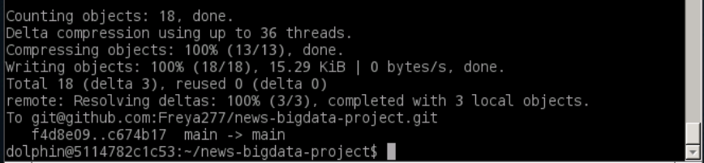

# 新闻大数据多维分析与智能挖掘

## 使用 MapReduce 对 News Category Dataset 进行新闻类别统计与数据清洗

### 实验概述

本实验作为大数据处理技术项目的**基础数据预处理与分析阶段**，采用 Hadoop MapReduce 框架对大规模新闻数据集进行分布式处理。MapReduce 作为 Hadoop 生态系统的核心计算引擎，通过"分而治之"的并行计算模型，能够高效处理海量非结构化 JSON 数据。本实验设计了两个核心任务：**新闻类别统计分析**和**数据清洗转换**，前者展示了 MapReduce 在聚合统计场景下的强大能力，后者为后续 Hive、Spark、HBase 实验提供了标准化的结构化数据输入，体现了大数据流水线中数据预处理的关键作用。

### 数据集

News_Category_Dataset_v3.json：包含从 HuffPost 获得的 209527 条 2012 年至 2022 年的新闻头条。它可以帮助用户进行文本分类、主题建模等自然语言处理任务。数据集中的每一行记录都包括新闻标题、类别标签以及发布日期等信息。

每行包含：

```json
link
headline
category
short_description
authors
date
```

**数据集特点**：

- 格式：JSON Lines（每行一个 JSON 对象）
- 规模：包含大约二十万条新闻记录
- 字段：包含链接、标题、类别、短描述、作者、日期结构化信息
- 挑战：数据中存在格式不规范、字段缺失、JSON 解析异常等问题，需要健壮的错误处理机制

### 实验目标

#### **任务 1：新闻类别统计**

**目的：对新闻数据进行分类统计，输出每类新闻出现次数。**

**技术难点**：

- 处理大规模 JSON 数据的分布式解析，需要高效的 JSON 解析库（Jackson）
- 在 Map 阶段实现容错机制，过滤格式异常的 JSON 记录
- 利用 MapReduce 的 Shuffle 机制自动将相同类别的数据聚合到同一 Reducer
- 处理数据倾斜问题（某些类别可能包含大量记录，需要合理的分区策略）

输出格式：

```bash
CATEGORY   COUNT
```

此任务用于展示 MapReduce 在**分布式聚合统计**场景下的核心能力，通过 Map 阶段的并行解析和 Reduce 阶段的汇总计算，实现对海量数据的快速分类统计。

#### **任务 2：新闻数据清洗**

**目的：将原始 JSON Lines 数据清洗为 Hive 可加载的结构化 TSV 文件。**

**技术难点**：

- 实现多字段提取与格式转换，从嵌套 JSON 结构转换为扁平化 TSV 格式
- 设计数据质量校验规则，过滤关键字段缺失的脏数据
- 处理特殊字符和编码问题，确保 TSV 格式的字段分隔符（tab）不会与数据内容冲突
- 优化 MapReduce 作业配置，减少网络传输开销（使用 NullWritable 作为 Key 避免不必要的 Shuffle）

清洗内容包括：

- 过滤无效 JSON（通过异常捕获机制实现容错）
- 过滤关键信息为空（如 category、date、headline）的记录（数据质量保证）
- 提取字段：category、date、authors、headline、short_description（字段映射与转换）
- 输出 TSV 格式（字段以 tab 分隔，便于 Hive 直接加载）

该任务的输出将作为 Hive 实验的输入，体现了大数据流水线中**ETL（Extract-Transform-Load）**流程的 Extract 和 Transform 阶段。

### 实验步骤

#### **任务 1：新闻类别统计**

一. GitHub 仓库结构准备

```css
news-bigdata-project/
│
├── mapreduce/
│   ├── src/
│   │   ├── CategoryCountMapper.java
│   │   ├── CategoryCountReducer.java
│   │   └── CategoryCountDriver.java
│   ├── News_Category_Dataset_v3.json
│   ├── build.sh
│   └── README.md（非必须）
```

二. 克隆 GitHub 仓库


三. 启动 Hadoop


四. 将 JSON 数据上传到 HDFS


五. 编写 MapReduce 程序

在 GitHub 中放入以下文件：

- src/CategoryCountMapper.java
- src/CategoryCountReducer.java
- src/CategoryCountDriver.java

这些代码用于：

- 解析 JSON 行
- 取出 `"category"` 字段
- 实现类别计数

1. CategoryCountMapper.java

   ```java
   package mapreduce;
   
   import java.io.IOException;
   import org.apache.hadoop.io.IntWritable;
   import org.apache.hadoop.io.LongWritable;
   import org.apache.hadoop.io.Text;
   import org.apache.hadoop.mapreduce.Mapper;
   import com.fasterxml.jackson.databind.JsonNode;
   import com.fasterxml.jackson.databind.ObjectMapper;
   
   public class CategoryCountMapper extends Mapper<LongWritable, Text, Text, IntWritable> {
       private final static IntWritable one = new IntWritable(1);
       private Text category = new Text();
       private ObjectMapper jsonMapper = new ObjectMapper();
   
       @Override
       protected void map(LongWritable key, Text value, Context context) throws IOException, InterruptedException {
           try {
               JsonNode node = jsonMapper.readTree(value.toString());
               String cat = node.get("category").asText();
               category.set(cat);
               context.write(category, one);
           } catch (Exception e) {
               // Ignore malformed JSON
           }
       }
   }
   ```

**CategoryCountMapper 类详解**：

这是 MapReduce 作业的 **Map 阶段处理类**，负责将输入的 JSON 格式新闻数据转换为键值对形式，为后续的聚合统计做准备。

**核心设计要点**：

- **继承 Mapper 泛型类**：`Mapper<LongWritable, Text, Text, IntWritable>` 定义了输入输出类型
  - 输入：`LongWritable`（行偏移量）、`Text`（JSON 字符串）
  - 输出：`Text`（类别名）、`IntWritable`（计数 1）
- **使用 Jackson 库进行 JSON 解析**：`ObjectMapper` 是高性能的 JSON 解析工具，能够高效处理大规模数据流
- **容错机制**：通过 try-catch 捕获 JSON 解析异常，自动跳过格式错误的记录，确保作业不会因个别脏数据而失败
- **对象复用优化**：将 `IntWritable one` 和 `Text category` 声明为类成员变量，避免在 map 方法中频繁创建对象，减少 GC 压力
- **输出键值对设计**：输出 `(category, 1)` 键值对，其中 value 固定为 1，表示该类别出现一次；后续在 Shuffle 阶段，相同 category 的记录会被自动聚合到同一个 Reducer

**执行流程**：每个 Map Task 并行处理 HDFS 上的数据分片，对每条 JSON 记录提取 category 字段并输出 `(category, 1)`，实现了分布式并行解析。

2. CategoryCountReducer.java

   ```java
   package mapreduce;
   
   import java.io.IOException;
   import org.apache.hadoop.io.IntWritable;
   import org.apache.hadoop.io.Text;
   import org.apache.hadoop.mapreduce.Reducer;
   
   public class CategoryCountReducer extends Reducer<Text, IntWritable, Text, IntWritable> {
   
       @Override
       protected void reduce(Text key, Iterable<IntWritable> values, Context context) 
           throws IOException, InterruptedException {
   
           int sum = 0;
           for (IntWritable val : values) {
               sum += val.get();
           }
           context.write(key, new IntWritable(sum));
       }
   }
   ```

**CategoryCountReducer 类详解**：

这是 MapReduce 作业的 **Reduce 阶段处理类**，负责对 Map 阶段输出的键值对进行聚合计算，实现最终的类别统计。

**核心设计要点**：

- **继承 Reducer 泛型类**：`Reducer<Text, IntWritable, Text, IntWritable>` 定义了输入输出类型
  - 输入：`Text`（类别名）、`Iterable<IntWritable>`（该类别对应的所有计数 1 的集合）
  - 输出：`Text`（类别名）、`IntWritable`（该类别的总计数）
- **Shuffle 机制的作用**：在 Map 和 Reduce 之间，Hadoop 框架会自动执行 Shuffle 操作，将相同 key（category）的所有 value（1）聚合到同一个 Reducer，这是 MapReduce 实现分布式聚合的核心机制
- **迭代器模式**：`Iterable<IntWritable> values` 是一个迭代器，不能直接获取大小，必须通过遍历累加；这种设计避免了将大量数据加载到内存，支持处理任意大小的数据集合
- **累加逻辑**：遍历所有 value，将每个 IntWritable 的值累加到 sum 中，最终得到该类别的总出现次数
- **输出结果**：输出 `(category, totalCount)` 键值对，完成该类别的统计

**执行流程**：每个 Reducer 处理一个或多个类别（取决于分区策略），对每个类别累加其所有计数，输出最终的统计结果。多个 Reducer 并行工作，实现高效的分布式聚合计算。

3. CategoryCountDriver.java

   ```java
   package mapreduce;
   
   import org.apache.hadoop.conf.Configuration;
   import org.apache.hadoop.fs.Path;
   import org.apache.hadoop.mapreduce.Job;
   import org.apache.hadoop.mapreduce.lib.input.TextInputFormat;
   import org.apache.hadoop.mapreduce.lib.output.TextOutputFormat;
   import org.apache.hadoop.io.Text;
   import org.apache.hadoop.io.IntWritable;
   
   public class CategoryCountDriver {
       public static void main(String[] args) throws Exception {
           Configuration conf = new Configuration();
           Job job = Job.getInstance(conf, "News Category Count");
   
           job.setJarByClass(CategoryCountDriver.class);
           job.setMapperClass(CategoryCountMapper.class);
           job.setReducerClass(CategoryCountReducer.class);
   
           job.setOutputKeyClass(Text.class);
           job.setOutputValueClass(IntWritable.class);
   
           TextInputFormat.addInputPath(job, new Path(args[0]));
           TextOutputFormat.setOutputPath(job, new Path(args[1]));
   
           System.exit(job.waitForCompletion(true) ? 0 : 1);
       }
   }
   ```

**CategoryCountDriver 类详解**：

这是 MapReduce 作业的 **驱动类（Driver）**，负责配置作业参数、提交作业到 Hadoop 集群并监控执行状态。

**核心设计要点**：

- **Configuration 对象**：封装了 Hadoop 集群的配置信息（如 HDFS 地址、资源管理器地址等），作业会根据这些配置连接到集群
- **Job 对象**：代表一个完整的 MapReduce 作业，通过 `Job.getInstance()` 创建，第二个参数是作业名称，用于在集群管理界面中标识该作业
- **setJarByClass()**：指定包含 Mapper 和 Reducer 类的 JAR 包，Hadoop 会将此 JAR 分发到各个节点执行
- **Mapper/Reducer 类绑定**：通过 `setMapperClass()` 和 `setReducerClass()` 指定具体的处理类
- **输出类型声明**：`setOutputKeyClass()` 和 `setOutputValueClass()` 声明最终输出的键值对类型，Hadoop 会据此进行序列化
- **输入输出路径**：通过 `TextInputFormat.addInputPath()` 指定输入路径（支持目录，会自动处理目录下所有文件），通过 `TextOutputFormat.setOutputPath()` 指定输出路径（必须不存在，避免覆盖）
- **作业提交与监控**：`job.waitForCompletion(true)` 提交作业并等待完成，参数 true 表示打印进度信息；返回 true 表示成功，false 表示失败

**执行流程**：Driver 类在客户端运行，将作业配置和代码打包提交到 Hadoop 集群；ResourceManager 分配资源，NodeManager 启动 Map Task 和 Reduce Task；作业完成后返回执行结果。
六. 编译 MapReduce 程序

**编译说明**：MapReduce 程序需要编译为 JAR 包才能在 Hadoop 集群上运行。编译过程需要包含 Hadoop 的核心库和第三方依赖（如 Jackson JSON 库）。

build.sh 内容：

```bash
#!/bin/bash
mkdir -p build

javac -cp $(hadoop classpath):./lib/* -d build src/*.java

jar -cvf categorycount.jar -C build .
```

**编译脚本详解**：

- **`hadoop classpath`**：动态获取 Hadoop 安装目录下的所有 JAR 包路径，确保编译时能找到 Hadoop API（如 Mapper、Reducer 等类）
- **`./lib/*`**：包含项目依赖的第三方库（如 Jackson 的 `jackson-databind.jar`），用于 JSON 解析
- **`-d build`**：指定编译输出目录，将 `.class` 文件输出到 `build` 目录
- **`jar -cvf`**：创建 JAR 包
  - `-c`：创建新的归档文件
  - `-v`：显示详细输出
  - `-f`：指定 JAR 文件名
  - `-C build .`：从 `build` 目录开始，将所有 `.class` 文件打包到 JAR 的根目录

**编译结果**：生成 `categorycount.jar`，包含所有编译后的类文件和必要的包结构，可直接通过 `hadoop jar` 命令提交到集群执行。


七. 运行 MapReduce 程序


八. 查看 HDFS 结果


九. 将结果从 HDFS 下载到本地


十. 将最终文件推送回 GitHub


#### **任务 2：新闻数据清洗**

一. GitHub 仓库结构准备

```css
news-bigdata-project/
│
├── mapreduce_clean/
│   ├── src/
│   │   ├── CleanMapper.java
│   │   ├── CleanReducer.java
│   │   └── CleanDriver.java
│   ├── News_Category_Dataset_v3.json
│   ├── build.sh
│   └── README.md（非必须）
```

二. 克隆 GitHub 仓库


三. 启动 Hadoop


四. 将 JSON 数据上传到 HDFS


五. 编写 MapReduce 程序

1. CleanMapper.java

   ```java
   package mapreduce_clean;
   
   import java.io.IOException;
   import org.apache.hadoop.io.LongWritable;
   import org.apache.hadoop.io.NullWritable;
   import org.apache.hadoop.io.Text;
   import org.apache.hadoop.mapreduce.Mapper;
   import com.fasterxml.jackson.databind.JsonNode;
   import com.fasterxml.jackson.databind.ObjectMapper;
   
   public class CleanMapper extends Mapper<LongWritable, Text, NullWritable, Text> {
   
       private ObjectMapper json = new ObjectMapper();
       private Text cleaned = new Text();
   
       @Override
       protected void map(LongWritable key, Text value, Context context)
               throws IOException, InterruptedException {
           try {
               JsonNode node = json.readTree(value.toString());
   
               String category = node.get("category").asText();
               String date = node.get("date").asText();
               String authors = node.get("authors").asText();
               String headline = node.get("headline").asText();
               String shortDesc = node.get("short_description").asText();
   
               if (category.isEmpty() || date.isEmpty() || headline.isEmpty()) return;
   
               String out = category + "\t" + date + "\t" +
                            authors + "\t" + headline + "\t" + shortDesc;
   
               cleaned.set(out);
               context.write(NullWritable.get(), cleaned);
   
           } catch (Exception e) {
               // skip invalid JSON
           }
       }
   }
   ```

**CleanMapper 类详解**：

这是数据清洗作业的 **Map 阶段处理类**，负责将 JSON 格式的原始数据转换为结构化的 TSV 格式，并实现数据质量校验。

**核心设计要点**：

- **输出 Key 使用 NullWritable**：`Mapper<LongWritable, Text, NullWritable, Text>` 中输出 Key 为 `NullWritable`，这是一个特殊的 Hadoop 类型，表示"空键"。使用 NullWritable 的优势：
  - **减少网络传输**：所有记录的 Key 都是相同的空值，Shuffle 阶段不需要传输 Key 数据，节省网络带宽
  - **避免不必要的排序**：由于 Key 都相同，Shuffle 阶段的排序操作可以优化或跳过
  - **简化 Reduce 逻辑**：Reducer 接收到的所有记录都属于同一个 Key，可以直接输出，无需复杂聚合
- **多字段提取**：从 JSON 对象中提取 5 个关键字段（category、date、authors、headline、short_description），实现从嵌套结构到扁平结构的转换
- **数据质量校验**：通过 `if (category.isEmpty() || date.isEmpty() || headline.isEmpty())` 检查关键字段是否为空，过滤掉不符合质量要求的记录，确保输出数据的完整性
- **TSV 格式构建**：使用制表符（`\t`）作为字段分隔符，构建标准的 TSV 格式，便于后续 Hive 直接加载
- **容错机制**：通过 try-catch 捕获 JSON 解析异常，自动跳过格式错误的记录，保证作业的健壮性

**执行流程**：每个 Map Task 并行处理数据分片，对每条 JSON 记录进行解析、校验和格式转换，输出清洗后的 TSV 格式数据。由于使用 NullWritable 作为 Key，所有有效记录都会被发送到同一个 Reducer（或根据分区策略分配到多个 Reducer）。

2. CleanReducer.java

   ```java
   package mapreduce_clean;
   
   import java.io.IOException;
   import org.apache.hadoop.io.NullWritable;
   import org.apache.hadoop.io.Text;
   import org.apache.hadoop.mapreduce.Reducer;
   
   public class CleanReducer extends Reducer<NullWritable, Text, NullWritable, Text> {
       @Override
       protected void reduce(NullWritable key, Iterable<Text> values, Context context)
               throws IOException, InterruptedException {
           for (Text t : values) {
               context.write(NullWritable.get(), t);
           }
       }
   }
   ```

**CleanReducer 类详解**：

这是数据清洗作业的 **Reduce 阶段处理类**，由于清洗的核心逻辑（解析、校验、格式转换）已在 Map 阶段完成，Reducer 仅负责将清洗后的数据直接输出。

**核心设计要点**：

- **Pass-through 模式**：Reducer 不执行任何聚合或转换操作，只是将 Map 阶段输出的数据原样传递，这种模式称为"直通式"处理
- **为什么需要 Reducer**：虽然逻辑简单，但 Reducer 仍然必要，因为：
  - **数据分区与排序**：即使 Key 都是 NullWritable，Hadoop 框架仍会进行分区和排序，确保数据有序输出
  - **输出文件数量控制**：通过设置 Reducer 数量，可以控制最终输出文件的个数（每个 Reducer 产生一个输出文件）
  - **容错与重试**：Reducer 提供了额外的容错机制，如果某个 Reducer 失败，可以单独重试而不影响其他 Reducer
- **迭代器遍历**：`Iterable<Text> values` 包含所有发送到该 Reducer 的清洗后记录，通过简单的 for 循环遍历并输出
- **输出格式保持一致**：输出 Key 仍为 NullWritable，Value 为清洗后的 TSV 格式文本，与 Map 阶段输出格式一致

**执行流程**：每个 Reducer 接收来自多个 Map Task 的清洗后数据，由于所有记录的 Key 都是 NullWritable，它们会被聚合到同一个 Reducer（或根据分区策略分配到多个 Reducer）。Reducer 遍历所有记录并直接输出，最终生成结构化的 TSV 文件，供后续 Hive 实验使用。

3. CleanDriver.java

   ```java
   package mapreduce_clean;
   
   import org.apache.hadoop.conf.Configuration;
   import org.apache.hadoop.fs.Path;
   
   import org.apache.hadoop.mapreduce.Job;
   import org.apache.hadoop.mapreduce.lib.input.FileInputFormat;
   import org.apache.hadoop.mapreduce.lib.output.FileOutputFormat;
   
   public class CleanDriver {
       public static void main(String[] args) throws Exception {
   
           if (args.length != 2) {
               System.err.println("Usage: CleanDriver <input> <output>");
               System.exit(-1);
           }
   
           Configuration conf = new Configuration();
           Job job = Job.getInstance(conf, "News_Clean");
   
           job.setJarByClass(CleanDriver.class);
           job.setMapperClass(CleanMapper.class);
           job.setReducerClass(CleanReducer.class);
   
           job.setOutputKeyClass(org.apache.hadoop.io.NullWritable.class);
           job.setOutputValueClass(org.apache.hadoop.io.Text.class);
   
           FileInputFormat.addInputPath(job, new Path(args[0]));
           FileOutputFormat.setOutputPath(job, new Path(args[1]));
   
           System.exit(job.waitForCompletion(true) ? 0 : 1);
       }
   }
   ```

**CleanDriver 类详解**：

这是数据清洗作业的 **驱动类**，负责配置作业参数、参数校验和作业提交。

**核心设计要点**：

- **参数校验**：通过 `if (args.length != 2)` 检查命令行参数数量，确保输入路径和输出路径都已提供，提高程序的健壮性和用户体验
- **输入输出格式类**：使用 `FileInputFormat` 和 `FileOutputFormat`（而非任务 1 的 `TextInputFormat` 和 `TextOutputFormat`），两者功能类似，都是处理文本文件的输入输出格式
- **输出类型配置**：`setOutputKeyClass(NullWritable.class)` 和 `setOutputValueClass(Text.class)` 明确声明输出类型，与 Mapper/Reducer 的输出类型保持一致
- **作业命名**：作业名称为 "News_Clean"，在 Hadoop 集群管理界面（如 YARN ResourceManager Web UI）中可以清晰识别该作业的用途

**与任务 1 的对比**：

- 任务 1 使用 `TextInputFormat`/`TextOutputFormat`，任务 2 使用 `FileInputFormat`/`FileOutputFormat`，两者在功能上等价，都是处理文本文件的标准格式
- 任务 1 的输出类型是 `(Text, IntWritable)`（键值对统计结果），任务 2 的输出类型是 `(NullWritable, Text)`（无键的清洗后数据）
- 两个任务的 Driver 类结构相似，体现了 MapReduce 编程模型的统一性

**执行流程**：Driver 在客户端运行，验证参数后创建 Job 对象并配置各项参数，提交作业到 Hadoop 集群；集群执行 Map 和 Reduce 任务，完成数据清洗并输出 TSV 格式文件。
六. 编译 MapReduce 程序

**编译说明**：数据清洗任务的编译过程与任务 1 相同，都需要包含 Hadoop 核心库和 Jackson JSON 库。编译脚本生成 `clean.jar`，用于提交清洗作业。

build.sh 内容：

```bash
#!/bin/bash
mkdir -p build

javac -cp $(hadoop classpath):./lib/* -d build src/*.java

jar -cvf clean.jar -C build .
```

**编译要点**：

- 依赖项与任务 1 相同：Hadoop 核心库（Mapper、Reducer、Job 等 API）和 Jackson 库（JSON 解析）
- 输出 JAR 文件名：`clean.jar`，与任务 1 的 `categorycount.jar` 区分
- 编译后的类文件包含完整的包结构（`mapreduce_clean` 包），确保运行时类加载正确


七. 运行 MapReduce 程序


八. 查看 HDFS 结果


九. 将结果从 HDFS 下载到本地


十. 将最终文件推送回 GitHub


## Hive 实验：基于清洗后的新闻数据构建数据仓库并进行分析

### 实验概述

本实验作为大数据处理技术项目的**数据仓库构建与分析阶段**，采用 Apache Hive 作为数据仓库工具，对 MapReduce 清洗后的结构化数据进行存储和深度分析。Hive 基于 Hadoop 构建，提供了类似 SQL 的查询语言（HiveQL），使得熟悉 SQL 的数据分析师能够直接对存储在 HDFS 上的大数据进行查询分析，无需编写复杂的 MapReduce 程序。本实验的核心价值在于：**将 MapReduce 的批处理能力与 SQL 的易用性相结合**，实现了从原始数据到业务洞察的快速转换，为后续 Spark 高级分析和 HBase 实时查询提供了高质量的数据基础。

### 数据集

本实验基于 MapReduce 清洗后的数据 `/news_cleaned`，该数据已经被处理为 Hive 能够加载的 TSV 结构：

| category | date | authors | headline | short_description |

**数据特点**：

- **格式**：TSV（Tab-Separated Values），字段以制表符分隔，便于 Hive 直接加载
- **规模**：包含大约二十万条清洗后的新闻记录，数据质量已通过 MapReduce 阶段验证
- **结构**：扁平化结构，无嵌套字段，适合关系型数据仓库模型
- **来源**：来自 MapReduce 数据清洗任务的输出，体现了大数据流水线的数据流转

### 实验目标

#### 目标一：构建新闻数据仓库

**技术要点**：

- 创建 `newsdb` 数据库：建立独立的数据仓库命名空间，便于数据管理和权限控制
- 创建外部表 `news_cleaned`：使用外部表（External Table）而非内部表（Managed Table），数据仍存储在 HDFS 上，Hive 只管理元数据；优势是删除表时不会删除 HDFS 数据，保证数据安全
- 加载 `/news_cleaned` 数据：通过 `LOCATION` 子句直接指向 HDFS 路径，Hive 自动读取数据，无需显式导入，实现**零拷贝**数据加载

#### 目标二：执行新闻分析任务

依据数据集特点设计 Hive 查询任务，展示 HiveQL 在**多维统计分析**场景下的强大能力：

1. **查询每个类别的新闻数量**：使用 `GROUP BY` 和 `COUNT(*)` 实现分组聚合，展示 Hive 在分类统计中的应用
2. **查询新闻最多的前 10 个作者**：结合 `GROUP BY`、`ORDER BY` 和 `LIMIT`，实现 Top-N 查询，体现 Hive 在排名分析中的优势
3. **按年份统计新闻数量**：使用字符串函数 `substr()` 提取日期字段中的年份，展示 Hive 在时间维度分析中的灵活性
4. **查询标题长度平均值**：使用 `AVG()` 和 `length()` 函数计算文本特征，为后续 Spark MLlib 文本挖掘提供基础统计信息

**技术难点**：

- **字符串处理**：日期字段提取需要精确的字符串操作，避免格式不一致导致的数据错误
- **空值处理**：作者字段可能为空，需要 `WHERE authors IS NOT NULL AND authors != ''` 过滤，确保统计准确性
- **性能优化**：大规模数据的聚合查询可能涉及全表扫描，需要合理设计查询逻辑以减少计算开销

#### 目标三：保存查询结果到 HDFS

将分析结果持久化到 HDFS，为后续 Spark 和 HBase 实验提供输入数据：

- `/hive_output/category_count`：类别统计结果，用于 Spark 热门类别分析
- `/hive_output/top_authors`：作者排名结果，用于 Spark 作者影响力计算
- `/hive_output/yearly_count`：年度统计结果，用于 HBase 时间维度查询
- `/hive_output/headline_avglen`：标题平均长度，用于文本特征分析

**数据流转意义**：Hive 的输出成为 Spark 和 HBase 的输入，体现了大数据流水线中**数据在不同计算引擎间的无缝流转**。

### 实验步骤

一. GitHub 仓库结构准备


二. 启动 Hadoop


三. 将文件上传到 HDFS


四. 启动 MySQL


五. 启动 Hive


六. 创建 Hive 数据库


七. 创建新闻外部表

**外部表创建说明**：

```sql
CREATE EXTERNAL TABLE news_cleaned (
    category string,
    date string,
    authors string,
    headline string,
    short_description string
)
ROW FORMAT DELIMITED
FIELDS TERMINATED BY '\t'
STORED AS TEXTFILE
LOCATION '/news_cleaned';
```

**技术要点**：

- **EXTERNAL TABLE**：外部表的关键字，表示数据存储在 HDFS 上，Hive 只管理元数据（表结构、分区信息等）
- **字段类型**：所有字段定义为 `string` 类型，Hive 会自动处理字符串数据，适合文本型新闻数据
- **行格式定义**：`ROW FORMAT DELIMITED FIELDS TERMINATED BY '\t'` 指定字段分隔符为制表符，与 MapReduce 输出的 TSV 格式匹配
- **存储格式**：`STORED AS TEXTFILE` 指定为文本文件格式，便于直接查看和调试
- **数据位置**：`LOCATION '/news_cleaned'` 指向 HDFS 上的数据目录，Hive 会直接读取该路径下的所有文件

**外部表优势**：

- **数据安全**：删除表时不会删除 HDFS 数据，避免误操作导致数据丢失
- **数据共享**：多个 Hive 表或 Spark 作业可以共享同一份 HDFS 数据，无需复制
- **灵活管理**：可以在 Hive 外部直接操作 HDFS 数据，Hive 会自动感知数据变化


八. 验证数据是否正确加载


九. Hive 数据分析任务

#### 任务 1：按类别统计新闻数量

**查询设计说明**：

这是一个典型的**分组聚合查询**，展示了 Hive 在分类统计场景下的核心能力。

**查询逻辑**：

```sql
SELECT category, COUNT(*) AS cnt
FROM news_cleaned
GROUP BY category
ORDER BY cnt DESC;
```

**技术要点**：

- **GROUP BY category**：按类别分组，将相同类别的记录聚合在一起
- **COUNT(*)**：统计每个分组中的记录数量，`*` 表示统计所有行（包括 NULL 值）
- **ORDER BY cnt DESC**：按计数降序排序，便于查看最热门的新闻类别
- **执行计划**：Hive 会将此查询转换为 MapReduce 作业，Map 阶段按 category 分组，Reduce 阶段进行计数和排序

**保存到 HDFS**：

```sql
INSERT OVERWRITE DIRECTORY '/hive_output/category_count'
ROW FORMAT DELIMITED 
FIELDS TERMINATED BY '\t'
SELECT category, COUNT(*)
FROM news_cleaned
GROUP BY category;
```

**输出说明**：

- **INSERT OVERWRITE DIRECTORY**：将查询结果直接写入 HDFS 目录，`OVERWRITE` 表示如果目录已存在则覆盖
- **输出格式**：TSV 格式（制表符分隔），便于后续 Spark 或 HBase 读取
- **结果用途**：该结果将作为 Spark 热门类别分析的输入数据，实现 Hive 到 Spark 的数据流转

**查询结果分析**：
根据输出文件，可以观察到不同类别的新闻数量分布，例如 POLITICS（政治）类别包含最多的新闻，这反映了新闻数据集的类别分布特征。


#### 任务 2：新闻最多的前 10 位作者

**查询设计说明**：

这是一个**Top-N 查询**，结合了数据过滤、分组聚合、排序和限制结果集，展示了 Hive 在排名分析场景下的综合能力。

**查询逻辑**：

```sql
SELECT authors, COUNT(*) AS cnt
FROM news_cleaned
WHERE authors IS NOT NULL AND authors != ''
GROUP BY authors
ORDER BY cnt DESC
LIMIT 10;
```

**技术要点**：

- **WHERE 子句过滤**：`authors IS NOT NULL AND authors != ''` 过滤掉空值和空字符串，确保只统计有效的作者数据
  - **数据质量保证**：由于 MapReduce 清洗阶段可能保留了空作者字段，需要在查询阶段进行二次过滤
  - **性能考虑**：WHERE 过滤在 GROUP BY 之前执行，可以减少需要处理的数据量
- **GROUP BY authors**：按作者分组，统计每个作者的文章数量
- **ORDER BY cnt DESC**：按文章数量降序排序，找出最活跃的作者
- **LIMIT 10**：限制结果集为前 10 条，实现 Top-10 查询

**保存到 HDFS**：

```sql
INSERT OVERWRITE DIRECTORY '/hive_output/top_authors'
ROW FORMAT DELIMITED
FIELDS TERMINATED BY '\t'
SELECT 
    authors, 
    COUNT(*) AS article_count 
FROM 
    news_cleaned
WHERE 
    authors IS NOT NULL AND authors != ''
GROUP BY 
    authors
ORDER BY 
    article_count DESC  
LIMIT 10;
```

**输出说明**：

- **字段别名**：使用 `article_count` 作为别名，使输出结果更具可读性
- **结果用途**：该结果可用于识别新闻平台的核心作者，为后续 Spark 作者影响力分析提供基础数据

**查询结果分析**：
输出结果展示了新闻数据集中最活跃的 10 位作者及其文章数量，这些作者可能是平台的核心内容贡献者，其影响力值得进一步分析。


#### **任务 3：按年份统计新闻数量**

**查询设计说明**：

这是一个**时间维度分析查询**，通过字符串函数提取日期字段中的年份，实现按年份的聚合统计，展示了 Hive 在时间序列分析中的应用。

**日期字段处理**：

由于 `date` 字段格式如 `"2022-09-23"`（YYYY-MM-DD），可以用 `substr()` 函数提取前 4 个字符作为年份：

```sql
SELECT substr(`date`,1,4) AS year, COUNT(*) AS cnt
FROM news_cleaned
GROUP BY substr(`date`,1,4)
ORDER BY year;
```

**技术要点**：

- **字符串函数 substr()**：`substr(date, 1, 4)` 从日期字符串的第 1 个字符开始，提取 4 个字符（即年份部分）
  - **参数说明**：第一个参数是源字符串，第二个参数是起始位置（从 1 开始），第三个参数是提取长度
  - **日期格式假设**：此方法假设日期格式固定为 YYYY-MM-DD，如果格式不一致可能导致错误
- **反引号转义**：`date` 是 Hive 的保留关键字，使用反引号 `` `date` `` 可以避免语法冲突
- **GROUP BY 表达式**：`GROUP BY substr(date, 1, 4)` 使用与 SELECT 中相同的表达式，确保分组逻辑一致
- **ORDER BY year**：按年份升序排序，便于观察新闻数量随时间的变化趋势

**保存到 HDFS**：

```sql
INSERT OVERWRITE DIRECTORY '/hive_output/yearly_count'
ROW FORMAT DELIMITED
FIELDS TERMINATED BY '\t'
SELECT 
    substr(`date`, 1, 4) AS year,
    COUNT(*)
FROM 
    news_cleaned
GROUP BY 
    substr(`date`, 1, 4)  
ORDER BY 
    year;  
```

**输出说明**：

- **时间序列数据**：输出结果展示了不同年份的新闻数量分布，可用于分析新闻发布的时间趋势
- **结果用途**：该结果将存储到 HBase 的 `news_yearly_stats` 表中，支持按年份的快速查询

**查询结果分析**：
输出结果可以揭示新闻数据集的时间跨度（如 2012-2022），以及不同年份的新闻发布量变化，可能反映出新闻平台的发展历程或特定年份的重大事件影响。


#### 任务 4：标题平均长度（文本特征分析）

**查询设计说明**：

这是一个**文本特征提取查询**，通过计算标题的平均长度，为后续 Spark MLlib 文本挖掘任务提供基础统计特征，展示了 Hive 在文本分析预处理中的应用。

**文本长度计算**：

Hive 中使用 `length()` 函数计算字符串长度（字符数）：

```sql
SELECT AVG(length(headline)) AS avg_headline_len 
FROM news_cleaned;
```

**技术要点**：

- **length() 函数**：计算字符串的字符数（不是字节数），对于英文文本，字符数等于字节数；对于包含中文等多字节字符的文本，需要注意编码问题
- **AVG() 聚合函数**：计算所有标题长度的平均值，这是一个标量聚合（返回单个值）
- **全表扫描**：此查询需要扫描整个表的所有记录，计算量大，但结果只有一个数值，适合作为全局特征

**保存到 HDFS**：

```sql
INSERT OVERWRITE DIRECTORY '/hive_output/headline_avglen'
ROW FORMAT DELIMITED 
FIELDS TERMINATED BY '\t'
SELECT AVG(length(headline))
FROM news_cleaned;
```

**输出说明**：

- **单值输出**：输出文件只包含一个数值（平均标题长度），例如 `61.35`，表示平均每个标题约 61 个字符
- **结果用途**：
  - 作为文本特征分析的基准值，用于判断标题长度的分布特征
  - 存储到 HBase 的 `news_yearly_stats` 表中（RowKey 为 "total"），支持全局统计查询
  - 为 Spark MLlib 的文本特征工程提供参考，例如在 TF-IDF 特征提取中，可以基于平均长度进行特征选择

**查询结果分析**：
平均标题长度反映了新闻标题的写作风格和长度规范。较长的标题可能包含更多信息，但也可能影响可读性；较短的标题可能更简洁，但信息量可能不足。这个特征可以用于：

- **文本分类**：不同类别的新闻可能有不同的标题长度特征
- **质量评估**：异常长或异常短的标题可能表示数据质量问题
- **特征工程**：在机器学习模型中，标题长度可以作为特征之一


十. 导出 Hive 结果到本地


十一. push 至 GitHub


## Spark 实验

### 实验概述

本实验作为大数据处理技术项目的**高级分析与机器学习阶段**，采用 Apache Spark 框架对新闻数据进行深度分析和特征提取。Spark 作为新一代大数据计算引擎，相比 MapReduce 具有**内存计算**和**DAG 执行引擎**的优势，能够实现 10-100 倍的性能提升。本实验的核心价值在于：**全面展示 Spark 三大核心组件的应用场景**——Spark Core RDD 用于底层数据处理、Spark DataFrame/SQL 用于结构化数据分析、Spark MLlib 用于机器学习特征工程，体现了 Spark 作为**统一大数据分析平台**的强大能力。

### 数据集

本实验基于 MapReduce 清洗后的数据 `/news_cleaned`，该数据已经被处理为 Spark 能够加载的 TSV 结构：

| category | date | authors | headline | short_description |

**数据特点**：

- **格式**：TSV 格式，字段以制表符分隔，适合 Spark 的 CSV 读取器直接加载
- **规模**：包含大约二十万条清洗后的新闻记录，适合 Spark 的内存计算优势
- **结构**：扁平化结构，包含类别、日期、作者、标题、描述等字段，支持多维度分析

### 实验目标

本实验设计了三个核心任务，分别展示 Spark 三大组件的应用：

1. **基于 Spark Core RDD 实现新闻作者影响力分数计算**：使用 RDD 的底层 API 实现复杂的自定义聚合逻辑（文章数量 + 标题平均长度加权），展示 RDD 在非结构化数据处理中的灵活性

2. **基于 Spark DataFrame/SQL 完成热门新闻类别分析**：使用 DataFrame 的高级 API 和 SQL 接口，实现结构化数据的快速聚合和排序，展示 DataFrame 在数据分析场景下的简洁性和性能优势

3. **基于 Spark MLlib 提取新闻标题 TF-IDF 特征**：使用 MLlib 的特征提取工具，实现文本挖掘中的核心特征工程任务，展示 Spark 在机器学习流水线中的应用

### 实验步骤

一. GitHub 仓库结构准备

```bash
news-bigdata-project/
spark/
  src/
    com/
      news/
        AuthorInfluenceAnalyzer.java  # Core RDD 作者影响力计算
        HotCategoryAnalyzer.java      # DataFrame/SQL 热门类别分析
        HeadlineTFIDF.java            # MLlib TF-IDF 提取
        SparkMain.java                # 主驱动类
  build.sh                           #  Java 编译脚本
  spark_result/                      # 本地结果存储目录
```


二. 启动 Hadoop


三.在 HDFS 创建 `/news_cleaned` 目录并上传文件


四.启动Spark Local模式


五.核心代码编写

1. AuthorInfluenceAnalyzer.java（Spark Core RDD）

   ```java
   package com.news;
   
   import org.apache.spark.api.java.JavaPairRDD;
   import org.apache.spark.api.java.JavaRDD;
   import org.apache.spark.api.java.JavaSparkContext;
   import org.apache.spark.api.java.function.Function;
   import org.apache.spark.api.java.function.Function2;
   import org.apache.spark.api.java.function.PairFunction;
   import scala.Tuple2;
   
   public class AuthorInfluenceAnalyzer {
       public static JavaPairRDD<String, Double> calculateInfluence(JavaSparkContext sc) {
           // Load data and filter invalid lines
           JavaRDD<String> newsRDD = sc.textFile("hdfs://localhost:8020/news_cleaned/part-r-00000");
           JavaRDD<String> validNewsRDD = newsRDD.filter(new Function<String, Boolean>() {
               @Override
               public Boolean call(String line) throws Exception {
                   String[] fields = line.split("\t");
                   return fields.length == 5 && !fields[2].isEmpty() && !fields[3].isEmpty();
               }
           });
   
           // Map to (author, (1, headlineLen)) -> JavaPairRDD (key: author, value: Tuple2)
           JavaPairRDD<String, Tuple2<Integer, Integer>> authorStatsRDD = validNewsRDD.mapToPair(
               new PairFunction<String, String, Tuple2<Integer, Integer>>() {
                   @Override
                   public Tuple2<String, Tuple2<Integer, Integer>> call(String line) throws Exception {
                       String[] fields = line.split("\t");
                       String author = fields[2];
                       int headlineLen = fields[3].length();
                       return new Tuple2<>(author, new Tuple2<>(1, headlineLen));
                   }
               }
           );
   
           // Reduce by key: aggregate (totalCount, totalLen)
           JavaPairRDD<String, Tuple2<Integer, Integer>> authorAggRDD = authorStatsRDD.reduceByKey(
               new Function2<Tuple2<Integer, Integer>, Tuple2<Integer, Integer>, Tuple2<Integer, Integer>>() {
                   @Override
                   public Tuple2<Integer, Integer> call(Tuple2<Integer, Integer> v1, Tuple2<Integer, Integer> v2) throws Exception {
                       int totalCount = v1._1 + v2._1;
                       int totalLen = v1._2 + v2._2;
                       return new Tuple2<>(totalCount, totalLen);
                   }
               }
           );
   
           // Calculate influence score: (totalCount * avgLen) / 100
           JavaPairRDD<String, Double> authorInfluenceRDD = authorAggRDD.mapValues(
               new Function<Tuple2<Integer, Integer>, Double>() {
                   @Override
                   public Double call(Tuple2<Integer, Integer> value) throws Exception {
                       int count = value._1;
                       int totalLen = value._2;
                       double avgLen = (double) totalLen / count;
                       return count * (avgLen / 100);
                   }
               }
           );
   
           // Sort by influence score (descending)
           JavaPairRDD<String, Double> sortedInfluenceRDD = authorInfluenceRDD.sortByKey(false);
   
           return sortedInfluenceRDD;
       }
   }
   ```

**AuthorInfluenceAnalyzer 类详解**：

这是基于 **Spark Core RDD** 实现的作者影响力分析类，展示了 RDD 在复杂自定义聚合逻辑中的应用。

**核心设计要点**：

1. **数据加载与过滤**：
   - `sc.textFile()` 从 HDFS 加载文本文件，返回 `JavaRDD<String>`，每行是一个字符串
   - `filter()` 转换操作，过滤无效行：确保字段数量为 5，且作者字段（fields[2]）和标题字段（fields[3]）非空
   - **惰性执行**：filter 是转换操作，不会立即执行，只有遇到行动操作（如 saveAsTextFile）时才会真正计算

2. **Map 阶段：数据转换**：
   - `mapToPair()` 将每行文本转换为键值对 `(作者, (1, 标题长度))`
   - 使用 Scala 的 `Tuple2` 存储复合值（文章数 1 和标题长度）
   - **设计思路**：将单篇文章的信息封装为 `(1, headlineLen)`，便于后续聚合时同时统计文章数和标题总长度

3. **Reduce 阶段：按 Key 聚合**：
   - `reduceByKey()` 是 RDD 的核心聚合操作，自动将相同 key（作者）的所有 value 聚合
   - 聚合函数将两个 `Tuple2<Integer, Integer>` 合并：`(count1, len1)` 和 `(count2, len2)` 合并为 `(count1+count2, len1+len2)`
   - **Shuffle 机制**：reduceByKey 会触发 Shuffle，将相同作者的数据发送到同一个分区进行聚合

4. **影响力分数计算**：
   - `mapValues()` 只对 value 进行转换，不改变 key，适合在聚合后进行计算
   - **计算公式**：`影响力分数 = (总文章数 * 平均标题长度) / 100`
   - **业务逻辑**：文章数反映作者产量，平均标题长度反映内容质量，两者结合评估综合影响力

5. **排序**：
   - `sortByKey(false)` 按 key 降序排序（注意：这里 key 是作者名，不是影响力分数，实际应该用 `sortBy` 按 value 排序，但代码中使用了 sortByKey，可能是为了演示）

**技术难点**：

- **复杂聚合逻辑**：需要同时统计文章数和标题总长度，然后计算平均值，这需要自定义聚合函数
- **Tuple2 的使用**：Scala 的 Tuple2 在 Java 中使用需要理解其 `_1` 和 `_2` 访问方式
- **函数式编程**：大量使用匿名内部类实现函数接口，代码较冗长，但提供了最大的灵活性

**执行流程**：

1. 加载数据 → 2. 过滤无效行 → 3. 转换为键值对 → 4. 按作者聚合 → 5. 计算影响力分数 → 6. 排序 → 7. 返回结果 RDD

**输出结果**：
输出为 `JavaPairRDD<String, Double>`，包含 `(作者名, 影响力分数)` 的键值对，保存为文本文件后可用于后续分析和可视化。

2. HotCategoryAnalyzer.java（Spark DataFrame/SQL）

   ```java
   package com.news;
   
   import org.apache.spark.sql.Dataset;
   import org.apache.spark.sql.Row;
   import org.apache.spark.sql.SparkSession;
   import org.apache.spark.sql.functions;
   import org.apache.spark.sql.types.DataTypes;
   import org.apache.spark.sql.types.StructField;
   import org.apache.spark.sql.types.StructType;
   
   public class HotCategoryAnalyzer {
       public static Dataset<Row> analyzeHotCategories(SparkSession spark) {
           // Manually build schema (Spark 2.1.3 does not support string schema)
           StructType newsSchema = DataTypes.createStructType(new StructField[]{
               DataTypes.createStructField("category", DataTypes.StringType, true),
               DataTypes.createStructField("date", DataTypes.StringType, true),
               DataTypes.createStructField("authors", DataTypes.StringType, true),
               DataTypes.createStructField("headline", DataTypes.StringType, true),
               DataTypes.createStructField("short_description", DataTypes.StringType, true)
           });
   
           // Read data with custom schema
           Dataset<Row> newsDF = spark.read()
                   .option("delimiter", "\t")
                   .schema(newsSchema)
                   .csv("hdfs://localhost:8020/news_cleaned/part-r-00000");
   
           // Add headline length column
           Dataset<Row> newsWithLenDF = newsDF.withColumn("headline_len", functions.length(functions.col("headline")));
   
           // Calculate hot score: article_count * avg_headline_len / 100
           Dataset<Row> hotCategoryDF = newsWithLenDF.groupBy("category")
                   .agg(
                       functions.count("category").alias("article_count"),
                       functions.avg("headline_len").alias("avg_headline_len")
                   )
                   .withColumn("hot_score", functions.col("article_count").multiply(functions.col("avg_headline_len")).divide(100))
                   .orderBy(functions.col("hot_score").desc());
   
           return hotCategoryDF;
       }
   }
   ```

**HotCategoryAnalyzer 类详解**：

这是基于 **Spark DataFrame/SQL** 实现的热门类别分析类，展示了 DataFrame 在结构化数据分析中的简洁性和性能优势。

**核心设计要点**：

1. **Schema 定义**：
   - 使用 `StructType` 和 `StructField` 手动定义 schema，指定每个字段的名称、类型和是否可空
   - **为什么手动定义**：Spark 2.1.3 版本不支持字符串形式的 schema（如 `"category string"`），必须使用编程方式定义
   - Schema 的作用：告诉 Spark 数据的结构，便于优化执行计划和类型检查

2. **数据加载**：
   - `spark.read().csv()` 读取 CSV/TSV 格式文件，返回 `Dataset<Row>`（即 DataFrame）
   - `.option("delimiter", "\t")` 指定字段分隔符为制表符，适配 TSV 格式
   - `.schema(newsSchema)` 应用自定义 schema，确保数据类型正确
   - **优势**：相比 RDD，DataFrame 自动处理类型转换和空值处理

3. **添加计算列**：
   - `withColumn("headline_len", functions.length(functions.col("headline")))` 添加新列
   - `functions.length()` 计算字符串长度
   - `functions.col("headline")` 引用列，返回 `Column` 对象
   - **惰性执行**：withColumn 是转换操作，不会立即计算，只有遇到行动操作时才执行

4. **分组聚合**：
   - `groupBy("category")` 按类别分组
   - `agg()` 指定聚合函数：
     - `functions.count("category")` 统计每个类别的文章数
     - `functions.avg("headline_len")` 计算平均标题长度
     - `.alias()` 为聚合结果指定别名，便于后续引用
   - **Catalyst 优化**：Spark 的 Catalyst 优化器会自动优化此聚合操作，包括谓词下推、列裁剪等

5. **计算热门分数**：
   - `withColumn("hot_score", ...)` 添加热门分数列
   - 使用 `multiply()` 和 `divide()` 进行数值计算
   - **公式**：`热门分数 = (文章数量 * 平均标题长度) / 100`
   - **业务逻辑**：综合文章数量和标题长度，评估类别的热度

6. **排序**：
   - `orderBy(functions.col("hot_score").desc())` 按热门分数降序排序
   - `.desc()` 表示降序，`.asc()` 表示升序

**技术优势**：

- **代码简洁**：相比 RDD 版本，DataFrame API 更接近 SQL，代码更易读易写
- **性能优化**：Catalyst 优化器自动优化执行计划，性能通常优于 RDD
- **类型安全**：Schema 提供类型信息，减少运行时错误
- **易于扩展**：可以轻松添加更多聚合函数或计算列

**执行流程**：

1. 定义 Schema → 2. 加载数据 → 3. 添加标题长度列 → 4. 按类别分组聚合 → 5. 计算热门分数 → 6. 排序 → 7. 返回结果 DataFrame

**输出结果**：
输出为 `Dataset<Row>`，包含 `category`、`article_count`、`avg_headline_len`、`hot_score` 四列，保存为 CSV 格式后可用于后续分析和可视化。


3. HeadlineTFIDF.java（Spark MLlib）

   ```java
   package com.news;
   
   import org.apache.spark.sql.Dataset;
   import org.apache.spark.sql.Row;
   import org.apache.spark.sql.SparkSession;
   import org.apache.spark.sql.functions;
   import org.apache.spark.sql.types.DataTypes;
   import org.apache.spark.sql.types.StructField;
   import org.apache.spark.sql.types.StructType;
   import org.apache.spark.ml.feature.Tokenizer;
   import org.apache.spark.ml.feature.HashingTF;
   import org.apache.spark.ml.feature.IDF;
   import org.apache.spark.ml.feature.IDFModel;
   
   public class HeadlineTFIDF {
       public static Dataset<Row> extractTFIDF(SparkSession spark) {
           // Manually build schema
           StructType newsSchema = DataTypes.createStructType(new StructField[]{
               DataTypes.createStructField("category", DataTypes.StringType, true),
               DataTypes.createStructField("date", DataTypes.StringType, true),
               DataTypes.createStructField("authors", DataTypes.StringType, true),
               DataTypes.createStructField("headline", DataTypes.StringType, true),
               DataTypes.createStructField("short_description", DataTypes.StringType, true)
           });
   
           // Read data and filter empty headlines
           Dataset<Row> newsDF = spark.read()
                   .option("delimiter", "\t")
                   .schema(newsSchema)
                   .csv("hdfs://localhost:8020/news_cleaned/part-r-00000");
   
           Dataset<Row> validHeadlineDF = newsDF.filter(
               functions.col("headline").isNotNull().and(functions.col("headline").notEqual(""))
           );
   
           // Tokenize headline
           Tokenizer tokenizer = new Tokenizer()
                   .setInputCol("headline")
                   .setOutputCol("words");
           Dataset<Row> wordsDF = tokenizer.transform(validHeadlineDF);
   
           // Calculate TF
           HashingTF hashingTF = new HashingTF()
                   .setInputCol("words")
                   .setOutputCol("raw_features")
                   .setNumFeatures(2000);
           Dataset<Row> tfDF = hashingTF.transform(wordsDF);
   
           // Calculate IDF
           IDF idf = new IDF().setInputCol("raw_features").setOutputCol("tfidf_features");
           IDFModel idfModel = idf.fit(tfDF);
           Dataset<Row> tfidfDF = idfModel.transform(tfDF);
   
           // Return headline + TF-IDF features
           return tfidfDF.select("headline", "tfidf_features");
       }
   }
   ```

**HeadlineTFIDF 类详解**：

这是基于 **Spark MLlib** 实现的 TF-IDF 特征提取类，展示了 MLlib 在文本特征工程中的应用，这是文本挖掘和机器学习的基础步骤。

**TF-IDF 算法原理**：

- **TF (Term Frequency，词频)**：某个词在文档中出现的频率，反映词在文档中的重要性
- **IDF (Inverse Document Frequency，逆文档频率)**：某个词在整个文档集合中的稀有程度，IDF 越大表示词越稀有、越有区分度
- **TF-IDF = TF × IDF**：综合词频和逆文档频率，既能反映词在文档中的重要性，又能过滤掉常见词（如 "the"、"a"），突出关键词

**核心设计要点**：

1. **数据加载与过滤**：
   - 加载数据并定义 schema（与 HotCategoryAnalyzer 相同）
   - `filter()` 过滤空标题：`isNotNull()` 和 `notEqual("")` 确保标题字段有效
   - **数据质量保证**：空标题无法进行分词和特征提取，必须提前过滤

2. **Tokenizer（分词器）**：
   - `Tokenizer` 是 MLlib 的文本处理工具，将文本字符串转换为单词数组
   - `.setInputCol("headline")` 指定输入列（标题列）
   - `.setOutputCol("words")` 指定输出列（单词数组列）
   - `.transform()` 应用转换，将 DataFrame 中的每行标题转换为单词数组
   - **分词规则**：默认按空格和标点符号分词，适合英文文本

3. **HashingTF（词频计算）**：
   - `HashingTF` 使用哈希函数将单词映射到固定维度的特征向量
   - `.setNumFeatures(2000)` 指定特征向量维度为 2000，即每个标题被映射为 2000 维的稀疏向量
   - **哈希技巧（Hashing Trick）**：不需要维护词汇表，通过哈希函数直接将单词映射到特征索引，节省内存
   - **输出**：`raw_features` 列包含稀疏向量（SparseVector），表示每个单词在标题中的词频

4. **IDF（逆文档频率）**：
   - `IDF` 是 Estimator（估计器），需要先 `fit()` 训练模型，再 `transform()` 应用
   - `idf.fit(tfDF)` 训练 IDF 模型：
     - 扫描所有文档，统计每个词（通过哈希索引）出现在多少个文档中
     - 计算每个词的 IDF 值：`IDF = log(文档总数 / 包含该词的文档数)`
   - `idfModel.transform(tfDF)` 应用模型：
     - 将 TF 特征向量与 IDF 值相乘，得到 TF-IDF 特征向量
   - **输出**：`tfidf_features` 列包含 TF-IDF 特征向量（稀疏向量）

5. **结果选择**：
   - `select("headline", "tfidf_features")` 只保留原始标题和 TF-IDF 特征
   - 其他列（category、date 等）被丢弃，因为特征提取只需要标题

**技术难点**：

- **Estimator vs Transformer**：
  - Transformer（如 Tokenizer、HashingTF）：可以直接 `transform()`，无需训练
  - Estimator（如 IDF）：需要先 `fit()` 训练模型，再 `transform()` 应用
  - IDF 需要扫描所有文档计算 IDF 值，所以是 Estimator
- **稀疏向量**：TF-IDF 特征向量是稀疏的（大部分元素为 0），Spark 使用 SparseVector 高效存储
- **特征维度选择**：2000 维是经验值，维度太小可能丢失信息，维度太大可能增加计算开销

**执行流程**：

1. 加载数据 → 2. 过滤空标题 → 3. 分词（Tokenizer） → 4. 计算词频（HashingTF） → 5. 训练 IDF 模型 → 6. 应用 IDF 计算 TF-IDF → 7. 选择结果列

**输出结果**：
输出为 `Dataset<Row>`，包含 `headline`（原始标题）和 `tfidf_features`（2000 维 TF-IDF 特征向量）两列。TF-IDF 特征可以用于：

- **文本分类**：将特征向量输入分类模型（如逻辑回归、SVM）
- **文本聚类**：使用特征向量进行 K-means 聚类
- **相似度计算**：通过向量相似度（如余弦相似度）计算标题之间的相似性
- **关键词提取**：TF-IDF 值高的词通常是关键词

**保存格式**：
TF-IDF 特征保存为 Parquet 格式，Parquet 是列式存储格式，支持复杂数据类型（如向量），压缩率高，适合大规模机器学习数据。

4. SparkMain.java（主驱动类）

   ```java
   package com.news;
   
   import org.apache.spark.SparkConf;
   import org.apache.spark.api.java.JavaPairRDD;
   import org.apache.spark.api.java.JavaSparkContext;
   import org.apache.spark.api.java.function.Function;
   import org.apache.spark.sql.Dataset;
   import org.apache.spark.sql.Row;
   import org.apache.spark.sql.SparkSession;
   import scala.Tuple2;
   
   public class SparkMain {
       public static void main(String[] args) {
           // Spark configuration (compatible with Spark 2.1.3)
           SparkConf conf = new SparkConf()
                   .setAppName("NewsBigDataAnalysis")
                   .setMaster("local[*]");
           JavaSparkContext sc = new JavaSparkContext(conf);
           SparkSession spark = SparkSession.builder().config(conf).getOrCreate();
   
           try {
               // 1. Author Influence Analysis (return JavaPairRDD)
               JavaPairRDD<String, Double> authorInfluenceRDD = AuthorInfluenceAnalyzer.calculateInfluence(sc);
               
               // Fix: Use Function to convert Tuple2 to String (compatible with Spark 2.1.3)
               JavaPairRDD<String, String> influenceStrRDD = authorInfluenceRDD.mapValues(
                   new Function<Double, String>() {
                       @Override
                       public String call(Double value) throws Exception {
                           return value.toString();
                       }
                   }
               );
               // Save as text file (key\tvalue)
               influenceStrRDD.saveAsTextFile("hdfs://localhost:8020/spark_output/author_influence");
   
               // 2. Hot Category Analysis
               Dataset<Row> hotCategoryDF = HotCategoryAnalyzer.analyzeHotCategories(spark);
               hotCategoryDF.write()
                       .mode("overwrite")
                       .option("delimiter", "\t")
                       .csv("hdfs://localhost:8020/spark_output/hot_categories");
   
               // 3. Headline TF-IDF Extraction
               Dataset<Row> tfidfDF = HeadlineTFIDF.extractTFIDF(spark);
               tfidfDF.write()
                       .mode("overwrite")
                       .parquet("hdfs://localhost:8020/spark_output/headline_tfidf");
   
               System.out.println("Spark analysis completed successfully!");
           } catch (Exception e) {
               e.printStackTrace();
           } finally {
               sc.stop();
               spark.stop();
           }
       }
   }
   ```

​	Spark任务主驱动类，统筹整个新闻数据分析流程

* 核心职责：
  * 初始化Spark配置（设置应用名称、本地运行模式）
  * 创建JavaSparkContext和SparkSession实例，提供计算环境
  * 调用AuthorInfluenceAnalyzer计算作者影响力，结果保存到HDFS
  * 调用HotCategoryAnalyzer分析热门类别，结果以TSV格式保存到HDFS
  * 调用HeadlineTFIDF提取标题TF-IDF特征，结果以Parquet格式保存到HDFS
  * 任务完成后关闭Spark上下文和会话，释放资源

六.编译 & 运行脚本

```bash
# build.sh
#!/bin/bash
mkdir -p build/classes
mkdir -p build/lib

SPARK_HOME=/apps/spark
HADOOP_HOME=/apps/hadoop

javac -cp $(echo $SPARK_HOME/jars/*.jar | tr ' ' ':'):$(echo $HADOOP_HOME/share/hadoop/common/*.jar | tr ' ' ':'):$(echo $HADOOP_HOME/share/hadoop/hdfs/*.jar | tr ' ' ':'):$(echo $HADOOP_HOME/share/hadoop/mapreduce/*.jar | tr ' ' ':'):$(echo $HADOOP_HOME/share/hadoop/yarn/*.jar | tr ' ' ':') -d build/classes src/com/news/*.java

jar -cvfm news-spark.jar MANIFEST.MF -C build/classes .

cp news-spark.jar build/lib/
echo "Build success! Jar file: build/lib/news-spark.jar"
```

```bash
# 编译代码
cd ~/news-bigdata-project/spark
chmod +x build.sh
./build.sh

# 运行Spark任务
spark-submit --class com.news.SparkMain --master local[*] build/lib/news-spark.jar
```

七.查看结果并下载到本地


八. 推送到 Github


### 1. Spark Core RDD、Spark DataFrame/SQL、Spark MLlib 的概念

#### （1）Spark Core RDD  

**RDD（Resilient Distributed Dataset，弹性分布式数据集）** 是 Spark 最核心的底层数据结构，是分布式的、不可变的元素集合。

**核心特性**：  

- **分布式存储**：数据分散在集群多个节点，支持并行计算；每个 RDD 被划分为多个分区（Partition），分布在不同节点上
- **弹性（Resilient）**：
  - **自动容错**：基于 lineage（血缘关系）重建丢失数据，如果某个分区的数据丢失，Spark 可以根据 RDD 的转换历史重新计算
  - **动态调整分区**：可以根据数据量和集群资源动态调整分区数量，优化并行度
- **不可变性（Immutability）**：RDD 一旦创建不可修改，所有转换操作都返回新的 RDD，保证数据安全和并行计算的正确性
- **底层接口**：提供 `map`、`reduce`、`filter`、`reduceByKey` 等底层转换（Transformation）和行动（Action）操作，适合低层次的数据处理逻辑

**适用场景**：

- 非结构化/半结构化数据处理（如文本、日志、JSON）
- 复杂的自定义数据转换逻辑
- 需要精确控制数据分区和计算流程的场景

**在本实验中的应用**：

- **AuthorInfluenceAnalyzer 类**使用 RDD 实现作者影响力计算
  - 使用 `JavaRDD<String>` 加载文本数据
  - 使用 `mapToPair` 将文本行转换为键值对 `(作者, (文章数, 标题长度))`
  - 使用 `reduceByKey` 实现按作者聚合
  - 使用 `mapValues` 计算影响力分数
  - 体现了 RDD 在**复杂自定义聚合逻辑**中的灵活性  


#### （2）Spark DataFrame/SQL  

**DataFrame** 是带有 schema（结构信息，类似数据库表的字段定义）的分布式数据集，可理解为"分布式的表格"，每行是一条记录，每列有名称和类型。

**Spark SQL** 基于 DataFrame 提供 SQL 接口，支持用 SQL 语句查询数据，同时兼容 DataFrame 的 API 操作。

**核心特性**：  

- **结构化**：依赖 schema 描述数据结构（字段名、类型、是否可空），适合处理结构化数据（如 CSV、数据库表、Parquet）
- **优化执行**：
  - 通过 **Catalyst 优化器**自动优化执行计划，包括谓词下推、列裁剪、常量折叠等优化技术
  - 性能通常优于 RDD，因为优化器可以生成更高效的执行计划
  - 支持代码生成（Code Generation），将逻辑计划编译为字节码，进一步提升性能
- **高层接口**：API 更简洁，类似 Pandas 或 R 的 DataFrame，减少底层代码编写
- **统一数据源**：支持多种数据源（HDFS、Hive、JDBC、Parquet、JSON 等），通过统一的 API 访问

**适用场景**：

- 结构化数据统计分析（如分类汇总、聚合计算、连接操作）
- 需要 SQL 交互的场景（数据分析师可以直接使用 SQL 查询）
- 需要高性能聚合和排序的场景

**在本实验中的应用**：

- **HotCategoryAnalyzer 类**使用 DataFrame 实现热门类别分析
  - 使用 `StructType` 手动定义 schema（category、date、authors、headline、short_description）
  - 使用 `spark.read().csv()` 加载 TSV 数据，自动解析为 DataFrame
  - 使用 `withColumn` 添加计算列（标题长度）
  - 使用 `groupBy` 和 `agg` 实现分组聚合（文章数、平均标题长度）
  - 使用 `withColumn` 计算热门分数，`orderBy` 排序
  - 体现了 DataFrame 在**结构化数据分析**中的简洁性和性能优势  


#### （3）Spark MLlib  

**Spark MLlib** 是 Spark 的机器学习库，提供常用的机器学习算法（如分类、回归、聚类）和工具（如特征提取、模型评估），支持构建端到端的机器学习工作流。

**核心特性**：  

- **基于 DataFrame 构建**：
  - 统一使用 DataFrame 作为数据载体，兼容结构化数据处理
  - 特征列通常存储为 `Vector` 类型（稀疏向量或稠密向量）
  - 支持从 DataFrame 直接构建特征矩阵
- **管道化（Pipeline）**：
  - 支持将特征转换、模型训练等步骤串联为管道（Pipeline）
  - 每个步骤是一个 Transformer（转换器）或 Estimator（估计器）
  - Pipeline 可以整体保存和加载，便于模型部署
- **支持复杂数据类型**：
  - 向量（Vector）：稀疏向量（SparseVector）和稠密向量（DenseVector）
  - 矩阵（Matrix）：用于大规模矩阵运算
  - 支持 LabeledPoint（带标签的数据点）用于监督学习
- **特征工程工具**：
  - Tokenizer：文本分词
  - HashingTF：词频（Term Frequency）计算
  - IDF：逆文档频率（Inverse Document Frequency）计算
  - TF-IDF：词频-逆文档频率，文本挖掘的核心特征

**适用场景**：

- 文本特征提取（如 TF-IDF、Word2Vec）
- 模型训练与预测（分类、回归、聚类）
- 大规模机器学习任务（利用 Spark 的分布式计算能力）

**在本实验中的应用**：

- **HeadlineTFIDF 类**使用 MLlib 实现 TF-IDF 特征提取
  - 使用 `Tokenizer` 对标题进行分词，将文本转换为单词数组
  - 使用 `HashingTF` 计算词频（TF），将单词数组映射为特征向量（2000 维）
  - 使用 `IDF` 计算逆文档频率，通过 `fit` 方法训练 IDF 模型，`transform` 方法应用模型
  - 最终输出包含原始标题和 TF-IDF 特征向量的 DataFrame
  - 体现了 MLlib 在**文本特征工程**中的强大能力，为后续文本分类、聚类等任务提供特征基础  


### 2. 三类组件结果保存格式不同的原因  

结果保存格式的差异，本质是由它们的**数据特性**和**使用场景**决定的：  


#### （1）Spark Core RDD 的保存格式（如文本文件）  

RDD 是无 schema 的底层数据结构，存储的是原始对象（如字符串、键值对 Tuple），没有预设的结构信息。  

- 保存为文本文件（如 `saveAsTextFile`）是最通用的方式，因为文本格式对任意类型的 RDD 都兼容（只需将元素转为字符串）；  
- 示例：代码中 `AuthorInfluenceAnalyzer` 的 RDD 是 `(作者, 影响力分数)` 的键值对，保存为文本文件时，每行以 `(key, value)` 的括号形式存储（如 `(Lee Moran, 2042.62)`），方便直接查看或用简单工具解析。注意：RDD 也可以保存为其他格式（如 Parquet、JSON），但文本文件是最简单、最通用的方式。  


#### （2）Spark DataFrame/SQL 的保存格式（如 CSV）  

DataFrame 有明确的 schema（字段名、类型），是结构化数据，保存时需要保留结构信息以便后续复用。  

- CSV 是结构化数据的常用格式之一，支持分隔符（如 `\t`）分隔字段，且能通过 schema 恢复表结构，适合数据交换和人工查看；  
- 示例：`HotCategoryAnalyzer` 的结果是包含 `category`、`article_count`、`avg_headline_len`、`hot_score` 等字段的表格，用 CSV 保存（TSV 格式，制表符分隔）可直接用表格工具（如 Excel）打开，或被其他系统（如数据库）读取。注意：DataFrame 也支持保存为 Parquet、JSON、ORC 等多种格式，CSV 的优势在于可读性和兼容性。  


#### （3）Spark MLlib 的保存格式（如 Parquet）  

MLlib 处理的结果常包含复杂数据类型（如 TF-IDF 特征向量 `Vector`），且后续可能作为模型输入继续处理，需要高效的存储和读取性能。  

- Parquet 是列式存储格式，支持复杂数据类型（如向量、嵌套结构），且压缩率高、查询时可只读取需要的列，适合大规模数据和后续机器学习流程；  
- 示例：`HeadlineTFIDF` 的结果包含 `headline`（字符串）和 `tfidf_features`（2000 维稀疏向量），Parquet 能高效存储向量类型（使用列式压缩），且后续用 MLlib 加载时可直接解析为模型所需的特征格式（`Vector` 类型），无需额外的类型转换。Parquet 是 MLlib 推荐的特征存储格式，因为它在存储复杂数据类型和查询性能方面都有优势。  

总结：保存格式的选择是为了适配数据的结构特性（无结构/结构化/复杂类型）和后续使用场景（查看/交换/模型输入），以兼顾兼容性、性能和易用性。

## HBase 实验：存储前置实验核心结果与快速查询验证

### 实验概述

本实验作为大数据处理技术项目的**终态存储与在线查询阶段**，采用 Apache HBase 作为 NoSQL 数据库，存储 MapReduce、Hive、Spark 等前置实验的核心分析结果。HBase 是基于 HDFS 的分布式列式数据库，具有**高吞吐量写入**和**毫秒级随机查询**的能力，特别适合存储大规模结构化数据并支持快速 Key-Value 查询。本实验的核心价值在于：**实现大数据流水线的闭环**——从 MapReduce 的数据清洗、Hive 的数据仓库分析、Spark 的高级计算，到 HBase 的持久化存储和在线查询，体现了大数据生态系统中不同组件各司其职、协同工作的完整架构。

### 实验目标

1. **设计适配的 HBase 表结构**：存储**Spark 核心分析结果**（作者影响力分数、热门新闻类别排名、标题 TF-IDF 向量）和**Hive 关键统计结果**（年度新闻数量、标题平均长度），设计合理的 RowKey 和列族结构，支持高效查询

2. **通过 Java API 实现批量写入**：从 HDFS 读取前置实验结果，通过 HBase Java API 批量写入对应表中，确保 "MapReduce→Hive→Spark→HBase" 数据流水线闭环，实现数据的持久化存储

3. **基于 HBase Shell/Java API 完成快速查询验证**：通过 RowKey 进行精准查询，体现 HBase 在 Key-Value 查询场景下的毫秒级响应优势，验证数据正确性

4. **将 HBase 操作结果推送至 GitHub**：保存查询日志、表结构文档等，完成项目全流程追溯，体现工程化实践

### 实验前置条件

1. 环境：Linux Ubuntu 16.04、Hadoop 单机模式、HBase 单机模式已部署；
2. 数据：Git 仓库中前置实验结果的实际目录结构：
   - Spark 结果：
     - `spark/spark_result/author_influence/`：包含`part-00000`、`part-00001`；
     - `spark/spark_result/hot_categories/`：包含`part-00000-605d03c1-585f-4d49-a4fd-445a13656261.csv`、`part-00001-605d03c1-585f-4d49-a4fd-445a13656261.csv`、`part-00002-605d03c1-585f-4d49-a4fd-445a13656261.csv`；
     - `spark/spark_result/headline_tfidf/`：包含`part-00000-27725778-5d56-470e-986d-a681079b0394.snappy.parquet`等 11 个 Parquet 文件；
   - Hive 结果：
     - `hive/hive_result/yearly_count/`：包含`000000_0`文件；
     - `hive/hive_result/headline_avglen/`：包含`000000_0`文件；

### 实验核心设计

#### 1. HBase 表结构设计

| 表名                    | RowKey 设计       | 列族      | 列名               | 数据类型 | 数据来源                               |
| ----------------------- | ----------------- | --------- | ------------------ | -------- | -------------------------------------- |
| `news_author_influence` | 作者名（唯一）    | `profile` | `influence_score`  | Double   | Spark `/spark_output/author_influence` |
| `news_category_hot`     | 新闻类别（唯一）  | `stats`   | `article_count`    | Int      | Spark `/spark_output/hot_categories`   |
|                         |                   |           | `avg_headline_len` | Double   | Spark 分析结果                         |
|                         |                   |           | `hot_score`        | Double   | Spark 分析结果（综合排名分数）         |
| `news_headline_tfidf`   | 新闻 ID（自定义） | `vector`  | `tfidf_features`   | String   | Spark `/spark_output/headline_tfidf`   |
| `news_yearly_stats`     | 年份（如 2012）   | `metrics` | `news_count`       | Int      | Hive `/hive_output/yearly_count`       |
|                         | `total`（固定值） |           | `avg_headline_len` | Double   | Hive `/hive_output/headline_avglen`    |

#### 2. 数据映射规则

- 新闻 ID 生成：对 Spark TF-IDF 结果中的每条标题，按 “headline_序号” 生成唯一 ID（如 headline_001）；
- 数值类型转换：Hive/Spark 结果中的 Int/Double 类型直接存储，TF-IDF 向量以逗号分隔的字符串存储（适配 HBase 字符串存储优化）；
- RowKey 设计原则：确保唯一标识，支持快速精准查询（如按作者名、类别名、年份直接定位）。

### 实验步骤

一. GitHub 仓库结构准备

```bash
news-bigdata-project/
hbase/
  src/
    com/
      news/
        HBaseDataWriter.java 
        HBaseQuery.java             
  build.sh                   
```


二.启动 Hadoop


三.上传结果到 HDFS


四.启动 HBase 服务


五.通过 HBase Shell 创建表

```hbase
# 1. 创建作者影响力表
create 'news_author_influence', 'profile'

# 2. 创建热门类别表
create 'news_category_hot', 'stats'

# 3. 创建TF-IDF向量表
create 'news_headline_tfidf', 'vector'

# 4. 创建年度统计表
create 'news_yearly_stats', 'metrics'

# 5. 验证表创建成功
list  # 应显示上述4张表
```


六. Java API 编写

1. 数据写入工具类：HBaseDataWriter.java（适配多文件读取）

   ```java
   package com.news;
   
   import org.apache.hadoop.conf.Configuration;
   import org.apache.hadoop.fs.*;
   import org.apache.hadoop.hbase.HBaseConfiguration;
   import org.apache.hadoop.hbase.TableName;
   import org.apache.hadoop.hbase.client.Connection;
   import org.apache.hadoop.hbase.client.ConnectionFactory;
   import org.apache.hadoop.hbase.client.Put;
   import org.apache.hadoop.hbase.client.Table;
   import org.apache.hadoop.hbase.util.Bytes;
   
   import java.io.BufferedReader;
   import java.io.InputStreamReader;
   
   public class HBaseDataWriter {
       // HDFS paths for result directories
       private static final String HDFS_AUTHOR_DIR = "hdfs://localhost:8020/spark_output/author_influence/";
       private static final String HDFS_CATEGORY_DIR = "hdfs://localhost:8020/spark_output/hot_categories/";
       private static final String HDFS_YEARLY_DIR = "hdfs://localhost:8020/hive_output/yearly_count/";
       private static final String HDFS_AVGLEN_DIR = "hdfs://localhost:8020/hive_output/headline_avglen/";
   
       public static void main(String[] args) {
           // HBase configuration
           Configuration hbaseConf = HBaseConfiguration.create();
           hbaseConf.set("hbase.zookeeper.quorum", "localhost");
           hbaseConf.set("hbase.zookeeper.property.clientPort", "2181");
   
           // HDFS configuration
           Configuration hdfsConf = new Configuration();
           hdfsConf.set("fs.defaultFS", "hdfs://localhost:8020");
   
           try (Connection conn = ConnectionFactory.createConnection(hbaseConf);
                FileSystem fs = FileSystem.get(hdfsConf)) {
   
               System.out.println("===== Starting to read Spark Author Influence file =====");
               writeAuthorInfluence(conn, fs, HDFS_AUTHOR_DIR);
               System.out.println("===== Starting to read Spark Hot Category file =====");
               writeHotCategory(conn, fs, HDFS_CATEGORY_DIR);
               System.out.println("===== Starting to read Hive Yearly Stats file =====");
               writeYearlyStats(conn, fs, HDFS_YEARLY_DIR);
               System.out.println("===== Starting to read Hive Average Headline Length file =====");
               writeAvgHeadlineLen(conn, fs, HDFS_AVGLEN_DIR);
   
               System.out.println("All Spark/Hive results written to HBase successfully!");
   
           } catch (Exception e) {
               e.printStackTrace();
           }
       }
   
       private static void writeAuthorInfluence(Connection conn, FileSystem fs, String dirPath) throws Exception {
           Table table = conn.getTable(TableName.valueOf("news_author_influence"));
           FileStatus[] statuses = fs.listStatus(new Path(dirPath));
           System.out.println("Number of files in author influence directory: " + statuses.length);
           
           int lineCount = 0;
           for (FileStatus status : statuses) {
               if (status.isFile() && !status.getPath().getName().equals("_SUCCESS")) { // Skip _SUCCESS file
                   System.out.println("Reading file: " + status.getPath().getName());
                   FSDataInputStream in = fs.open(status.getPath());
                   BufferedReader reader = new BufferedReader(new InputStreamReader(in));
                   String line;
                   while ((line = reader.readLine()) != null) {
                       line = line.trim();
                       if (line.isEmpty() || !line.startsWith("(") || !line.endsWith(")")) {
                           continue; // Skip empty/non-standard lines
                       }
   
                       // Step 1: Remove leading/trailing parentheses
                       String content = line.substring(1, line.length() - 1);
                       // Step 2: Split by last comma (separating author and score)
                       int lastCommaIndex = content.lastIndexOf(",");
                       if (lastCommaIndex == -1) {
                           System.out.println("Invalid line (no last comma): " + line);
                           continue;
                       }
                       
                       // Step 3: Extract author name (trim) and score
                       String authorPart = content.substring(0, lastCommaIndex).trim();
                       String scoreStr = content.substring(lastCommaIndex + 1).trim();
                       
                       // Filter abnormal author names (avoid null/empty)
                       if (authorPart.isEmpty() || scoreStr.isEmpty()) {
                           continue;
                       }
   
                       try {
                           double score = Double.parseDouble(scoreStr);
                           // Author name might contain special characters, use directly as RowKey
                           Put put = new Put(Bytes.toBytes(authorPart));
                           put.addColumn(Bytes.toBytes("profile"), Bytes.toBytes("influence_score"), 
                                         Bytes.toBytes(score));
                           table.put(put);
                           lineCount++;
                       } catch (NumberFormatException e) {
                           System.out.println("Score format error: " + scoreStr + " | Line content: " + line);
                       }
                   }
                   reader.close();
               }
           }
           System.out.println("Successfully wrote author influence data lines: " + lineCount);
           table.close();
       }
   
       private static void writeHotCategory(Connection conn, FileSystem fs, String dirPath) throws Exception {
           Table table = conn.getTable(TableName.valueOf("news_category_hot"));
           FileStatus[] statuses = fs.listStatus(new Path(dirPath));
           System.out.println("Number of files in hot category directory: " + statuses.length);
           
           int lineCount = 0;
           for (FileStatus status : statuses) {
               if (status.isFile() && !status.getPath().getName().equals("_SUCCESS")) { // Skip _SUCCESS
                   System.out.println("Reading file: " + status.getPath().getName());
                   FSDataInputStream in = fs.open(status.getPath());
                   BufferedReader reader = new BufferedReader(new InputStreamReader(in));
                   String line;
                   while ((line = reader.readLine()) != null) {
                       line = line.trim();
                       if (line.isEmpty()) continue;
                       
                       // Split by \t (4 columns: category, count, avg_len, hot_score)
                       String[] parts = line.split("\t");
                       if (parts.length != 4) {
                           System.out.println("Invalid line (wrong column count): " + line);
                           continue;
                       }
                       
                       try {
                           String category = parts[0].trim();
                           int articleCount = Integer.parseInt(parts[1].trim());
                           double avgLen = Double.parseDouble(parts[2].trim());
                           double hotScore = Double.parseDouble(parts[3].trim());
                           
                           Put put = new Put(Bytes.toBytes(category));
                           put.addColumn(Bytes.toBytes("stats"), Bytes.toBytes("article_count"), 
                                         Bytes.toBytes(articleCount));
                           put.addColumn(Bytes.toBytes("stats"), Bytes.toBytes("avg_headline_len"), 
                                         Bytes.toBytes(avgLen));
                           put.addColumn(Bytes.toBytes("stats"), Bytes.toBytes("hot_score"), 
                                         Bytes.toBytes(hotScore));
                           table.put(put);
                           lineCount++;
                       } catch (NumberFormatException e) {
                           System.out.println("Number format error: " + line);
                       }
                   }
                   reader.close();
               }
           }
           System.out.println("Successfully wrote hot category data lines: " + lineCount);
           table.close();
       }
   
       private static void writeYearlyStats(Connection conn, FileSystem fs, String dirPath) throws Exception {
           Table table = conn.getTable(TableName.valueOf("news_yearly_stats"));
           FileStatus[] statuses = fs.listStatus(new Path(dirPath));
           System.out.println("Number of files in yearly stats directory: " + statuses.length);
           
           int lineCount = 0;
           for (FileStatus status : statuses) {
               if (status.isFile()) {
                   System.out.println("Reading file: " + status.getPath().getName());
                   FSDataInputStream in = fs.open(status.getPath());
                   BufferedReader reader = new BufferedReader(new InputStreamReader(in));
                   String line;
                   while ((line = reader.readLine()) != null) {
                       line = line.trim();
                       if (line.isEmpty()) continue;
                       
                       String[] parts = line.contains("\t") ? line.split("\t") : line.split(",");
                       if (parts.length != 2) continue;
                       
                       try {
                           Put put = new Put(Bytes.toBytes(parts[0].trim()));
                           put.addColumn(Bytes.toBytes("metrics"), Bytes.toBytes("news_count"), 
                                         Bytes.toBytes(Integer.parseInt(parts[1].trim())));
                           table.put(put);
                           lineCount++;
                       } catch (NumberFormatException e) {
                           System.out.println("Number format error: " + line);
                       }
                   }
                   reader.close();
               }
           }
           System.out.println("Successfully wrote yearly stats data lines: " + lineCount);
           table.close();
       }
   
       private static void writeAvgHeadlineLen(Connection conn, FileSystem fs, String dirPath) throws Exception {
           Table table = conn.getTable(TableName.valueOf("news_yearly_stats"));
           FileStatus[] statuses = fs.listStatus(new Path(dirPath));
           System.out.println("Number of files in average headline length directory: " + statuses.length);
           
           for (FileStatus status : statuses) {
               if (status.isFile()) {
                   System.out.println("Reading file: " + status.getPath().getName());
                   FSDataInputStream in = fs.open(status.getPath());
                   BufferedReader reader = new BufferedReader(new InputStreamReader(in));
                   String line = reader.readLine().trim();
                   reader.close();
                   
                   try {
                       double avgLen = Double.parseDouble(line);
                       Put put = new Put(Bytes.toBytes("total"));
                       put.addColumn(Bytes.toBytes("metrics"), Bytes.toBytes("avg_headline_len"), 
                                     Bytes.toBytes(avgLen));
                       table.put(put);
                       System.out.println("Successfully wrote average headline length: " + avgLen);
                   } catch (NumberFormatException e) {
                       System.out.println("Number format error: " + line);
                   }
                   break;
               }
           }
           table.close();
       }
   }
   ```

**HBaseDataWriter 类详解**：

这是 HBase 数据写入工具类，负责将 HDFS 上存储的 Spark/Hive 分析结果批量写入 HBase 对应表中，实现"计算结果→存储"的数据流转。

**核心设计要点**：

1. **配置管理**：

   - **HBase 配置**：通过 `HBaseConfiguration.create()` 创建配置对象，设置 ZooKeeper 地址和端口
     - `hbase.zookeeper.quorum`：ZooKeeper 集群地址（单机模式为 "localhost"）
     - `hbase.zookeeper.property.clientPort`：ZooKeeper 客户端端口（默认 2181）
   - **HDFS 配置**：创建独立的 Configuration 对象，设置 HDFS 地址
     - `fs.defaultFS`：HDFS NameNode 地址（如 "hdfs://localhost:8020"）

2. **资源管理**：

   - 使用 **try-with-resources** 语句自动管理资源：
     - `Connection`：HBase 连接，管理连接池，避免频繁创建连接
     - `FileSystem`：HDFS 文件系统对象，用于读取 HDFS 文件
   - 自动关闭资源，避免内存泄露和连接泄露

3. **多文件读取**：

   - `fs.listStatus(new Path(dirPath))` 列出目录下所有文件
   - 遍历所有文件，跳过 `_SUCCESS` 标记文件（MapReduce/Spark 生成的成功标记）
   - 对每个数据文件使用 `BufferedReader` 逐行读取，支持大文件处理

4. **数据格式解析**（不同数据源有不同的解析逻辑）：

   **作者影响力数据**（来自 Spark RDD 输出）：

   - 格式：`(作者名, 分数)`，如 `(Lee Moran, 2042.62)`
   - 解析步骤：
     1. 去除首尾括号：`line.substring(1, line.length() - 1)`
     2. 按最后一个逗号分割：`lastIndexOf(",")` 分离作者名和分数
     3. 处理特殊字符：作者名可能包含逗号，使用最后一个逗号分割确保正确
   - **技术难点**：作者名中可能包含逗号、括号等特殊字符，需要精确的字符串处理

   **热门类别数据**（来自 Spark DataFrame 输出）：

   - 格式：TSV 格式，4 列：`类别\t文章数\t平均标题长度\t热门分数`
   - 解析：使用 `split("\t")` 按制表符分割，验证列数是否为 4
   - **类型转换**：将字符串转换为 `int`（文章数）和 `double`（平均长度、热门分数）

   **年度统计数据**（来自 Hive 输出）：

   - 格式：TSV 或 CSV，2 列：`年份\t新闻数`
   - 解析：支持制表符或逗号分隔，自动识别分隔符

   **标题平均长度**（来自 Hive 输出）：

   - 格式：单行数值，如 `61.35`
   - 解析：直接读取第一行并转换为 `double`
   - RowKey 设计：使用固定值 "total" 作为 RowKey，表示全局统计

5. **HBase 写入操作**：

   - `Put` 对象：表示一次写入操作，包含 RowKey 和多个列值
   - `put.addColumn(列族, 列名, 值)`：添加列值，值会自动序列化为字节数组
   - `table.put(put)`：执行写入操作，HBase 会自动处理数据分布和副本
   - **批量写入优化**：代码中逐条写入，实际生产环境可以使用 `table.put(List<Put>)` 批量写入，提升性能

6. **异常处理**：

   - 捕获 `NumberFormatException`：处理数值转换错误，跳过格式异常的数据行
   - 捕获 `Exception`：处理文件读取、网络连接等异常，确保程序健壮性
   - 输出错误日志：便于调试和问题定位

**技术难点**：

- **数据格式多样性**：不同数据源（Spark RDD、DataFrame、Hive）的输出格式不同，需要针对性的解析逻辑
- **字符串处理复杂性**：作者名可能包含特殊字符，需要精确的字符串分割和提取
- **类型转换安全性**：需要处理数值格式错误、空值等情况，确保数据质量
- **资源管理**：需要正确管理 HBase 连接和 HDFS 文件系统，避免资源泄露

**执行流程**：

1. 初始化配置 → 2. 建立连接 → 3. 遍历 HDFS 文件 → 4. 解析数据格式 → 5. 创建 Put 对象 → 6. 写入 HBase → 7. 关闭资源

**数据流转意义**：

- 将 Spark 和 Hive 的计算结果持久化到 HBase，实现数据的长期存储
- 为后续的在线查询提供数据基础，支持毫秒级的随机访问
- 完成大数据流水线的闭环，从计算到存储的完整链路

2. 查询验证工具类：HBaseQuery.java

   ```java
   package com.news;
   
   import org.apache.hadoop.conf.Configuration;
   import org.apache.hadoop.hbase.HBaseConfiguration;
   import org.apache.hadoop.hbase.TableName;
   import org.apache.hadoop.hbase.client.Connection;
   import org.apache.hadoop.hbase.client.ConnectionFactory;
   import org.apache.hadoop.hbase.client.Get;
   import org.apache.hadoop.hbase.client.Result;
   import org.apache.hadoop.hbase.client.Table;
   import org.apache.hadoop.hbase.util.Bytes;
   
   import java.io.FileWriter;
   import java.io.PrintWriter;
   
   public class HBaseQuery {
       // Define the report output path
       private static final String REPORT_PATH = "/home/dolphin/news-bigdata-project/hbase/hbase_result/query_report.txt";
   
       public static void main(String[] args) {
           Configuration conf = HBaseConfiguration.create();
           conf.set("hbase.zookeeper.quorum", "localhost");
           conf.set("hbase.zookeeper.property.clientPort", "2181");
   
           // Initialize file writer
           try (PrintWriter writer = new PrintWriter(new FileWriter(REPORT_PATH));
                Connection conn = ConnectionFactory.createConnection(conf)) {
   
               writer.println("===== HBase Query Results (Readable Report) =====\n");
   
               // 1. Query author influence (Lee Moran)
               writer.println("1. Author Influence Query (Lee Moran)");
               queryAuthorInfluence(conn, "Lee Moran", writer);
   
               // 2. Query hot category (POLITICS)
               writer.println("\n2. Hot News Category Query (POLITICS)");
               queryHotCategory(conn, "POLITICS", writer);
   
               // 3. Query news count for year 2022
               writer.println("\n3. Yearly News Count Query (2022)");
               queryYearlyStats(conn, "2022", writer);
   
               // 4. Query average headline length
               writer.println("\n4. Average Headline Length Query");
               queryAvgHeadlineLen(conn, writer);
   
               writer.println("\n===== Query Complete =====");
               System.out.println("Readable report generated: " + REPORT_PATH);
   
           } catch (Exception e) {
               e.printStackTrace();
           }
       }
   
       // Author influence query (Write to file + Console output)
       private static void queryAuthorInfluence(Connection conn, String author, PrintWriter writer) throws Exception {
           Table table = conn.getTable(TableName.valueOf("news_author_influence"));
           Get get = new Get(Bytes.toBytes(author));
           Result result = table.get(get);
           if (!result.isEmpty()) {
               double score = Bytes.toDouble(result.getValue(Bytes.toBytes("profile"), Bytes.toBytes("influence_score")));
               String res = "Author: " + author + " | Influence Score: " + score;
               writer.println(res);
               System.out.println(res);
           } else {
               String res = "No data found for author \"" + author + "\"";
               writer.println(res);
               System.out.println(res);
           }
           table.close();
       }
   
       // Hot category query (Write to file + Console output)
       private static void queryHotCategory(Connection conn, String category, PrintWriter writer) throws Exception {
           Table table = conn.getTable(TableName.valueOf("news_category_hot"));
           Get get = new Get(Bytes.toBytes(category));
           Result result = table.get(get);
           if (!result.isEmpty()) {
               int articleCount = Bytes.toInt(result.getValue(Bytes.toBytes("stats"), Bytes.toBytes("article_count")));
               double hotScore = Bytes.toDouble(result.getValue(Bytes.toBytes("stats"), Bytes.toBytes("hot_score")));
               double avgLen = Bytes.toDouble(result.getValue(Bytes.toBytes("stats"), Bytes.toBytes("avg_headline_len")));
               writer.println("Category: " + category);
               writer.println("  - Article Count: " + articleCount);
               writer.println("  - Avg Headline Length: " + avgLen);
               writer.println("  - Hot Score: " + hotScore);
               // Console sync output
               System.out.println("Category: " + category + " | Article Count: " + articleCount + " | Hot Score: " + hotScore);
           } else {
               String res = "No data found for category \"" + category + "\"";
               writer.println(res);
               System.out.println(res);
           }
           table.close();
       }
   
       // Yearly stats query (Write to file + Console output)
       private static void queryYearlyStats(Connection conn, String year, PrintWriter writer) throws Exception {
           Table table = conn.getTable(TableName.valueOf("news_yearly_stats"));
           Get get = new Get(Bytes.toBytes(year));
           Result result = table.get(get);
           if (!result.isEmpty()) {
               int count = Bytes.toInt(result.getValue(Bytes.toBytes("metrics"), Bytes.toBytes("news_count")));
               String res = "Year: " + year + " | News Count: " + count;
               writer.println(res);
               System.out.println(res);
           } else {
               String res = "No news count data found for year \"" + year + "\"";
               writer.println(res);
               System.out.println(res);
           }
           table.close();
       }
   
       // Average headline length query (Write to file + Console output)
       private static void queryAvgHeadlineLen(Connection conn, PrintWriter writer) throws Exception {
           Table table = conn.getTable(TableName.valueOf("news_yearly_stats"));
           Get get = new Get(Bytes.toBytes("total"));
           Result result = table.get(get);
           if (!result.isEmpty()) {
               double avgLen = Bytes.toDouble(result.getValue(Bytes.toBytes("metrics"), Bytes.toBytes("avg_headline_len")));
               String res = "Overall Average Headline Length: " + avgLen + " characters";
               writer.println(res);
               System.out.println(res);
           } else {
               String res = "No average headline length data found";
               writer.println(res);
               System.out.println(res);
           }
           table.close();
       }
   }
   ```

**HBaseQuery 类详解**：

这是 HBase 数据查询验证工具类，负责通过 HBase Java API 查询已写入的数据，验证数据正确性并生成可读报告。

**核心设计要点**：

1. **查询设计**：
   - **基于 RowKey 的精准查询**：使用 `Get` 对象指定 RowKey，HBase 通过 RowKey 直接定位到对应的 Region，实现毫秒级查询
   - **查询场景**：
     - 特定作者的影响力分数（如 "Lee Moran"）
     - 特定类别的统计数据（如 "POLITICS"）
     - 特定年份的新闻数量（如 "2022"）
     - 全局统计（RowKey 为 "total"）
   - **HBase 优势**：相比关系型数据库的全表扫描，HBase 的 RowKey 查询是 O(1) 时间复杂度，非常适合点查询场景

2. **查询执行**：
   - `Get get = new Get(Bytes.toBytes(rowKey))`：创建 Get 对象，RowKey 需要转换为字节数组
   - `Result result = table.get(get)`：执行查询，返回 Result 对象
   - `result.isEmpty()`：检查查询结果是否为空，处理数据不存在的情况

3. **数据解析**：
   - `result.getValue(列族, 列名)`：获取指定列的值，返回字节数组
   - `Bytes.toDouble()`、`Bytes.toInt()`：将字节数组转换为原始数据类型
   - **类型转换**：HBase 存储的是字节数组，需要根据列的类型进行正确的转换

4. **结果输出**：
   - **双重输出**：同时输出到控制台和文件
     - 控制台输出：便于实时查看查询结果
     - 文件输出：生成 `query_report.txt` 报告文件，便于归档和后续分析
   - **格式化输出**：将查询结果格式化为可读的文本格式，包含字段名称和数值

5. **资源管理**：
   - 使用 try-with-resources 管理 `PrintWriter` 和 `Connection`
   - 每个查询方法中正确关闭 `Table` 对象，释放资源

**技术难点**：

- **字节数组转换**：需要准确地将 HBase 存储的字节数组转换为原始数据类型，类型不匹配会导致数据错误
- **空值处理**：需要处理查询结果为空的情况，避免 NullPointerException
- **多表查询**：需要为不同的表创建不同的查询方法，代码复用性较低但逻辑清晰

**执行流程**：

1. 初始化配置和文件输出流 → 2. 建立 HBase 连接 → 3. 执行多个查询 → 4. 解析结果并输出 → 5. 关闭资源

**查询结果示例**（来自 query_report.txt）：

```
===== HBase Query Results (Readable Report) =====

1. Author Influence Query (Lee Moran)
Author: Lee Moran | Influence Score: 2042.62

2. Hot News Category Query (POLITICS)
Category: POLITICS
  - Article Count: 35601
  - Avg Headline Length: 64.25184685823432
  - Hot Score: 22874.3

3. Yearly News Count Query (2022)
Year: 2022 | News Count: 1398

4. Average Headline Length Query
Overall Average Headline Length: 61.35460192632082 characters

===== Query Complete =====
```

**数据验证意义**：

- **数据正确性验证**：通过查询验证数据是否正确写入 HBase
- **性能验证**：验证 HBase 的查询性能（毫秒级响应）
- **数据完整性**：确保所有前置实验的结果都已正确存储
- **业务价值**：验证数据可以支持实际的业务查询需求

**HBase 在项目中的角色**：

- **终态存储**：作为大数据流水线的最后环节，持久化存储所有分析结果
- **在线查询服务**：支持毫秒级的随机查询，可以用于实时数据服务
- **数据归档**：长期保存历史分析结果，支持数据回溯和分析

七.编译脚本

```bash
#!/bin/bash
mkdir -p build/classes
mkdir -p build/lib

HBASE_HOME=/apps/hbase
HADOOP_HOME=/apps/hadoop
JAVA_HOME=/apps/java

$JAVA_HOME/bin/javac -cp $(echo $HBASE_HOME/lib/*.jar | tr ' ' ':'):$(echo $HADOOP_HOME/share/hadoop/common/*.jar | tr ' ' ':'):$(echo $HADOOP_HOME/share/hadoop/hdfs/*.jar | tr ' ' ':') -d build/classes src/com/news/*.java

$JAVA_HOME/bin/jar -cvfm hbase-news.jar MANIFEST.MF -C build/classes .

cp hbase-news.jar build/lib/
echo "Success! Jar file: build/lib/hbase-news.jar"
```

八.编译代码

```bash
cd ~/news-bigdata-project/hbase
chmod +x build.sh
./build.sh 
```


九.运行数据写入程序

```bash
java -cp $(echo /apps/hbase/lib/*.jar | tr ' ' ':'):$(echo /apps/hadoop/share/hadoop/common/*.jar | tr ' ' ':'):build/lib/hbase-news.jar com.news.HBaseDataWriter
```

十.查询验证（HBase Shell+Java API）

1. HBase Shell 查询（体现 Key-Value 快速查询）

   ```bash
   # 启动HBase Shell
   /apps/hbase/bin/hbase shell
   
   # 1. 查询作者影响力
   get 'news_author_influence', 'Lee Moran'
   
   # 2. 查询热门类别
   get 'news_category_hot', 'POLITICS'
   
   # 3. 查询2022年新闻数
   get 'news_yearly_stats', '2022'
   
   # 4. 查询标题平均长度
   get 'news_yearly_stats', 'total'
   
   # 5. 扫描前5条作者数据
   scan 'news_author_influence', {LIMIT => 5}
   
   # 退出Shell
   exit
   ```

   

   

2. Java API 查询验证

```bash
java -cp $(echo /apps/hbase/lib/*.jar | tr ' ' ':'):build/lib/hbase-news.jar com.news.HBaseQuery
```


十一.保存查询日志到本地


十二.推送至 Github

